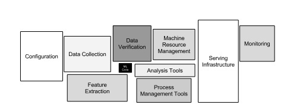

# #3 Technical debt in Machine learning systems has very high interest rate.

## **Introduction**

The harsh reality of new graduates joining a Machine learning team is that the "model development" part of the job dwarfs in comparison to everything else the team needs to support.

New modelling approaches are often a second-thought, as the process of creating a new model is often automatized as much as possible and often not as important as previous points (as long as the current model(s) are working!).

Still, owning an end-to-end ML system comes with great challenges: both technical and organizational.

In this article, I will explore common ML systems anti patterns, how to (hopefully) avoid them and how to prioritize and tackle ML technical debt.

## Enforcing modularization in a Machine learning system is hard.

It is common knowledge that strong abstraction and boundaries using modular design result in more maintainable code.

However, enforcing strict abstraction boundaries for ML systems is quite challenging.

🚩

Entanglement

When mixing signals together from different sources, making isolated improvements is impossible: changing one feature distribution will change the importance of all other features in the model. This can be often considered a constraints that cannot really be "fixed".

In some cases though, it is possible to disentangle the system by serving a model ensemble.

The features are split in non overlapping subsets and the final model is an ensemble of models trained on different subsets. In this way, changing one feature has a reduced blast-radius. 

🚩

Undeclared consumers

The prediction of an ML model is often made available to other systems: either the model is directly called or the output is saved in some logs consumed by many different teams.

Without access control, many consumers can use the model output as they please. This is dangerous practice as it creates tight coupling between the model itself and other systems.

Improvements in the ML model can lead to net negative impact as other teams using the model see a degradation in their own system.

This means _improvement deadlock_ : improving the accuracy of the model leads to other systems detriments. The model stops being updated and becomes stale, further damaging the performance.

## ML systems anti-patterns.

🚩

Pipeline jungles

To move fast, features are often acquired from different teams without a proper process.

One SQL pipeline to read the logs from team A, an RPC to call the model from team B and one DB read from team C and a final data pipeline to put everything together: the recipe for a pipeline jungle.

The system is brittle: many failure points in the system, one failure away from the whole pipeline being broken.

A good approach is instead to have one modular system responsible for receiving signals and transforming them so that they can be ingested for the actual ML pipeline.

🚩

Many non standardized experimental snippets

Every member of the team has its own little experimental code path that is used to try different experiments. This experimental code paths are often unmaintained and prone to contain deprecated dependencies.

There should be an experimental template that is well documented and up to standard as other parts of the codebase.

An experiment should not be something that is done "when one has time to try this new idea out": there should be proper allocated time for this work and that should be reflected in the quality of the experimental code base.

## Data dependencies >> Code dependencies

Minimising code dependencies is a well known problem, with different tools at one's disposal to tackle it. Data dependencies are much more tricky to investigate and solve.

When getting started with an ML system, It's easy to start consuming signals from other systems to build up a sizeable dataset. Most of the times, the team you are working on does not even own those systems!

You start getting a signal from that team, another signal from that other team, and soon enough you are getting hundreds of signals from 10 different teams in your company.

Plus, are those signals raw features? Or are they output of yet-another-ML model? You see where this is going.

What if a team stop sending a very important feature for your model? What if they slightly change how it is computed? On their side, this is an improvement but on your side, this can lead to a performance loss.

💡

Signals should be **versioned**.   
That way, you immediately know that something is changing and you can have a process in place to mitigate possible risks.

## You can never stay still if you own a ML system.

Being a Machine learning engineer is exciting: the systems you are building often directly interact with the external world.

However, the external world is always changing: this is a maintenance burden on your systems.

At the end of the day, every system has some number **X** such that if some threshold is higher than that, we _doSomething()_.

The threshold is chosen, the model is launched, everyone is happy.

However, data distribution shifts fast and the model performance drops equally fast. How to mitigate the risk?

💡

**Continuous training.**   
Models should be continuously trained on up-to-date data and deployed.

💡

**Safeguards**  
You want to be able to sleep at night. It can be useful to set action limits as a sanity check. If safeguards trigger for a particular system, that should be investigated manually.

## How to identify and prioritise ML technical debt?

I am sure at this point you are thinking:

> "Well, I understand the problem, but my leadership does not care I cleaneup up some old deprecated configuration. They care about new shiny models and numbers going up!"

I argue it is quite easy to show how impactful cleaning up is:

  * Team members ramp up X% faster.

  * Features development is sped up by Y%.

  * Z% less Software Engineering hours spent fixing _that-workflow-everyone-knows-about_

  * .... and more!

The gist here is: let your fantasy go wild. It is straightforward to map the examples above to the bottom line.

Now, your higher-ups are convinced: they want you to be in charge of the clean up! How do you identify what to work on?

I suggest evaluating the current technical debt alongside different dimensions:

**Effort name** Risk SWE days saved SWE days needed Pipeline is deprecated HIGH 4 5 Signals integration failing EXTREME 2 7 Servingi is failing in one cell LOW 3 42

Ultimately, the goal of reducing technical debt is eliminating risk:

  * Risk of losing your most important feature because the integration is deprecated

  * Risk of losing your true positives for 1 week because your labelling pipeline fails.

For that reason, I'd focus on clearly defining that dimension for each item.

All that's left now is tackle that debt head on :).

* * *

## **References**

  1. [Hidden Technical debt in Machine Learning Systems.](https://proceedings.neurips.cc/paper/2015/file/86df7dcfd896fcaf2674f757a2463eba-Paper.pdf)
