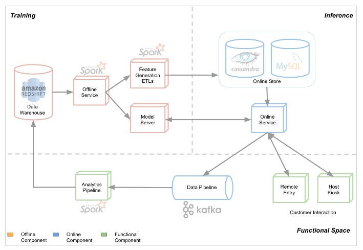
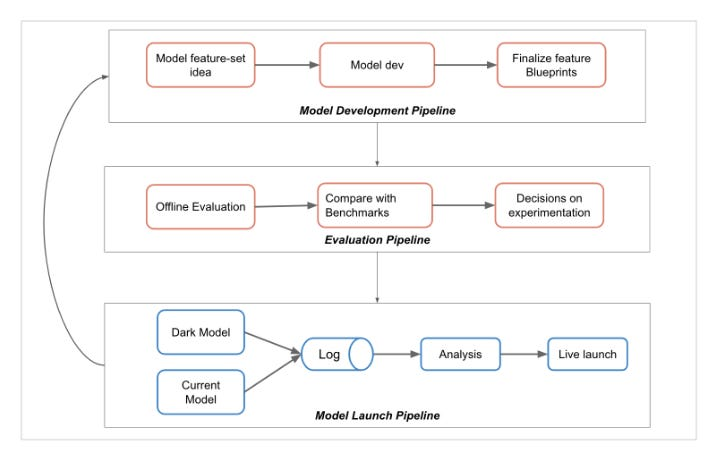

# #4 How Yelp predicts Wait Time for your favourite restaurant?

Photo by [Diego PH](true) on [Unsplash](https://unsplash.com)

## Introduction

In this article, I will describe how Yelp predicts the waiting time for restaurants around the world.

In this setting, latency of the system is paramount: when users want to know the current waiting time, they expect an immediate answer. However, they don't particularly care for the system to be extremely precise: a difference of a few minutes will not make the system unusable.

## The system

The system can be broken down in three different components:

  1. Offline pipeline: data wrangling, model training, feature generation.

  2. Online serving: serving the model which tracks current state of restaurant and responds to requests.

  3. Monitoring.

The Offline Service is responsible for model training using time sensitive features. Other non time sensitive features are generated in the Feature generation pipeline and stored for online serving alongside the restaurants' state.

The Online Service is responsible for generating predictions in real time by leveraging the online stores and model server.

Prediction logs are consumed by the data pipeline for monitoring purposes and stored in the data warehouse.

## Model development and launch process

Until now, the architecture is quite standard. However, I want to specifically focus on the model development, evaluation and launch pipeline as it is quite involved.

If this step looks promising, then the model is "Dark launched". Meaning that _real_ online traffic also goes through the new model: predictions are made, but not executed on.

This is useful for many reasons:

  * Compare performance across different affected systems

  * Checking differences between offline and online pipelines

  * Checking the latency of the new model to make sure the predictions are still happening real time.

If this is still looking promising, then the new model is getting launched.

The launch does not happen immediately:

  * We still need to be careful to check model performance on a large time scale.

  * Substituting the old model with the new one in one step might lead to the service being offline for some time, which we want to avoid in an online system.

For this reason, the launch is done step by step following an incremental roll out process.

## Feedback loops

Giving a prediction to the user _affects_ the time they show up to a restaurant.

If the prediction causes the user to arrive at the restaurant after their table is available, they actually may wait longer than expected if the model had given them a shorter estimate. The waiting time is directly affected by the prediction of the model, which is then reflected in the labelled data on which the model is trained on.

It would probably be best not to rely on wait time for training when the user is affected by the very model we are using.

However, only relying on users input on waiting time could lead to problems: the users that share this data are probably non representative of the overall population.

Another advantage of the incremental roll out process is to analyze these events by comparing how the available data changes.

## Monitoring the model and measuring success.

Prediction speed, feature quality and overall system up-time are all important metrics of a Machine Learning system, however the effects on the end users need to be taken into account as well:

  * The wait time should be as long as expected.

  * The model should not send too many clients at the same time to a restaurant just because the restaurant is empty, as this leads to still non-zero wait time.

## References

  1. [Architecting Restaurant Wait Time Predictions](https://engineeringblog.yelp.com/2019/12/architecting-wait-time-estimations.html)
