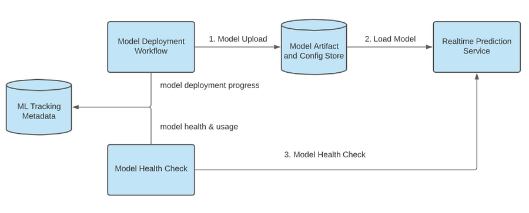

# # 5 How Uber continuously deploys Machine learning models at scale?

# Introduction

Today topic is about continuous model deployment.

When working with Machine Learning systems, one must always remember that the world around is changing fast _._ Training a model, deploying it online and calling it a day is **not** a valid option, as model's performance degrades quickly.

If you want to know more about Machine learning systems anti-patterns, I suggest to have a look at one of the past issues:

[#3 Technical debt in Machine learning systems has very high interest rate.](machinelearningatscale.com/ml-tech-debt/)

[Introduction The harsh reality of new graduates joining a Machine learning team is that the “model development” part of the job dwarfs in comparison to everything else the team needs to support. The priority of the team is often: improving models’ up-time, optimizing the data pipeline, adding new…](machinelearningatscale.com/ml-tech-debt/)[Machine learning at scaleLudovico Bessi](machinelearningatscale.com/ml-tech-debt/)

Still, there are many challenges when building such a system:

  * The system should support a large volume of model deployments on a daily basis, without affecting the Real-time prediction system.

  * The system should handle the ever increasing memory footprint of newly retrained models hitting servers.

  * The system should support different rollout strategies. Sometimes a model is deployed fast to fix an issue that is hurting. Sometimes a model is dark-launched to analyze the performance on live data. Sometimes you just need your standard rollout.

In the next three sections, I will analyze how to best design a system to tackle these challenges.

* * *

# Model deployment

Model deployment workflow, from [1]

Machine learning engineers should be empowered to deploy and retire unused models through the model deployment API.

Every new to-be-deployed model is uploaded to a "Model Artifact" store.

The process is quite rigorous:

  1. **Artifact validation** : the model should include all necessary artifacts for serving and monitoring.

  2. **Compilation** : all artifacts and metadata are packaged into a self-contained instance.

  3. **Serving validation** : Load the compiled package and check on sample data that the model can run and is compatible with the Real-time prediction service.

Periodically, the Realtime prediction service checks the store, compares it with the local state and triggers loading of the new models.

One naïve solution might have been to seal the model artifacts into the real-time prediction service image and deploy models together with the service.

This is quite an heavy process, that does not scale well if the number of deployed models per hour keeps growing.

As the saying goes: "You should build a system that can scale to the next order of magnitude". If you build it for the current scale, then you will need to migrate too soon. If you make it too scalable, then you are probably over-engineering it.

With the current design, model ingestion is decoupled from the server deployment cycle: this enables faster iteration.

* * *

# Model Auto-Retirement

In a well-oiled machine learning system, a model retirement process should be integrated.

For many different reasons, a model should just stop predicting: there is no more business value that justifies having a model or maybe the training data is not available anymore.

Plus, model artifacts are usually quite heavy and can be a burden on memory consumptions.

The solution from Uber is to force machine learning engineers to set a mandatory expiration date to every model that is deployed. If a model has not been used and is past the expiration period, the automatic retirement workflow is triggered. 

* * *

# Supporting different model roll outs.

The prediction service should support a standard rollout and shadow rollout.

> Shadow rollout

In a shadow rollout, a model is deployed on live traffic, but there is no enforcement on the predictions. This ensures that we are testing the model performance on real data.

Usually, a shadow model is a new model or variation of a model we want to test: testing time can span multiple days.

On top of that, the shadow traffic can be picked based on different criteria.

Lastly, shadow models should be treated as second-class citizens: if traffic is too heavy, the predictions should be automatically paused.

> Standard rollout

After it is clear that a model is working well, it's time for deployment! This is the fun part: 1%, 10%, 50% .... and 100%!

In the end, a launch email with all the amazing metrics that have been improved is the cherry on the cake! :)

* * *

# Continuous integration and deployment

Until now, the discussion was focused on the model deployment workflow. However, the actual binaries supporting the workflow are also changing, like every piece of software.

There must be high-confidence that a new binary does not affect all models that are being the deployed on top of it.

  * A model should always be able to be loaded by the Real-time service and make predictions.

  * The service should always be able to start, no matter how many dependencies.

  * The release should always be able to build even if the build scripts are changed.

A three-step rollout strategy is enforced.

  1. Staging integration tests: basic functionalities are tested in a non-production environment.

  2. Canary integration tests: ensure serving performance across all production models.

  3. Production rollout: the release is deployed onto all Real-time prediction Service instances, in a rolling fashion.

* * *

# References

  1. [Continuous integration and deployment for Machine learning Serving and Models.](https://www.uber.com/en-CH/blog/continuous-integration-deployment-ml/)
