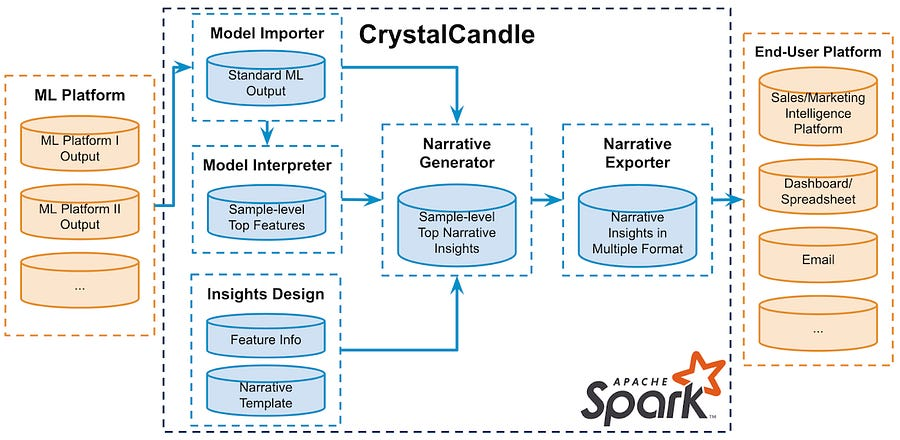
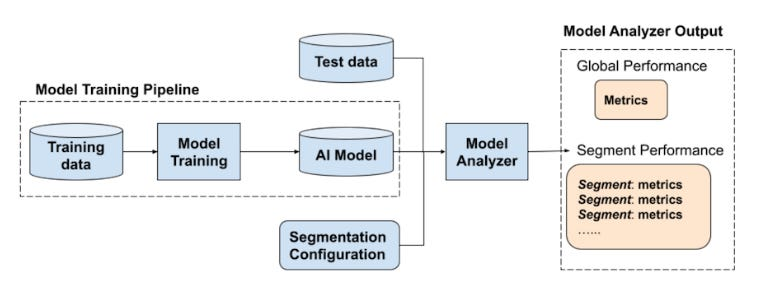

# #6 How LinkedIn built a Machine Learning system focused on Explainable AI?

# Introduction

Lately, there has been a strong focus in tech space on building Machine learning systems that:

  * Respect privacy.

  * Avoid harmful bias.

  * Mitigate unintended consequences.

Still, building a transparent and trustworthy system is not easy an easy fit.

The focus of this article is going to be on:

  * Transparency as a first principle.

  * Main components for an End-to-end explainability system.

Let's dive in!

* * *

# Transparency + Context = Explainability

LinkedIn defines "Transparency" in an AI system if the behavior of the system and its related components are understandable, explainable and interpretable.

The end users of ML models should be empowered to make a decision based on the output, by understanding:

  * How a model is trained and evaluated.

  * What are its decision boundaries.

  * Why the model made that specific prediction.

All this makes sense. The tough part is creating a system that can work on different models and for different stakeholders.

Sometimes, an high level VP wants to understand better the training data used for compliance reasons.

Other times, Machine Learning engineers debugging the model want to understand the inner details to mitigate some strange predictions.

* * *

# End-to-end system explainability for decision-makers and ML engineers

> Explainability for decision makers

Complex predictive machine learning models often lack transparency, resulting in low trust from decision makers despite having high predictive power.

Many model interpretation approaches return top-K most important features to help interpret decisions, however the features could still be too complex or too domain specific to be clearly understood.

CrystalCandle explainability system, from [1]

The image above shows an Apache Spark based pipeline from machine learning platforms to end-user platforms. 

There are four main components:

  * Model importer.

  * Model interpreter.

  * Narrative generator.

  * Narrative exporter.

The "Narrative generator" component is particularly interesting: top-K features are integrated with detailed information on the actual features to be used by operators not familiar with the underlying systems.

Suppose a user is flagged as abusive, but it is actually a false positive. They will go through an approval process: the human reviewer can have access to a wealth of information to clearly understand what happened and help the end user as best as possible.

This information can also be leveraged by ML engineers to understand what went wrong: this might lead to a model-fix project that reduce the number of FPs by 10%. At the the O(millions) users scale, this would be an incredible result!

> Explainability for Machine learning engineers

Machine learning engineers should be able to understand the models to identify possible blindspots.

  * Identify subsets of data where the model is under-performing

  * Automatically refine the model on the underperforming segments

The overall design is technically simple: all computations are carried out offline when needed.

This could be a nice side project at your company where it's easy to showcase impact by leveraging models improvement or enhanced decisions based on models. More explainability, more performance and less pagers!

* * *

# References

  1. [Our approach to building transparent and explainable AI systems.](https://engineering.linkedin.com/blog/2021/transparent-and-explainable-AI-systems)
