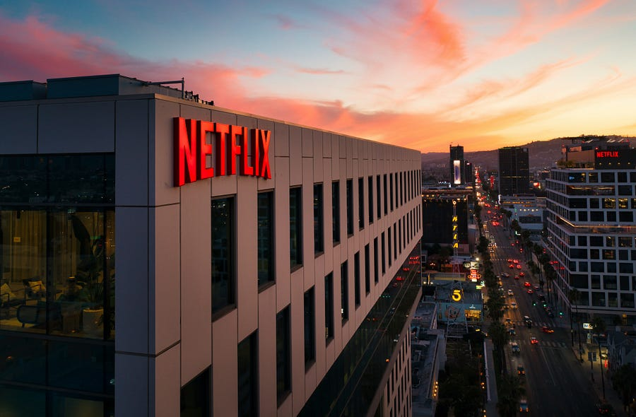
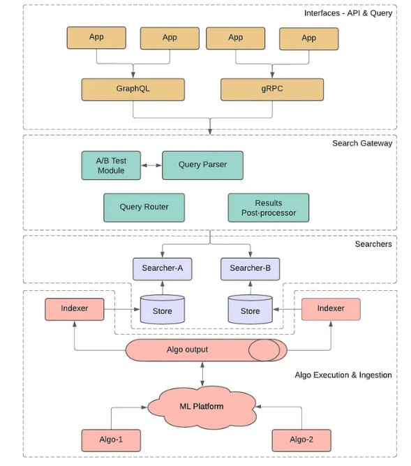

# #13 How Netflix built a media understanding platform for ML innovations.

# Table of contents

  1. **Introduction.**

  2. **First iteration: on-demand batch processing.**

  3. **Second iteration: enabling online requests with pre-computation.**

  4. **Final system architecture.**

# Introduction

In today's article, I will describe how Netflix built a ML Media understanding platform.

Let's start from the use cases:

  1. **Dialogue search:** An editor should be able to search across titles, characters and different languages to get to the right frames.

  2. **Visual search:** An editor should be able to look for specific visual elements using natural language.

  3. **Reverse shot search:** An editor should be able to find shots similar to an input image.

The end goal is to speed up the tedious work that artists and video editors must carry out, to leave them more free time for creativity endeavours.

What I really appreciate from the Netflix is their focus on a **MVP** (minimum viable product) above everything else.

The engineers started building something that does not scale, just to test that customers are satisfied with the end product. It looks like that start up advice [2] applies also to BigTech after all!

* * *

# On-demand batch processing

Users submit their request and wait for the system to generate the output.

Some ML models are quite computationally intensive: this flow can take many hours.

After the output is generated, the output is available for offline consumption.

* * *

# Enabling online requests wit pre-computation

  1. **ML models live on different systems:** Whenever ML researchers finished a new algorithm, they had to integrate it separately into a different customer system.

  2. **On boarding new customers is still time consuming**. Integrating a new system from the ground up takes a lot of engineering time.

The workflow is tightly-coupled application-to-data architecture with ML models mixed in with UI and software stack. Good for an MVP, but not great as a fully fledged production system.

Now that the MVP is validated, it is time to build a platform that is modular, pluggable and configurable. In this way, different specialized teams can contribute relevant components to the platform independently.

* * *

# Final system architecture

It is possible to interact with the platform using either [gRPC](https://grpc.io/) or [GraphQL](https://graphql.org/) interfaces.

The schema design must be generic enough to:

  1. Account for future use cases

  2. Hide complex details of the actual search systems

  3. Express complex queries

### Search Gateway

For ease of coordination and maintenance the query processing and response handling is abstracted away in the Search Gateway module.

The client generated input query is first given to the Query processing system.

The query processing modifies queries to match the target data set. This includes “embedding” transformation and translation. For queries against embedding based data sources it transforms the input such as text or image to corresponding vector representation. Each data source or algorithm could use a different encoding technique so, this stage ensures that the corresponding encoding is also applied to the provided query.

Different encoding techniques are needed because there are different ways to process an image. For example: is it "just" an image, or is it a frame of a longer video?

Once the query is transformed and ready for execution, the execution is delegated to one or more of the searcher systems.

The Query router decides which query should be routed to which system.

A search may intersect or aggregate the data from multiple algorithms: a single query can result in multiple search executions. Each Searcher proxy is responsible for mapping input queries to ones expected by the corresponding searcher.

The Searcher-proxy is also responsible for consuming the raw response from the searcher before handing it over to the Results post-processor component.

The Results post-processor works on the results returned by one or more searchers. It can rank results by applying custom scoring, populate search recommendations based on other similar searches.

### Searchers

As mentioned above, query execution is handled by the searcher system.

It supports different categories of searches including full text and embedding vector based similarity searches. It can store and retrieve temporal as well as spatial data. This service leverages [Cassandra](https://cassandra.apache.org/_/index.html) for data storage and retrieval.

### Algo execution & Ingestion

The team responsible for this module specializes in building a suite of media-specific machine learning models and tooling. There is a strong collaboration between Research scientist and ML engineers to make new models available to all customers.

The system has simple integrations with end users applications, to make it simple to customize query generation and response handling per the needs of individual applications and algorithms.

* * *

# References

  1. [Building a Media Understanding Platform for ML innovations.](https://netflixtechblog.com/building-a-media-understanding-platform-for-ml-innovations-9bef9962dcb7)

  2. [Do things that do not scale](http://paulgraham.com/ds.html)
