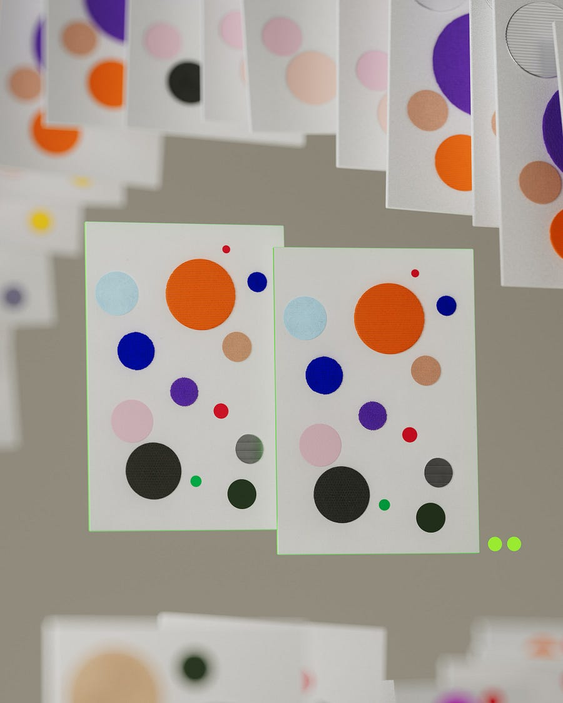

# #18 Machine Learning At Scale: Challenges and Solutions of Deploying On-Device Machine Learning models.

# Table of contents

  1. **Introduction: On-Device Machine Learning is hard!**

  2. **First solution: Optimize the size of your Machine Learning model.**

  3. **Second solution: Create two different Machine Learning models.**

## Introduction: On-Device Machine Learning is hard!

In the past articles, I have been focusing on large scale systems assuming almost endless computational resources. However, there are cases where you might be interested in deploying a Machine learning model On-Device.

The idea is that you can't always rely on a user having a perfect internet connection, but you still want them to enjoy your precious Machine Learning models.

In this setting, you are probably looking at the smallest model that still satisfies some accuracy threshold.

Still, sometimes your model just can't be reduced to a smaller size, even after all optimization techniques you . Let's see how you can still make sure your model is satisfying users' requests.

* * *

## First solution: Optimize the size of your Machine Learning model.

### Quantization

Neural network weights are floating point numbers.

The process of replacing data-intensive weights with lighter weights is called quantization. You can go from float32 to int8, but you can also go from float32 to float16.

This idea sounds very simple in principle: just approximate to the nearest new format, right? Wrong.

The loss function of Neural network is a very complicated object, as you can see in more details in [6].

Approximating the parameters sacrifices precision: there are no guarantees that this will not mess your model, so tread carefully!

The most common quantization techniques are: **Post-training quantization** and **Quantization aware training**.

Post-training quantization is exactly what it sounds like: quantize the weights after the model is trained. Quite simple! However, it usually leads to a higher accuracy loss.

In Quantization aware training, the gradients are calculated already for the quantized weights. This is more involved, but usually leads to better accuracy.

### Pruning

Model pruning is a technique where the connections of a network are iteratively removed during training or post-training.

In [4], authors show that under certain conditions 90% of parameters can be removed to improve inference and reduce storage requirements without deeply affecting accuracy. Such an interesting read!

### Knowledge distillation

After the original model is trained, a significantly smaller student model is trained to predict the original model. This technique is also known "Teacher-student models" [5].

Remarkably, this technique has been successfully applied to compress BERT. The student model can now run on smartphone devices!

Given the result, this is definitely worth trying.

* * *

## Second solution: **Create two different Machine Learning models**

You have tried every possible trick: your model still can't be reduced to the required size.

One clever solution is to try and split the problem into two smaller problems:

  * The first problem should be something extremely easy that can be solved On-Device

  * The second problem should be solved by on-the-cloud model that cannot be run On-Device, but that is called thanks to the first model.

> Instead of trying to classify which instrument is being played, first classify if the sound is indeed an instrument or not, and only then ping the server-side model for instrument classification.

I am sure you might be wondering: how can you guarantee that the offline model is not suffering for data drift?

There are a few monitoring solutions:

  * Evaluate model performance by saving a subset of On-Device predictions

  * Create a replica of the On-Device model online for continuous evaluation purposes.

* * *

## References

  1. [Machine Learning Design Patterns.](https://www.oreilly.com/library/view/machine-learning-design/9781098115777/)

  2. [Neural-networks-quantization.](https://tivadardanka.com/blog/neural-networks-quantization)

  3. [Quantization and Quantization aware training.](https://deci.ai/quantization-and-quantization-aware-training/)

  4. [The Lottery Ticket Hypothesis: Finding Sparse, Trainable Neural Networks](https://arxiv.org/abs/1803.03635)

  5. [Distilling the Knowledge in a Neural Network](https://arxiv.org/abs/1503.02531)

  6. [Visualizing the Loss Landscape of Neural nets.](https://tivadardanka.com/blog/neural-networks-quantization)
