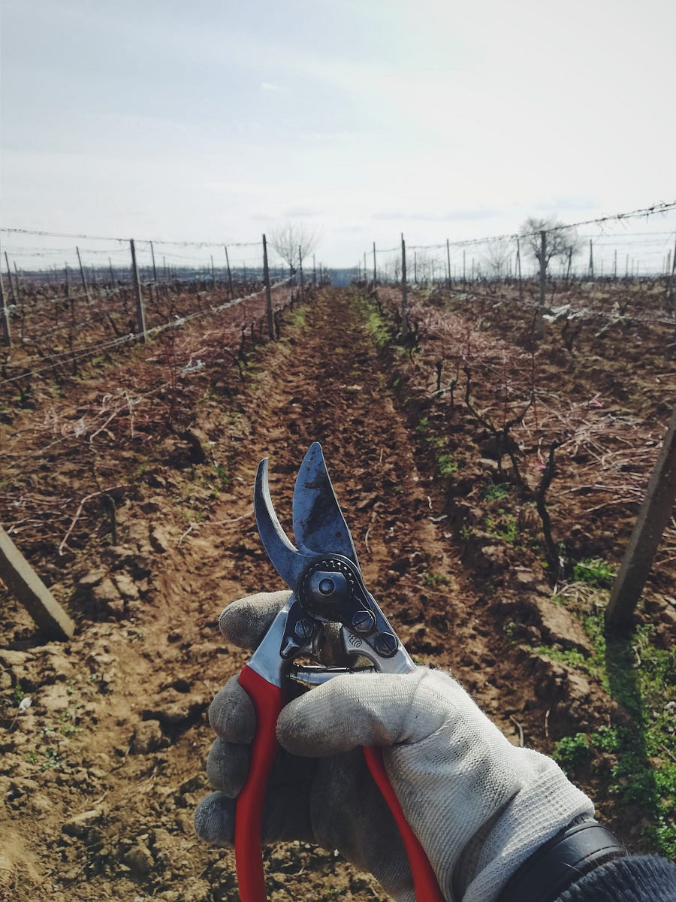

# #30 Pruning vs Quantization. Final showdown!

# Table of contents

  1. **Introduction.**

  2. **Pruning vs quantization. Which one is better?**

  3. **Closing thoughts.**

# Introduction

I know what you might be thinking. I have already discussed about quantization and pruning in two past articles:

[Machine learning at scaleLudovico Bessi](machinelearningatscale.com/machine-learning-on-device-models/)

[Machine learning at scaleLudovico Bessi](machinelearningatscale.com/compressing-large-language-models/)

However, the paper [1] published recently on arxiv really caught my eyes, as It is the first paper I have read that directly compares the two techniques to be able to decide which one is best in different settings.

I found the results pretty interesting and I really wanted to share them with you!

Let's get started!

* * *

# Pruning vs quantization. Which one is better?

The following methods have been compared:

  * Magnitude pruning.

  * Symmetric uniform quantization.

The methods have been evaluated on the common signal-to-noise ratio (SNR) measure.

Many weights in neural networks are roughly Gaussian-shaped, so the first distribution that was evaluated was the Gaussian distribution.

The second distribution being evaluated is one with heavy tails: a student-t distribution is chosen.

The paper goes on to discuss the Per-layer comparison between Post-training quantization and Post-training pruning.

Next time you need to shrink a model size, forget about pruning! ;)

* * *

# References

  1. [Pruning vs quantization](https://arxiv.org/pdf/2307.02973.pdf)
