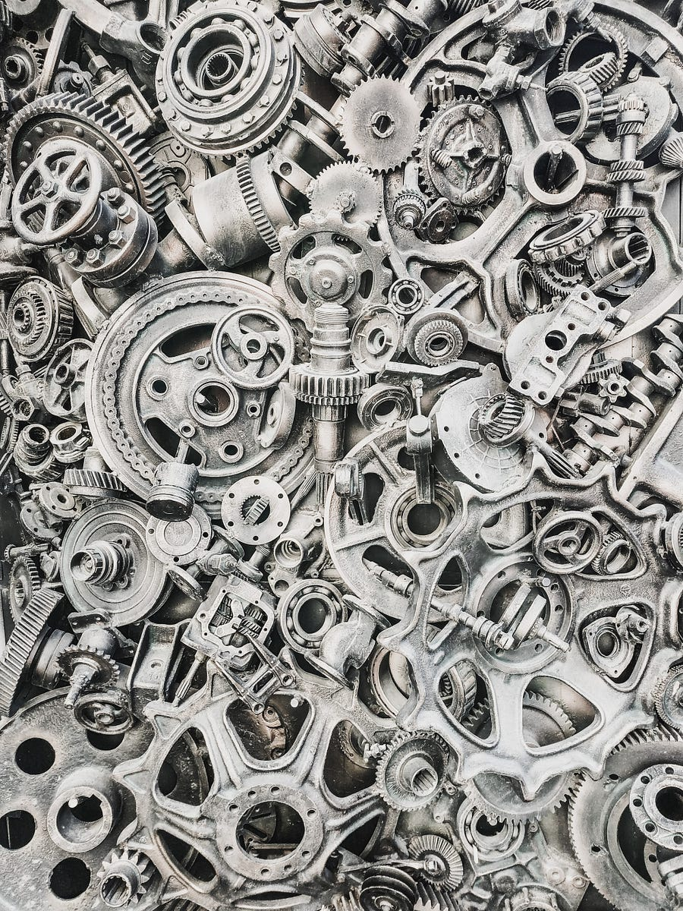

# #36 Transformers as.. Support Vector Machines?!

# Table of contents

  1. **Introduction.**

  2. **Transformers == SVM?**

  3. **Closing thoughts.**

# Introduction

I have recently came across a new paper with the eye-catching title: "Transformers as Support Vector Machines" [1].

I could not resist opening it and having a look, especially after binge-reading a very interesting discussion on hacker news [2].

Below, I will summarize what I think of it!

* * *

# Transformers == SVM?

The paper establishes a formal equivalence between the optimization geometry of self-attention and a hard-margin SVM problem that separates optimal tokens from non-optimal tokens using linear constraints.

Attention induces sparsity through the softmax: 'bad' tokens that fall on the wrong side of the SVM decision boundary are suppressed by the softmax function, while 'good' tokens are those that end up with non-zero softmax probabilities.

As the author of the paper describes:

> SVM summarizes the training dynamics of the attention layer, so there is no hidden-layer. It operates on the token embeddings of that layer.

> Essentially, weights of the attention layer converge (in direction) to the maximum margin separator between the good vs bad tokens.

> There is no label involved, instead you are separating the tokens based on their contribution to the training loss. We can formally assign a "score" of each token for 1-layer model but this is tricky to do for multilayer with MLP heads.

Through softmax-attention, transformer is running a "feature/token selection procedure".

Thanks to softmax, we can obtain a clean SVM interpretation of max-margin token separation.

These deep connections really excite me!

Those equivalences can connect two different fields and allows to transfer methods from one field to the other: each field usually has developed quite a number of methods and tricks over the time.

There have been similar equivalences before, for example: Linear Transformers Are Secretly Fast Weight Programmers [3].

I suspect we will see more papers looking for equivalences between the current cool architecture and everything else, as they help shed light on the inner workings of the new models.

* * *

# Closing thoughts

This paper has no relevant practical applications, however it connects two seemingly different mathematical formalisms and show some sort of equivalence under restrictions.

It helps in adding intuitive understanding of what exactly it's going on!

As an example: It is quite easy to make an SVM overfit, while Transformers have generally fewer issues. Could this help shed some light on why that's the case down the line? Maybe!

# References

  1. [Transformers as Support Vector Machines.](https://arxiv.org/pdf/2308.16898.pdf)

  2. [HN: Transformers as Support Vector Machines.](https://news.ycombinator.com/item?id=37367951)

  3. [Linear Transformers Are Secretly Fast Weight Programmers](https://arxiv.org/abs/2102.11174)
