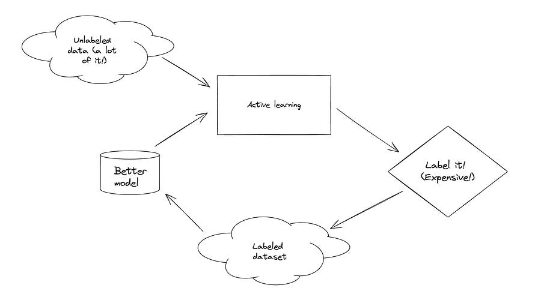
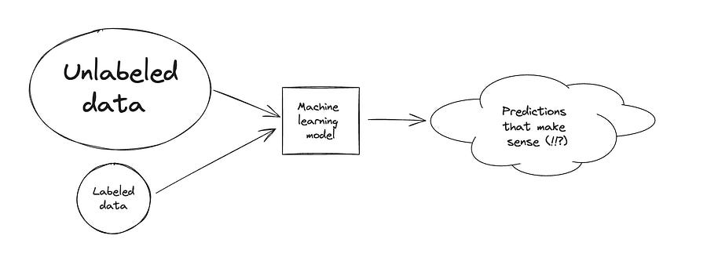

# 42. Active learning

*How to decide which labels are important enough to manually label?*

*How to decide which labels are important enough to manually label?*

# Introduction

In the previous article, we discussed techniques for supervised learning: a setting where the majority of the dataset is composed of unlabeled data. In that setting, we worked on defining a loss function made up of two terms: one for labeled data and one for unlabeled data and we discussed how to leverage the unlabeled data to get better performance.

Missed the previous article? Here it is:

## [41\. Semi-supervised learning](2024-06-16-semi-supervised-learning.md)

Ludovico Bessi

·

June 16, 2024

Introduction Semi supervised learning is halfway between supervised and unsupervised learning. In addition to unlabelled data, the algorithm is provided with some supervision information - but not necessarily for all examples! The labeled portion is usually quite small compared to to the unlabeled one…!

[Read full story](2024-06-16-semi-supervised-learning.md)

In this setting, let’s switch up the problem: we care about the following:

We have very few labels (or none). Labelling is very expensive. How do we choose the samples to manually label that improve the model performance the most?

The process of identifying the most valuable examples to label next is referred to “sampling strategy”. The scoring function that is used in the sampling process is named “acquisition function”.

How can we define a proper sampling process? Which properties are the most desirable?

We are going to touch on a few different techniques:

  * **Uncertainty sampling**

  * **Diversity sampling**

  * **Expected model change sampling**

  * **Measuring representativeness of sample to guide sampling**

  * **Forgetting events sampling**

Let’s dive right in!

* * *

* * *

# Techniques

## Uncertainty sampling

This technique selects examples for which the model produces the most uncertain predictions. But how to quantify uncertainty? There are a few formulas based on the predicted probabilities:

\\(\text{Least confidence score: }U(x)= 1 - \mathcal{P}_\theta(\hat y \vert x )\\)

\\(\text{Entropy: }U(x) = - \sum_{y \in \mathcal{Y}}P_\theta(y\vert x)\log{P_\theta(y\vert x)}\\)

Another way to quantify uncertainty is to rely on a committee of expert models by measuring uncertainty based on a pool of opinions. We can define the uncertainty by adapting the formulas above by iterating over model predictions or leveraging KL divergence between the probability of a single model given the average model probability.

## Diversity sampling

Diversity sampling intend to find a collection of samples that can well represent the entire data distribution. Diversity is important because the model is expected to work well on any data in the wild, just not on a narrow subset.

Common approaches often rely on quantifying the similarity between samples.

## Expected model change sampling

Another simple heuristic that just aims to take the sample that generates the greatest parameters change.

## Measuring representativness

This technique borrows from a computational geometry idea called “Core set approach”. The core set refers to a set of points that approximates the shape of a larger point set.

In active learning, we expect a model that is trained over the core set to behave comparably with the model on the entire data points.

There are some optimization math going on here, if you are interested you can dive deeper into [1].

The main idea is that the problem can be translated over a k-center problem: choose k center points such that the largest distance between a data point and its nearest neighbours is minimized. Fun fact, the problem is NP hard but you can approximate it using greedy techniques.

## Forgetting events sampling

This technique is quite original. A sample is considered forgettable if the predicted label changes across training epochs. On the contrary, if a label is consistent then it’s considered unforgettable.

Then, forgetting a sample can be used as a signal for active learning acquisition if we assume that a model changing predictions during training is an indicator of model uncertainty.

* * *

# Conclusions

I hope you learned some new that can be applied in your daily projects.

If yes, let me know how in the comments below :)

Ludo

* * *

# References

  1. [Learning with not enough data: Active learning](https://lilianweng.github.io/posts/2022-02-20-active-learning/)

  2. [Active learning literature survey](https://burrsettles.com/pub/settles.activelearning.pdf)
