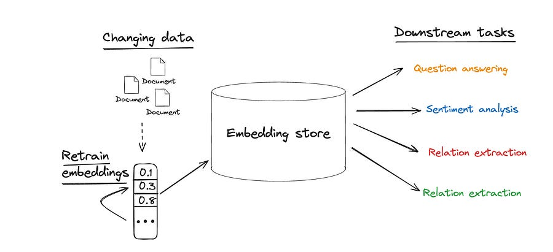
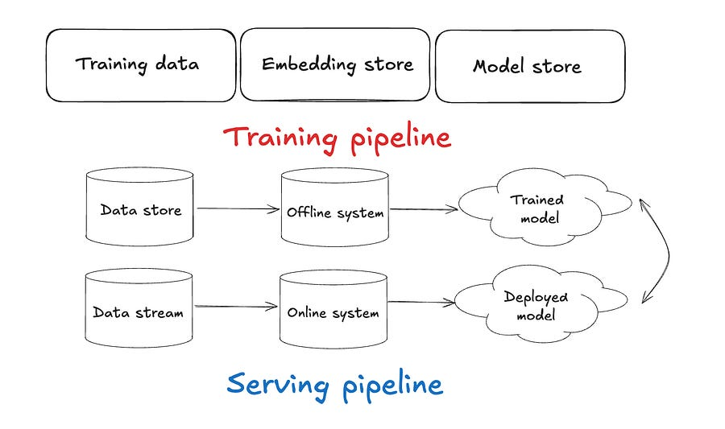

# 45. Compound AI systems

*State-of-the-art AI results are increasingly obtained by compound systems with multiple components, not just monolithic models.*

*State-of-the-art AI results are increasingly obtained by compound systems with multiple components, not just monolithic models.*

# Introduction

By this point, we are all familiar with features stores. They are very helpful to:

  * **Democratize Usage** : Features can be accessed by different teams.

  * **Multi modality support:** Batch, realtime and RPC features with online and offline data parity.

  * **Feature transformers:** Setup chains of transformations at training/serving time.

  * **Historical and near real time data** available

I have talked about them extensively in previous articles:

## [#17 Uber's Offline Platform For Optimal Feature Discovery.](2023-04-23-uber-optimal-feature-discovery.md)

Ludovico Bessi

·

April 23, 2023

Introduction Optimal feature discovery through a centralised Feature Store Results Introduction Today's topic is about feature selection. As a Machine Learning engineer, you are tempted to ingest as many features as possible from different teams in hope to improve your model performance.

[Read full story](2023-04-23-uber-optimal-feature-discovery.md)

## [#20 Machine Learning Features store challenges from Constructor.io](2023-05-14-online-feature-stores.md)

Ludovico Bessi

·

May 14, 2023

Table of contents Introduction. What is a Feature Store anyway? Offline Batch Layer Online Serving Layer Closing thoughts Introduction In today's article I will discuss engineering challenges faced by Constructor.io [1] when implementing a feature store.

[Read full story](2023-05-14-online-feature-stores.md)

However, things are changing. It’s becoming more common to “abstract” away the feature engineering step and just create embeddings. What has been observed is that:

Downstream systems require less supervised data and provide a quality lift compared to hand-tuned features.

But that adds a different type of overhead. We could now describe the offline and online system as follows:

# Introduction

By this point, we are all familiar with features stores. They are very helpful to:

  * **Democratize Usage** : Features can be accessed by different teams.

  * **Multi modality support:** Batch, realtime and RPC features with online and offline data parity.

  * **Feature transformers:** Setup chains of transformations at training/serving time.

  * **Historical and near real time data** available

I have talked about them extensively in previous articles:

## [#17 Uber's Offline Platform For Optimal Feature Discovery.](2023-04-23-uber-optimal-feature-discovery.md)

Ludovico Bessi

·

April 23, 2023

Introduction Optimal feature discovery through a centralised Feature Store Results Introduction Today's topic is about feature selection. As a Machine Learning engineer, you are tempted to ingest as many features as possible from different teams in hope to improve your model performance.

[Read full story](2023-04-23-uber-optimal-feature-discovery.md)

## [#20 Machine Learning Features store challenges from Constructor.io](2023-05-14-online-feature-stores.md)

Ludovico Bessi

·

May 14, 2023

Table of contents Introduction. What is a Feature Store anyway? Offline Batch Layer Online Serving Layer Closing thoughts Introduction In today's article I will discuss engineering challenges faced by Constructor.io [1] when implementing a feature store.

[Read full story](2023-05-14-online-feature-stores.md)

However, things are changing. It’s becoming more common to “abstract” away the feature engineering step and just create embeddings. What has been observed is that:

Downstream systems require less supervised data and provide a quality lift compared to hand-tuned features.

But that adds a different type of overhead. We could now describe the offline and online system as follows:

Let’s look at the challenges.

* * *

# Challenges

## 1\. Tail scalability challenge

The long tail of entities is a major issue. Majority of entities are rare!

This means that a large number of patterns needed to resolve the tail, making it difficult to scale a system that can learn the patterns.

## 2\. Memory usage

Embeddings linearly grow per number of entities. More computations affect latency.

It’s also harder to fit on a device!

A solution is to only keep the “top k entity” embeddings to drop memory consumption with acceptable accuracy still.

## 3\. Embedding in non-english languages

There is a lack of equally abundant resources in languages other than English.

Memory usage increases the size of **embeddings by the number of languages**

## 4\. Embedding stability

Updating an embedding model is hard business. 

As it is one component in a system of downstream tasks that depend on the embedding quality you need to make sure also those are retrained. 

Otherwise, a previous correct downstream prediction might become incorrect!

## 5\. Embedding evaluation

There are many questions you can ask yourself with trained embeddings:

  1. Are they biased to popular entities in a given geolocation?

  2. Vulnerable to adversarial attacks?

  3. Are the downstream applications affected by the updated embeddings?

  4. How to enable safe and regular model updates?

* * *

# Conclusions

Using embeddings instead of features can massively speed up the development process, however there are some additional tradeoffs that one needs to take into account to have a smooth flow.

The challenges I have described above are usually business-dependent and you are the most equipped person to answer if a given solution is needed: e.g. you might not need to care at all about retraining models if entities are very stable.

Let me know what challenges you faced in your day to day job and how you managed to solve them.

Ludo

* * *

* * *

# References

  1. [Feature stores in the coming wave of embedding ecosystems.](https://vldb.org/2021/files/slides/tutorial/tutorial4.pdf)

# Introduction

State-of-the-art AI results are increasingly obtained by compound systems with multiple components, not just monolithic models.

A few numbers:

  * 60% of LLM applications use some form of RAG

  * 30% use multi step chains

A compound AI system is a system that tackles AI tasks using multiple interacting components, including multiple calls to models, retrievers, or external tools. 

In contrast, an AI model is simply a statistical model, e.g., a Transformer that predicts the next token in text.

Increasingly more and more state-of-the-art results are obtained using compound systems. Why is that? 

  1. Iterating on a system design is much faster than waiting for the training to finish.

  2. Tasks are easier to improve with system design: for example, suppose that the current best LLM can solve coding contest problems 30% of the time, and tripling its training budget would increase this to 35%; this is still not reliable enough to win a coding contest! In contrast, engineering a system that samples from the model multiple times, tests each sample, etc. might increase performance to 80% with today’s models.

  3. Machine learning models are inherently limited because they are trained on static datasets, so their “knowledge” is fixed. Therefore, ML engineers need to combine models with other components, such as search and retrieval, to incorporate timely data.

  4. Neural network models alone are hard to control: while training will influence them, it is nearly impossible to guarantee that a model will avoid certain behaviours. Using an AI system instead of a model can help ML engineers control behaviour more tightly.

* * *

# Developing compound AI systems

However, designing such systems has its new share of challenges.

### **Design Space**

The range of possible system designs for a given task is vast. For example, even in the simple case of retrieval-augmented generation (RAG) with a retriever and language model, there are: 

  1. Many retrieval and language models to choose from

  2. Other techniques to improve retrieval quality, such as query expansion or reranking models.

  3. Techniques to improve the LLM’s generated output (e.g., running another LLM to check that the output relates to the retrieved passages)

In addition, ML engineers need to allocate limited resources, like latency and cost budgets, among the system components. For example, if you want to answer RAG questions in 100 milliseconds, should you budget to spend 20 ms on the retriever and 80 on the LLM, or the other way around?

### **Optimization**

Often in ML, maximizing the quality of a compound system requires co-optimizing the components to work well together.

In single model development a la PyTorch, engineers can easily optimize a model end-to-end because the whole model is differentiable. 

However, compound AI systems contain non-differentiable components like search engines or code interpreters, and thus require new methods of optimization.

Optimizing these compound AI systems is still a new research area; for example, DSPy offers a general optimizer for pipelines of pretrained LLMs.

### **Operations**

Machine learning operations (MLOps) become more challenging for compound AI systems. For example, while it is easy to track success rates for a traditional ML model like a spam classifier, how should ML engineers track and debug the performance of an LLM agent for the same task, which might use a variable number of “reflection” steps or external API calls to classify a message?

* * *

# Conclusions

There are some emerging paradigms in the LLMOps space. Many engineers are stichting together different AI stacks:

  * Agents are LLMs interacting with each other

  * RAG is a stack of information retrieval applications interacting with LLMs

  * Langchain/Llamaindex give you tool for controlling outputs with chain of thoughts, self consistency, etc.

Are you using any of these tools in your ML stack at your current job?  
Let me know in the comments!

Ludo 

* * *

# References

  1. [Compound AI systems.](https://bair.berkeley.edu/blog/2024/02/18/compound-ai-systems/)
