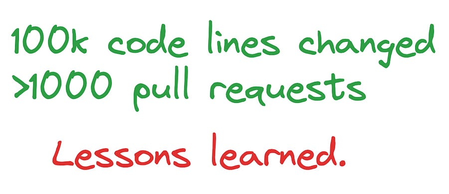

# [Special edition] Scaling Your Impact: Lessons learned from 1,000 Pull Requests and 100,000 Lines of Code

*Practical Lessons in Maximizing Engineering Contributions*

*Practical Lessons in Maximizing Engineering Contributions*

I have just crossed 100k line of code changes at Google (added, removed and edited) with about more than 1000 change lists (CLs ~= Pull requests) in just a bit more than 2 years. (Yes, that’s around 2 per day for every working day, woah!)

In today’s **special edition** , I am going to reflect on:

  * What do I think of CL count as a measure of impact?

  * Strategies I use to get my CLs reviewed and submitted fast.

  * How to stay consistent with your output as a software engineer.

  * … and some juicy statistics around submission time, number of comments per CL, languages etc.

This feels very different from my usual technical articles, but something makes me think you are going to enjoy this one :)

# CL count == IMPACT?

I believe that having a low CL count can be problematic for software engineers at L3, L4 and L5 level: after all, your job **is** to write code.

**Having said that, there are many caveats:**

  * **Question:** Does that mean that an engineer that does N CLs is worse than a one that does 2*N?  
**Answer:** No. After a certain threshold the ROI is likely not there. I think the same about LeetCode questions btw ;).

  * **Question:** Can you compare CL stats across different orgs (or different teams even)?  
**Answer:** No. Different teams have wildly different CL distributions. A team that needs to build a new product from the ground up has wildly different CL outputs from a team does heavy quality work with ML modelling.

What I believe many engineers (myself included!) need to do is sharpen their product sense.

I constantly ask myself (literally everyday when I decide what to work on) what is the single most impactful task I can do, and once I decide I go and execute.

At my level (L4), code is still the lever with the highest leverage I can pull, as I still lack influencing skills across orgs.

With this premise, you know now why my code output is so high: I find that has the most impact, simple as that.

Reducing by X% the CPU consumption of an online inference system? At Google’s scale, you bet that’s impactful. (been there, done that)

Creating a new product for YouTube Ads that billions of people will see and interact with? Yeah, you got the point. (been here, doing that now :D)

As I grow as an engineer, I hope to scale myself to be able to increase my impact. By the way, that still means new software at the end of the day, just that I will not be the only one writing it ;).

# A CL that is not submitted is a CL that has no impact :D

Your CL is sitting there, not being submitted.

You resolve comment after comment, but more comments pile up.

You get frustrated. You are losing time on this and you have more code to write.

I know the feeling. My first CL had more than 25 comments on it. (The Google experience, everyone passed through it :D)

Now, the majority of my CLs have 0 or 1 comments and 80% of them are submitted within 6h from creation.

What changed? Did I become a better engineer?   
That’s for sure, looking at my first CLs makes me cringe :) 

But that’s not all! I focus on:

  * Keeping my CLs stupidly small whenever I can.

  * Know your code: if you know your code is getting deleted 2 days after, you might not need to write tests for every possible interaction.

  * Know your reviewer: even if the style is standardized across Google, some reviewers still have some preference and you can anticipate those comments.

  * Review your own code first. Act as a reviewer yourself. Spotted some embarassing things I am glad I found before sending for review ;)

  * Reduce lag between rounds of review: if your reviewer just reviewed your code, it is high likely that he/she is currently in “review mode”, so try to answer fast so they still have context on what they just reviewed.

Are my CL reviews always spotless? No, of course not. Some of my CLs from time to time still get more than 15 comments, and that’s ok! Some code changes are highly controversial and require iterations to get it right.

Hope this was helpful!

# How to be consistent!??!? Give me your secret pls

I will keep this short. There is no secret. I enjoy the act of coding and “the grind” required to ship complex software with millions of moving parts. I know the feeling of finally launching something for billions of user to interact with and that’s what makes me tick. No secret sauce, no secret technique.

# The stats!

Some statistics to satisfy your curiosity:

  * 100k code line changed

  * > 1k CLs in 2 years, 2 CLs per day on average submitted.

  * Median submission time of 1h! (Thanks blazingly fast reviewers!)

  * 80% of all CLs submitted within 6h.

  * >95% of CLs 2 comments or less.

  * Top programming language:

    * 1385 C++ files changed

    * 800 config files (yep, that’s ML for you at a big tech company)

    * 141 python files only!

Curious about something else? Write me on LinkedIn, I usually reply quite fast.

Let me know if you enjoyed this type of article!

Ludo

# References

  * Internal stats tool at Google ;)
