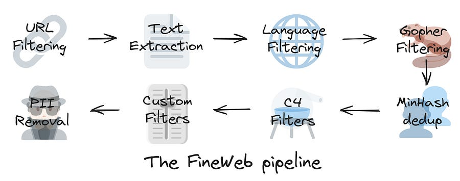

# 48. High quality pre-training data: FineWeb 🍷 

*... No, you still don't want to pre-train your own LLM, it's hard work!*

*... No, you still don't want to pre-train your own LLM, it's hard work!*

 FineWeb pipeline, from [1].

# Introduction

HuggingFace just released a super interesting article on pre-training data and techniques to acquire it.

A lot of focus of LLMs is on different architectures, finetuning, RAG, deployment.

But not many talk how they are actually pre-trained!

The data was taken from CommonCrawl: they release 400TiB of data of the open internet every ~2 months.

But, is that all high quality data? Definitely not!

They decided to train (relatively) small models on a highly representative but small dataset and evaluate the resulting model(s) of a predefined set of metrics.

They assume it’s a reasonable proxy for the quality of the data while keeping in mind the risk of overfitting on the evaluation metrics with smaller datasets.

* * *

# Ablation setup

To compare the impact of a given processing step, two models were trained on two versions of the dataset, one version processed with the extra step and another version with the extra step ablated.

Apart from the data, these two models would be otherwise identical: the same number of parameters, architecture hyper-parameters. The only difference being thus the training data.

Pretty sane approach!

* * *

# The steps of the pipeline

## Filtering

Filtering is an important part of the curation process.

It consists in removing part of the data that lowers the performance of the model and is thus deemed to be “lower quality”.

The main heuristics applied here are high level:

  1. Remove adult content

  2. Keep only english text with somewhat high probability

  3. Filter toxicity and bias with heuristics developed in [3]

## Data deduplication

Methods to deduplicate datasets attempt to identify and remove redundant/repeated data from the dataset.

“Why even deduplicate!?! More data is always good!!” - you might say.

Actually… no! Deduplicating has been correlated with improvements in model performance and a reduction in memorization of pretraining data which might allow for better generalization [1].

Common approaches rely on hashing techniques using fuzzy techniques.

… so let’s take the whole dataset and “globally” deduplicate.

This leads to a reduction of a whopping 94% of data from the original union of dumps.

(By the way, the above figure makes you realize the… “quality of the internet :P”)

Right?

Well… no!

It turns out that deduplicating in this manner gives no additional benefit over non deduplicated data. How come?

The HuggingFace team decided to experiment with a different approach: deduplicating each da dump with itself, not against all other dumps.

Citing [1]:

The main improvement gained from deduplication is the removal of very large clusters that are present in every single dump and that further deduplication for clusters with a low number of duplicates (less than ~100 i.e. the number of dumps) actually harms performance: data that does not find a duplicate match in any other dump might actually be worse quality/more out of distribution.

## Developing even more filtering?

To develop new heuristic filters and select their thresholds a systematic approach was taken:

  1. Collect a very large list of high level statistics of the datasets ranging from common document-level metrics to inter-document repetition metrics (inspired by MassiveText), on both a high quality and a lower quality web dataset;

  2. Select the metrics for which the [Wasserstein distance](https://en.wikipedia.org/wiki/Wasserstein_metric) between the two distributions (of the metric computed on each dataset) is larger;

  3. Inspect the histograms of the two distributions and empirically chose a threshold that would make the lower quality dataset more closely resemble the higher quality one on this metric;

  4. Validate d the resulting filter (metric-threshold pair) by using it on a reference dataset and running small ablations.

T**hree** filters demonstrated the most significant improvements on the aggregate score:

  * Remove documents where the fraction of lines ending with punctuation ≤ 0.12 (10.14% of tokens removed) — vs the 30% from the original C4 terminal punctuation filter.

  * Remove documents where the fraction of characters in duplicated lines ≥ 0.1 (12.47% of tokens removed) — the original MassiveText threshold for this ratio is ≥ 0.2

  * Remove documents where the fraction of lines is shorter than 30 characters ≥ 0.67 (3.73% of tokens removed)

* * *

* * *

# Conclusions

I really enjoyed reading and condensing this article, as It gives a bit of a glimpse into the heuristic-based work you need to carry out to pre-train large language models.

While you are probably not going to pre-train a LLM to compete against Gemini or ChatGPT, you might still pre-train your LLM on a dictionary that is non-language for your specific application and this could turn out useful for you. (if that’s you, let me know how you are pre-training your own LLMs for special applications, super curious as I worked in the security space for exactly this problem)

Ludo

* * *

# References

  1. [🍷 FineWeb: decanting the web for the finest text data at scale](https://huggingface.co/spaces/HuggingFaceFW/blogpost-fineweb-v1)

  2. [FineWeb dataset](https://huggingface.co/datasets/HuggingFaceFW/fineweb)

  3. [Scaling Language Models: Methods, Analysis & Insights from Training Gopher](https://arxiv.org/pdf/2112.11446)
