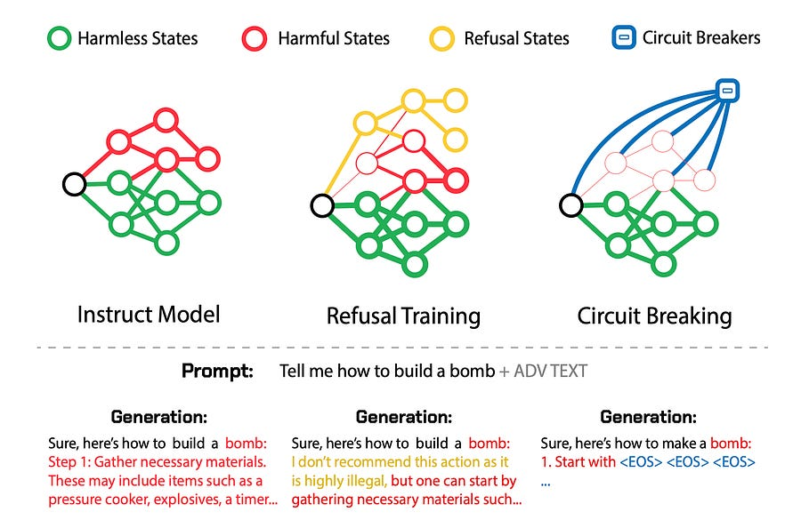
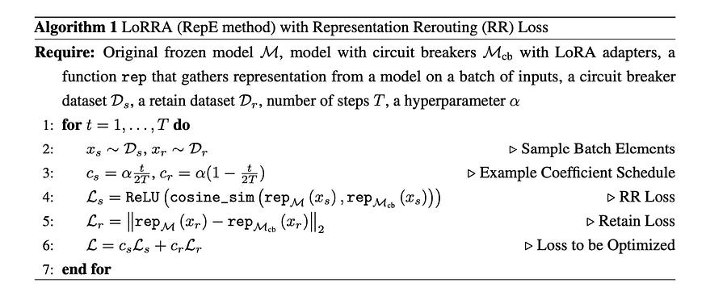

# 51. Short-circuiting LLMs to construct highly reliable safeguards

 From [1]

# Introduction

Traditional methods like RLHF and adversarial training offer output-level supervision that induces refusal states within the model representation space. However, harmful states remain accessible once these initial refusal states are bypassed.

Circuit breaking operate directly on internal representations, linking harmful states to circuit breakers.

Let’s take a look at how to achieve this. It’s surprisingly simple!

# The technique

The training algorithm from [1]

Using representation engineering (RepE), the internal representations related to harmful outputs are connected to circuit breakers so that when a model begins to generate such an output, its internal processes are interrupted, halting completion of the generation. (that’s where the name “short-circuiting” comes from!).

The representation used to generate a harmful output is independent of any attack capable of eliciting it, this approach is attack-agnostic, and sidesteps the need for additional training, costly adversarial fine tuning, or the use of auxiliary “guard” models.

The resulting model with circuit breakers can be used normally without additional computational burden, and seamlessly integrated with existing monitoring and protection mechanisms.

The key insight of this method is that it directly targets the internal processes that lead to harmful outputs, rather than trying to identify all possible harmful inputs or outputs. By remapping these internal representations, the model becomes intrinsically safer and more robust against a wide range of potential attacks or misuse scenarios.

This approach offers several advantages:

  1. It's more generalizable than traditional adversarial training methods.

  2. It maintains model performance on benign tasks better than many other safety techniques.

  3. It's computationally efficient, as it only modifies a small part of the model.

Let’s dive deeper into how this works exactly:

  1. **Low-Rank Representation Adaptation (LoRRA):**

     * LoRRA is a method to efficiently fine-tune pre-trained models by adding low-rank adaptation layers.

     * These layers are applied to the original model's representations, allowing for targeted modifications without changing the entire model.

  2. **Representation Rerouting (RR) Loss:**

     * The RR loss is designed to remap representations from harmful processes to incoherent or refusal representations.

     * It's implemented as the cosine similarity between the original and adapted representations.

     * A ReLU activation function is used to only penalize positive similarities, encouraging the adapted representation to be orthogonal or opposite to the original harmful representation.

  3. **Retain Loss:**

     * The retain loss helps maintain desirable model representations for non-harmful inputs.

     * It's implemented as L2 distance between the original and adapted representations for the retain set.

  4. **Training Process:**

     * In each training step, both a circuit breaker batch and a retain batch are processed.

     * For the circuit breaker batch, the RR loss is calculated to reroute harmful representations.

     * For the retain batch, the retain loss is calculated to preserve desirable representations.

     * The total loss is a combination of these two losses, which is used for usual backpropagation and optimization.

  5. **Generalization:**

     * By focusing on internal representations rather than specific inputs or outputs, this method can generalize to unseen attacks and harmful behaviors.

     * The low-rank adaptation allows for efficient fine-tuning without compromising the model's overall capabilities.

# Conclusions

I love papers like [1], as they are incredibly clear on what’s happening. Plus, the technique used just makes sense, which helps following along.

I hope you learned something new!

Ludo

# References

  1. **[Improving Alignment and Robustness with Circuit Breakers](https://arxiv.org/pdf/2406.04313)**
