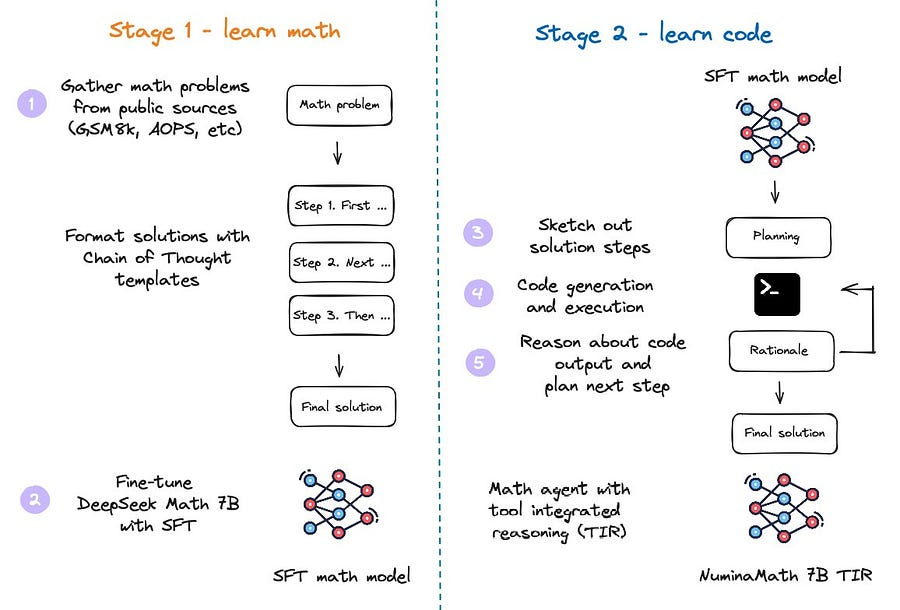

# 55. Artificial Intelligence Math Olympiad: Deep dive into Numina solution.

*A lesson in iterating through different approaches with LLMs.*

*A lesson in iterating through different approaches with LLMs.*

 From [1]

# Introduction

Today’s deep dive is a masterclass of iterating on an LLM solution.

We are going to dissect the winning solution of the kaggle challenge “AI Math Olympiad”.

What you are going to get out of today’s article:

  * Lean how to finetune a model to make it become a reasoning agent integrated with Python execution capability 

  * Understand the secret sauce behind the winning solution: a novel decoding algorithm to generate solution candidates during inference

  * How to craft the perfect dataset for a specific task.

It really puts together a lot of ideas that I have explored in the previous posts:

  * Data quality is everything. I discussed that in 48\. High Quality Pretraining data

  * AI systems are made up of different moving pieces, not a single giant model you can API call. I talk about that in 45\. AI Compounds systems

Let’s dive right in!

# The challenge

The goal of the challenge is to create algorithms and models that can solve tricky math problems written in LaTeX format.

The problems are at around the [AMC'12](https://artofproblemsolving.com/wiki/index.php/AMC_12_Problems_and_Solutions) level. (Already getting quite challenging, but not international mathematical olympiads level, although that’s the goal!)

# From 8/50 to the winning solution of 29/50

The initial solution is quite straightforward. 

> The team finetuned DeepSeekMath-Base 7B to act as “reasoning agent” that can solve mathematical problems via a mix of natural language reasoning and the use of the Python REPL to compute intermediate results.

They followed the training recipe introduced already by MuMath [2].

#### **First finetune**

First, they finetuned on diverse dataset of natural language problems and solutions with Chain of thoughts (CoT).

This initial submission only scored 8/50.

#### **Second finetune: crafting the perfect dataset**

Then, they focused their effort on crafting a strong synthetic dataset of tool integrated reasoning where each math problem is decomposed into a sequence of rationales, python programs and their outputs. They used this second dataset to further finetune the model.

What I find incredibly interesting is that they performed full fine tuning in both stages, that is they did not parameter efficient finetuning like LoRA, Q-LoRA or Q-Galore because they were not scared of being stuck in experimentation mode with different params.

This dataset consists of several hundred thousand problems, each with solutions written in a Chain of Thought manner. The sources of the dataset range from Chinese high school math exercises to US and international mathematics olympiad competition problems.

The data was collected from online exam paper PDFs and mathematics discussion forums.

Citing [1], The processing steps include:

  1. OCR from the original PDFs.

  2. Segmentation into problem-solution pairs.

  3. Translation into English.

  4. Realignment to produce a Chain of Thought reasoning format.

  5. Final answer formatting.

But, they did not stop here and went further than that!

They selected 60k problems and utilized a pipeline leveraging GPT-4 to generate [TORA](https://github.com/microsoft/ToRA)-like reasoning paths, executing the code and producing results until the solution was complete.

#### **New decoding approach**

Here, I am just going to describe as they do in [1]:

  1. For each problem, copy the input N times to define the initial batch of prompts to feed the LLM. This effectively defines the number of candidates one uses for majority voting.

  2. Sample N diverse completions until a complete block of Python code is produced.

  3. Execute each Python block and concatenate the output, including tracebacks if they appear.

  4. Repeat M times to produce a batch of generations of size N and depth M, allowing the model to self-correct code errors using the traceback. If a sample fails to produce sensible outputs (e.g., incomplete code blocks), prune that result.

  5. Postprocess the solution candidates and then apply majority voting to select the final answer

Looking the technique “in the face” really demystifies the whole thing!

# **Final notes**

They also mentioned some additional and unsexy challenges:

  * They had to quantize the model to 8bit to make it fit on the GPUs as the competition as pretty stringent requirements on compute.

  * They could have quantized to 16bit to improve performance a little, but they preferred to keep it to 8bit to get some more speed. As I like to say: developer speed >>> everything :D.

  * Training a pure CoT model and using majority voting for evaluation naively did not work as well

  * **Avoided overfitting by crafting four strong evaluation datasets.** The fundamentals never get old ;)

  * They run out of time and could not try a very promising approach using KTO [3] and finetune the model using a similar approach to Orca-Math [4].

I really loved how the decoding approach “makes sense when you read it” and I love the fact that at the end of the day it’s all about data, compute and evals.

Liked this? Tell me about it!

* * *

# References

  1. **[Winning AIMO progress prize](https://huggingface.co/blog/winning-aimo-progress-prize)**

  2. **[MuMath-Code: Combining Tool-Use Large Language Models with Multi-perspective Data Augmentation for Mathematical Reasoning](https://arxiv.org/abs/2405.07551)**

  3. **[KTO: Model Alignment as Prospect Theoretic Optimization](https://arxiv.org/abs/2402.01306)**

  4. **[Orca-Math: Unlocking the potential of SLMs in Grade School Math](https://arxiv.org/abs/2402.14830)**
