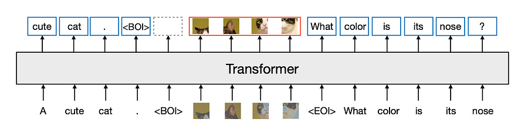
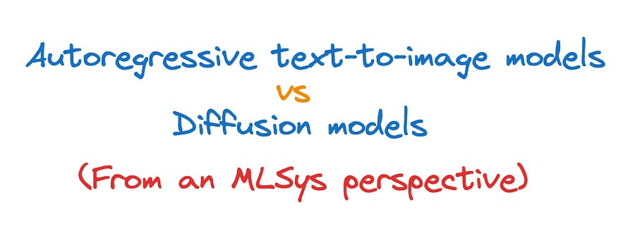

# 56. Transfusion: Predict the Next Token and Diffuse Images with One Multi-Modal Model.

*Transfusion combines the language modeling loss function (next token prediction) with diffusion to train a single transformer over mixed modality sequences*

*Transfusion combines the language modeling loss function (next token prediction) with diffusion to train a single transformer over mixed modality sequences*

From [1]

# Introduction

In one of my previous articles, I compared autoregressive text-to-image models against diffusion models from a point of view of machine learning systems (i.e. inference speed, ease of training, etc) you can find it here:

[49\. Autoregressive text-to-image vs Diffusion models.Ludovico Bessi·August 11, 2024[Read full story](2024-08-11-49-autoregressive-text-to-image-vs.md)](2024-08-11-49-autoregressive-text-to-image-vs.md)

Today we are going to take a look at a brand new model from Meta that aims at taking the best of both worlds. It’s a multimodal model by nature, so you get image results that are on par with diffusion while keeping strong generation capabilities!

# The model

Transfusion is a single model trained with two objectives: language modeling and diffusion. Each of these objectives represents the state of the art in discrete and continuous data modeling. The main innovation is that you can use separate losses for different modalities over shared data and parameters.

Each string is tokenized into a sequence of discrete tokens.

Each image is encoded as latent patches using a VAE. Patches are sequenced left to right top to bottom to create a sequence of patch vectors from each image. A new special token is created to highlight that the image input is ending and beginning.

The vast majority of the model’s parameters belong to a single transformer, which processes every sequence, regardless of modality.

The transformer takes a sequence of high-dimensional vectors as input, and produces similar vectors as output. To convert the data into this space, lightweight modality-specific components with unshared parameters are used.

## Transfusion attention

Language models typically use causal masking to efficiently compute the loss and gradients over an entire sequence in a single forward-backward pass without leaking information from future tokens. While text is naturally sequential, images are not, and are usually modeled with unrestricted (bidirectional) attention. Transfusion combines both attention patterns by applying causal attention to every element in the sequence, and bidirectional attention within the elements of each individual image. This allows every image patch to attend to every other patch within the same image, but only attend to text or patches of other images that appeared previously in the sequence.

Enabling intra-image attention significantly boosts model performance!

## Training objective

It is exactly what you imagine: combine the language modelling objective (next token prediction) with the diffusion objective (prediction of image patches).

This formulation is a specific instantiation of a broader idea: combining a discrete distribution loss with a continuous distribution loss to optimize the same model.

## Inference

Reflecting the training objective, the decoding algorithm also switches between two modes: LM and diffusion. In LM mode, the standard practice of sampling token by token from the predicted distribution is followed.

When an “image generation begin” token is found, the decoding algorithm switches to diffusion mode, where the standard procedure of decoding from diffusion models is followed.

Once the diffusion process has ended, an “image generation complete” token is appended the predicted image, and the decoding process switches back to LM mode again.

# Scaling

One of the major advantages of autoregressive models was that you could use all the little MLSys tricks that are already available for LLM inference also in that setting.

The prominent open-science method for training a single mixed modal model that can generate both text and images is to quantize images into discrete tokens, and then model the entire token sequence with a standard language model. The key difference with Transfusion is that it keeps images in continuous space, removing the quantization information bottleneck that we find for “baseline approaches”.

Transfusion actually scales significantly better than quantising images and training a LLM over discrete image tokens. It looks like we can mix and match to get

# Conclusion

Transfusion represents an exciting new direction in multimodal AI models, aiming to combine the strengths of autoregressive language models and diffusion-based image generation. By using a shared transformer architecture with modality-specific components and a hybrid attention mechanism, it can easily handle both text and image data.

Key advantages of this approach include:

  1. Unified architecture for multiple modalities

  2. Combination of causal and bidirectional attention for improved image modeling

  3. Retaining continuous image representations, avoiding information loss from discretization

  4. Scalability that outperforms pure language model approaches on images

Exciting stuff!

Let me know if you plan on using them in your systems!

Ludo

# References

  1. **[Transfusion: Predict the Next Token and Diffuse Images with One Multi-Modal Model](https://arxiv.org/pdf/2408.11039)**
