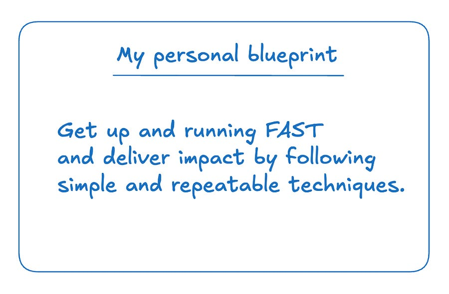

# 58. My personal blueprint to get up and running fast when joining a new company / new team. 

*Simple techniques you can apply as well!*

*Simple techniques you can apply as well!*

# Introduction

You are joining a new team at your current company or you are joining a new company from outside.

You are pumped! You want to make a good first impression and start delivering!

But… you are stuck following the usual “onboarding routine” of new members of the team and you are not able to shine as you know you are capable of.

Let’s get that solved right here and now with a few simple ideas.

But first, let’s clarify the goal.

# Goal(s)

  * Accumulate respect from both engineering and business side so you can trade that for space and agency

  * Being able to break company soft/hard rules to get things done fast.

  * When colleagues think of you, they say: “Ah, that ludo, loved working with him. He should be driving more projects in the org!”

Let’s see how to get there. Not all advice will be applicable, but I hope you can get something out of my experiences.

# Idea #1: Shorten the onboarding process as much as possible.

The shorter your onboarding (e.g. the period where you lack the capacity to deliver high-quality code at speed, the better your "onboarding" is going to be).

As a corollary, first impressions also really do matter.

There is really no trick, but you need to understand how to play the game.

This is the mindset you need to have (from [1]):

  * I just joined -- I am a tool to be used. I must be serviceable and provide value.

  * No task is too small, no discussion or person is beneath me.

  * Everything should be tackled head-on with clear communication and reporting.

  * Be fast(er than anyone else).

    * The faster I am, the more I can do, the closer I can get to being able to work on what I want.

Spend ages in the codebases, mapping systems and their relationships out, where the data is stored, where does it go, who transforms it, why do we do this at all.

Go up and down the stack. 

Ask people for their top 3 biggest projects and read all their PRs, observe how things get done, how problems get approached and solved.

To survive the first few weeks, you need to learn fast what system you can label as “black box” and don’t investigate further. If you really go down every code path you will never finish onboarding. Use your judgement here!

# Idea #2: Become the go-to person for a specific part of the codebase (bonus points if it’s driving a lot of business value)

Following point 1., by this time you have identified important systems (that maybe lack a bit of ownership? after all, if you got hired the reason is that there’s more work to do than people actively working).

Be willing to spend some time mapping out systems and understand if something is lacking that you can start fixing. (there’s alway something that needs fixing)

Once you identify it (that’s the hardest part), just go and fix. Rinse and repeat a few times. Congrats, if your team work on big enough systems, you are probably already quite up to speed if not the expert.

Remember, it’s the time to start DOING things. I assure you are overthinking it with all the reading and taking notes and writing down diagrams for the architecture.

Just go in and DO stuff.

# Idea #3: Build the right relationships

Following part 2., you don’t only map systems out. You map people AND systems out. In that order.

Who are the 20% doing the 80% that matters?

  * What does this person do? How close are they to the core primitives of what makes the company tick?

  * How is their code? Can I see it? Is it impressive?

Once you have a solid list, try to get closer. Understand what they work on (and WHY). Read their PRs, understand who they work with.

The goal here is to simply understand:

  * How can you become more like them?

  * How can you absorb their knowledge, their skills and everything they have that you currently don’t have.

Over time, the goal is to also be able to work with them directly even for a small self-contained project. If they work with you, they should want to vouch for you, which should help you get to the most interesting projects when the time comes.

Remember, the majority of the engineers are perfectly capable of doing 99% of the projects at their level of expertise. The problem is that there are not so many “cool projects”, so not everyone gets an impactful process.

Your goal is to always get the impactful project or, even better, being able to create it yourself.

# Idea #4: Do your job well, do it fast, solve your manager problems.

How do you progress further?

Simple, but not easy.

Do your job well. Ask your manager what problem they are having and brainstorm how you can help them solving them.

Do it. At this moment in time, you should not care what the project is.

Now, after having proved to your manager that you can other problems and solve them. Try to also ask for specific problems you like and you feel will be aligned with your growth and interest.

# Closing off

Hope you learnt something that will speed up your next onboarding!

Do you have any tricks that I did not mention here to speed up the onboarding process and develop fast when changing teams? I’d love to hear them!

Ludo

# References

  1. [Becoming competitive when joining a new company](https://ludwigabap.bearblog.dev/on-becoming-competitive-when-joining-a-new-company/)
