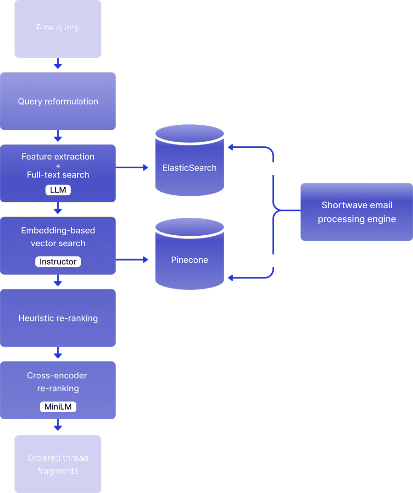

# 61. How shortwave designed the world smartest email using RAG systems

*And how you can learn how to the same by reading this post ;)*

*And how you can learn how to the same by reading this post ;)*

# Introduction

Following last week article about LinkedIn GenAI platform, let’s continue with another RAG based system. This time, we are making email smarter.

Let’s see how they do it!

# The system (it’s big!)

From [1]

That’s a lot take in. Let’s break it down.

The job of AI search is to find emails that are relevant to answering the user's question from across their entire email history, and to rank them by usefulness so that smart tradeoffs can be made during question answering.

## Query reformulation

Query reformulation takes a query that lacks needed context, and rewrites it using an LLM so that it makes sense on its own. Query reformulation considers anything that is visible on the screen that the user might be referring to, including the chat history, the currently visible thread, and any current draft. So, for example, you can ask “find similar emails”, and query reformulation would turn that into “Find emails similar to this email about my flight to Phoenix”.

## Feature extraction and full text search

Often, the best way to find relevant emails is to use traditional full-text or metadata-based queries. If you can figure out what queries to run, you can simply use traditional search infrastructure to find relevant emails.

Fortunately, LLMs can help out here!

From the reformulated query, a collection of features that describe attributes in the question that might yield useful queries is extracted.

Then, look for the usual things. Date ranges, names of people, keywords, email addresses, labels and so on.

You can do this by a large number of parallel calls to a fast LLM, each optimized to extract a specific feature. Having these LLM calls be independent of each other enables a degree of modularity that makes it easier to test and evolve them.

Each extracted feature is also assigned a confidence score to improve explainability.

## Embedding based vector search

In many cases, keyword and metadata-based searches are not enough to find the emails we are looking for. Fortunately, we have a more powerful semantic-aware search technique that can help us in those cases: vector embedding search. When we ingest an email into Shortwave, we use an open source embedding model ([Instructor](https://huggingface.co/hkunlp/instructor-large)) to embed the email. We do this on our own servers with GPU acceleration for improved performance, security, and cost. Then, we store that embedding in our Vector database ([Pinecone](https://pinecone.io/)), namespaced per-user (the namespacing is one of the main reasons we chose Pinecone).

## Heuristic reranking

Once all of the emails from the traditional and embedding search have been identified and their metadata has been loaded, a large collection of emails to sort through is created. This often results in a thousand or more emails, far too many to fit into a prompt. It is necessary to reduce this to just a few dozen results, and this must be done quickly.

If a date range feature has been previously extracted from the query, a Gaussian filter is applied to the similarity scores, boosting the emails that fall within the date range and penalizing everything else. The exact parameters of the Gaussian filter are tied to the confidence score of the date range feature. This approach allows for prioritization of emails within a specific time period while still considering emails outside that time period with some tolerance.

If any names, people, or email addresses were extracted from the query, emails that mention those contacts are given a boost. Similarly, the magnitude of this boost is determined by the confidence score of the feature.

If any label names were extracted from the query, emails with those labels receive a boost.

When the query exhibits a high recency bias (another extracted feature), more recent emails are prioritized over older ones. This ensures correct handling of questions like "Where was our last offsite held?" which focuses on the most recent offsite rather than older ones.

Promotions and Updates are de-prioritized in favor of higher-value emails.

For cross-encoder re-ranking, the most powerful technique involves an open-source cross-encoding model specifically designed for this task. The MS Marco MiniLM model, running on proprietary GPUs, is utilized. Although this model is more sophisticated than the heuristics, it is also slower. Therefore, only the top-ranked email thread fragments from the previous step are processed through the cross-encoder model.

# Closing thoughts

Despite the complexity of the system, it has been optimized to be able to answer almost all questions within 3-5 seconds. This end-to-end latency includes multiple LLM calls, vector DB lookups, ElasticSearch queries, calls to open-source ML models, and more. Heavy use is made of concurrency, streaming, and pipelining to achieve this. A large amount of compute power is also applied to the problem: beefy servers and clusters of high-end GPUs are utilized.

As can be seen, building a real-world, production-ready AI assistant deeply integrated into real application data is a complex task.

I believe today’s article really shows how deep into the rabbit hole you need to go to create a production ready system.

Hope you enjoyed today’s article! :)

Ludo

# References

  1. [Deep dive into the world smartest email](https://www.shortwave.com/blog/deep-dive-into-worlds-smartest-email-ai/)
