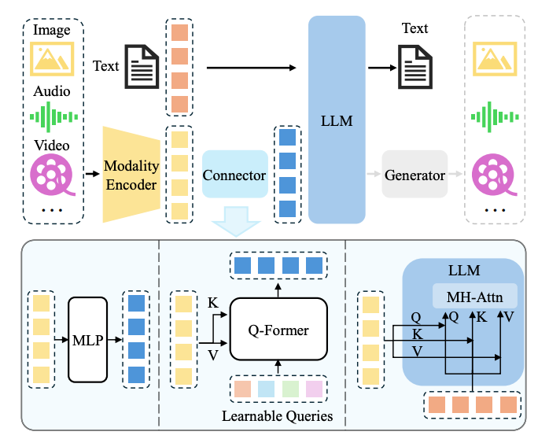
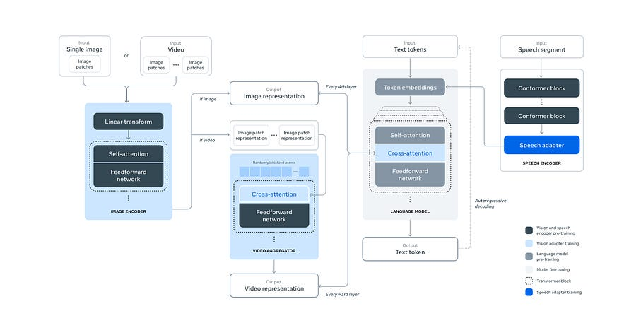

# 63. How multimodal LLMs (MLLM) work under the hood?

*Deep dive and case studies*

*Deep dive and case studies*

# Introduction

In the rapidly evolving field of artificial intelligence, Multi-modal Large Language Models (MLLMs) are pushing the boundaries of what machines can understand and generate. They combine the power of text-based language models with the ability to process and interpret other forms of data, such as images and video.

This article dives into the architecture and principles behind MLLMs, exploring how they bridge the gap between different modalities of information to create more versatile and capable AI systems.

At the heart of MLLMs are three key components:

  * a pre-trained modality encoder

  * a pre-trained Large Language Model (LLM)

  * a modality interface that connects them.

In today’s article I will examine each of these elements in detail, with a particular focus on the crucial role of the modality interface.

We'll explore the two main approaches to implementing this interface:

  * token-level fusion

  * feature-level fusion 

And discuss their respective strengths and challenges. To illustrate these concepts, we'll take a close look at Meta's approach to adding visual capabilities to their Llama 3 model, providing insights into the cutting-edge techniques used in developing state-of-the-art MLLMs.

Let’s go! :)

# General overview

From [2]

A typical MLLM can be abstracted into three modules, i.e. a pre-trained modality encoder, a pre-trained LLM, and a modality interface to connect them.

In between, the modality interface serves to align different modalities. Some MLLMs also include a generator to output other modalities apart from text.

## Modality encoder

The encoders compress raw information, such as images or audio, into a more compact representation. Rather than training from scratch, a common approach is to use a pretrained encoder that has been aligned to other modalities. For example, CLIP incorporates a visual encoder semantically aligned with the text through large-scale pretraining on image-text pairs. Therefore, it is easier to use such initially pre-aligned encoders to align with LLMs through alignment pre-training- Apart from vanilla CLIP image encoders, some works also explore using other variants. Thus, the model naturally supports flexible image resolution input.

## Pre-trained LLM

Instead of training an LLM from scratch, it is more efficient and practical to start with a pre-trained one. There is not much to be said here, pick your favourite LLM and run with it :).

## Modality interface

Since LLMs can only perceive text, bridging the gap between natural language and other modalities is necessary. However, it would be costly to train a large multimodal model in an end-to-end manner. A more practical way is to introduce a learnable connector between the pre-trained visual encoder and LLM. 

It is responsible for bridging the gap between different modalities. Specifically, the module projects information into the space that LLM can understand efficiently. Based on how multimodal information is fused, there are broadly two ways to implement such interfaces, i.e. token-level and feature-level fusion. 

Token-level fusion:

  * Think of this as "translating" other modalities into something the LLM can directly understand.

  * You're basically converting non-text data into tokens that can be mixed with regular text tokens.

  * It's like creating a universal language that both the vision model and LLM speak.

Common approach:

  * Use learnable query tokens to extract info from visual features.

  * Transform these into a format compatible with text tokens.

  * Concatenate with text tokens before feeding into LLM.

Example: LLaVA

  * Uses simple MLP to project visual tokens.

  * Aligns feature dimensions with word embeddings.

Key point: The number of visual tokens and input resolution matter more than the specific adapter architecture.

Feature-level fusion:

  * Instead of converting everything to tokens, this approach lets different modalities interact more deeply.

  * It's like adding bilingual translators throughout the LLM's processing pipeline.

Examples:

  1. Flamingo: Adds cross-attention layers between frozen Transformer layers.

  2. CogVLM: Inserts "visual expert" modules in each Transformer layer.

  3. LLaMA-Adapter: Uses learnable prompts embedded with visual knowledge as prefixes.

Trade-offs:

  * Token-level is simpler and often performs well on tasks like VQA.

  * Feature-level allows for deeper integration but can be trickier to tune.

The interface is tiny compared to the main models, but it's doing the crucial job of bridging modalities.

# Case study: Meta Llama 3 multimodal model

From [1]

Ok, we have seen the general idea. Now, let’s see a specific example coming from Meta!

The Big Picture: They're not training a huge multimodal model from scratch. Instead, they're taking a pre-trained Llama 3 and a pre-trained image encoder, then teaching them to work together. It's like introducing two experts who speak different languages and training an interpreter to help them communicate.

  1. The Two-Stage Approach: a) Image Stage:

     * Take a pre-trained image encoder (think CLIP-like model)

     * Add cross-attention layers between this and Llama 3

     * Train on tons of image-text pairs

  2. The Two-Stage Approach: b) Video Stage:

     * Add temporal aggregator layers (to understand sequences of images)

     * More cross-attention layers for video

     * Train on tons of video-text pairs

  3. Why This Approach is Clever:

     * Parallel development: Can work on language and vision separately

     * Avoid tokenization headaches: No need to figure out how to tokenize images

     * Preserve text performance: Llama 3's text abilities stay intact

     * Compute efficient: Don't need to run full images through the entire LLM

  4. The Image Encoder:

     * ViT-H/14 (Vision Transformer, Huge version, 14x14 pixel patches)

     * 630M parameters initially, bumped to 850M

     * Trained on 2.5B image-text pairs

     * Outputs 7680-dim vector for each of 256 patches (16x16 grid)

  5. The Image Adapter:

     * Cross-attention layers every 4th Llama 3 layer

     * Uses Generalized Query Attention (GQA) for efficiency

     * For Llama 3 405B, this adds about 100B parameters (it's chunky!)

  6. Video Adapter:

     * Can handle up to 64 frames

     * Temporal aggregator: Squishes 32 frames into 1

     * More cross-attention layers (every 4th image cross-attention layer)

  7. Data Processing (it's intense):

     * Quality filtering: Remove low-quality captions

     * De-duplication: Using SSCD model and clustering

     * Resampling: Boost rare concepts

     * OCR: Add text from images to captions

     * Safety checks: Remove NSFW content, blur faces

     * For video: Filter low-motion, ensure alignment, etc.

  8. Cool Tricks:

     * Multi-layer feature extraction from image encoder

     * Synthetic data generation (captions, structured images)

     * Visual grounding (linking text to image regions)

     * Screenshot parsing for UI understanding

Before, we discussed about feature level vs token level fusion approaches.

Meta decides to got Feature-Level: using cross-attention layers to let Llama 3 "look at" image features throughout its processing.

  * Pros:

    * Flexibility: The cross-attention mechanism allows the model to attend to different parts of the image at different stages of processing.

    * Preserve visual structure: By not converting images to tokens, they keep the spatial relationships intact.

    * Scalability: This approach scales better to high-resolution images and videos.

    * Modularity: Easier to swap out or upgrade the image encoder without retraining the entire system.

  * Cons:

    * More complex architecture

    * Potentially harder to train and tune

**Key implementation details:**

  * Cross-attention layers every 4th Llama layer: This lets visual information influence text processing at multiple levels of abstraction.

  * Multi-layer feature extraction from the image encoder: Provides both low-level and high-level visual features to the LLM.

  * Temporal aggregator for video: Allows feature-level fusion of temporal information without explosion of token count.

# Closing thoughts

I really loved writing out this article, as at the end of the day the techiniques employed are quite easy to understand and logical.

Hope you enjoyed it!

Ludo

# References

  1. [LLAMA-3 report](https://arxiv.org/abs/2407.21783)

  2. [Survey on multimodal LLMs](https://arxiv.org/abs/2306.13549)

  3. [Recent advances in multimodal LLMs](https://arxiv.org/pdf/2401.13601)
