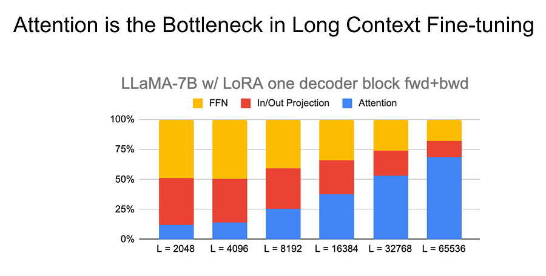

# 64. Breaking the Attention Barrier: A Deep Dive into Scaling LLM Context Length

*aka let's save some money!*

*aka let's save some money!*

# Introduction

We all know the usual “Attention is expensive, it’s O(N^2) time and space complexity”.

Which means that the longer the context, the worst your wallet will feel :D. 

That’s all there is to it, money!

Ok, let’s stop crying about it and see how we can fix this while maintaining strong performance.

How can we deal with attention cost? We generally have a few levers to pull:

  * Make the computation more efficient, duh! (Alternative attention mechanisms)

  * Compute less, duh! (Approximate attention mechanisms)

Let’s dive deep into the approaches and understand what’s going on for each of them.

I will also talk about how to actually extend context of models. This will be fun :)

Caution! This article is DENSE. Take your time, I promise it will be worth it.

# Make computation more efficient

## **FlashAttention**

Flash Attention is an algorithm designed to address the memory and computational bottlenecks associated with attention mechanisms in large language models. Traditional attention computations require storing the entire attention matrix in memory, which becomes prohibitively expensive for long sequences. Flash Attention overcomes this limitation by utilizing a tiling approach, where it computes attention in smaller blocks or tiles, significantly reducing memory usage.

The key insight behind Flash Attention is its strategic balance between computation and memory access. Instead of storing the full attention matrix, it recomputes certain values on-the-fly. This trade-off is beneficial because on modern hardware, particularly GPUs, computation is often faster and more energy-efficient than memory access. By leveraging this principle, Flash Attention achieves better hardware utilization, resulting in faster processing times and reduced energy consumption.

One of the most appealing aspects of Flash Attention is its easy integration into existing transformer architectures. It doesn't require changes to the model architecture or training process, making it a drop-in replacement for standard attention mechanisms.

## RingAttention

Ring Attention is a distributed attention mechanism specifically designed to optimize multi-GPU training of large language models. As models grow in size and complexity, efficiently distributing computation across multiple GPUs becomes crucial. Ring Attention addresses this challenge by reorganizing the communication pattern between GPUs to reduce overhead and improve scalability.

The core idea of Ring Attention is to arrange the GPUs in a logical ring topology. In this configuration, each GPU is responsible for computing partial attention scores and values for a subset of the data. Instead of using all-to-all communication, where every GPU needs to communicate with every other GPU, Ring Attention employs a more efficient ring communication pattern. Each GPU passes its partial results to its neighbor in the ring, and this process continues until all GPUs have aggregated the necessary information.

This approach offers several advantages. Firstly, it significantly reduces the communication overhead, as each GPU only needs to communicate with its immediate neighbors in the ring. Secondly, it scales well with an increasing number of GPUs, making it particularly suitable for large-scale distributed training setups. The ring topology also allows for better load balancing and more predictable communication patterns, which can lead to more efficient hardware utilization. While Ring Attention may introduce a slight increase in latency due to the sequential nature of communication along the ring, the overall reduction in communication volume often results in net performance gains, especially for larger models and GPU clusters.

## ChunkAttention

Chunk Attention is an approach developed to handle extremely long sequences in attention-based models. Chunk Attention addresses the quadratic limitation by processing the input sequence in smaller, manageable chunks.

In Chunk Attention, the input sequence is divided into fixed-size chunks. Attention is then computed in two stages: first, within each chunk, and second, between chunk representations. This chunking strategy allows the model to capture local context within chunks efficiently while still maintaining some ability to process global context through the inter-chunk attention. By doing so, Chunk Attention significantly reduces the memory requirements and computational complexity for long sequences.

While Chunk Attention does trade off some global context for improved efficiency, it has proven effective in many applications, particularly those involving long documents or time series data. It can be combined with other efficiency techniques, such as sparse attention patterns or low-rank approximations, to further improve performance. One of the challenges in implementing Chunk Attention is determining the optimal chunk size, which often involves a trade-off between computational efficiency and model performance.

## BlocksparseAttention

BlockSparse attention specifies blocks of the input to attend to, instead of calculating attention across all tokens.

The key idea is that not all tokens in a sequence need to attend to each other. For many tasks, only local or structurally relevant tokens are necessary for effective processing. BlockSparse attention takes advantage of this by splitting the input into smaller blocks and computing attention only within these blocks. This reduces the overall complexity of the attention mechanism, allowing the model to handle longer sequences more efficiently.

# Compute less

## Reformer

One of the key innovations in Reformer is the use of locality-sensitive hashing (LSH) attention. LSH is a technique that allows for quick approximation of nearest neighbour search in high-dimensional spaces. In the context of attention, LSH is used to group similar items together, allowing the model to compute attention only within these groups rather than across the entire sequence.

This dramatically reduces the computational complexity from quadratic to log-linear, making it feasible to process much longer sequences. Additionally, Reformer uses reversible layers, a technique inspired by reversible neural networks, which allows the model to reconstruct activations on-the-fly during backpropagation rather than storing them in memory.

Another important feature of Reformer is its use of chunked feed-forward layers. In standard transformers, the feed-forward layers often consume a significant portion of the model's memory. Reformer addresses this by processing these layers in chunks, reducing the peak memory usage. This chunking, combined with the LSH attention and reversible layers, allows Reformer to handle sequences of tens of thousands of tokens on commodity hardware, a feat that would be impossible with standard transformer architectures. Despite these significant changes, Reformer maintains the expressive power of traditional transformers, making it a powerful tool for tasks involving long-range dependencies, such as long document processing or music generation.

## Longformer

Longformer is an adaptation of the transformer architecture specifically designed to handle extremely long documents. Longformer introduces a novel attention pattern that scales linearly with sequence length, allowing it to process documents with tens of thousands of tokens efficiently.

The core innovation in Longformer is its attention mechanism, which combines local windowed attention with global attention. In the local windowed attention, each token attends only to a fixed-size window of surrounding tokens. This captures local context efficiently and scales linearly with sequence length. The global attention, on the other hand, is applied only to select tokens (such as [CLS] tokens or tokens at sentence boundaries) that attend to the entire sequence and are attended to by all other tokens. This combination allows Longformer to capture both local nuances and global context effectively.

Despite its modifications to the attention mechanism, Longformer can be initialized from pre-trained transformer models, allowing it to benefit from transfer learning. (!!!)

## Interested in LLM optimizations? [Let me know here!](https://app.youform.com/forms/tfc7z4jo)

# An (important) note on different architectures

Why is FlashAttention overall winning? I.e why don’t you see alternative architectures in papers from leading tech companies. The reason is that the scheme used are most of the times inefficient for accelerators (looking at you, Reformer). Flash/Sharding tricks let you cover plenty of context with vanilla transformers. 

In [8], they explained it well: 

Novel inductive biases can indeed be quite risky which might explain why most state-of-the-art LLMs are based on relatively vanilla architectures…

…amongst all ten architectures that we consider, the vanilla Transformer has the best scaling behaviour, even if its absolute performance at each compute region is not the greatest.

# Enabling long context ability for models like LLaMA?

## RoPE (Rotary position embedding)

Rotary Position Embedding (RoPE) is a technique used in transformers to handle the position of tokens in a sequence more efficiently. In standard transformers, position embeddings are added to token embeddings, but RoPE modifies this by encoding positions in a way that allows the model to capture the relative distance between tokens. This is especially helpful for tasks that depend on sequence order, such as language modeling.

What makes RoPE unique is how it uses trigonometric functions to create these embeddings. Each token is represented as a vector, and RoPE rotates these vectors based on their positions in the sequence. This rotation helps the model understand how far apart tokens are from each other, improving its ability to capture long-range dependencies. Since RoPE directly modifies the attention mechanism, it doesn't rely on adding positional information separately, leading to a more unified and efficient system.

## Positional Interpolation

Positional interpolation is a technique designed to extend the context window of transformers without having to retrain the model entirely.

This process involves interpolating between the original fixed position embeddings and the new, longer sequence. The idea is to smoothly transition between positions so that the model can generalize its understanding of relative token positions over larger contexts. With positional interpolation, models can work with much longer sequences than they were originally trained on, making it a practical solution for improving context length without full retraining.

## NTK-Aware Interpolation

NTK-aware interpolation builds on positional interpolation but incorporates insights from the Neural Tangent Kernel (NTK). The NTK provides a framework to understand how changes to the input sequence affect the model's behaviour, especially when scaling position embeddings. NTK-aware interpolation adjusts position embeddings more carefully, ensuring that the scaling preserves the original model's dynamics.

The idea behind NTK-aware interpolation is that position embeddings influence how models understand token relationships, so naive scaling might disrupt this understanding. NTK-aware methods take into account how the model was trained and adjust embeddings in a way that aligns with the learned relationships. This helps the model better generalize to longer sequences without losing the effectiveness of its pre-trained knowledge.

## PoSE (Portable sliding window embedding)

PoSE, or Portable Sliding Window Embedding, is a technique designed to extend the context window for language models by applying a sliding window mechanism. Traditional transformers process a fixed-length sequence at a time, which limits their ability to understand long documents or conversations. PoSE addresses this by breaking long sequences into overlapping windows and processing them in chunks, allowing the model to retain information across the windows.

In this method, embeddings are shared between overlapping tokens from one window to the next. By doing so, PoSE enables the model to "remember" key information from the previous window and continue building context as it processes further. This approach reduces the need for fully retraining models on extended context lengths while still capturing long-range dependencies.

## LongLora (Low-Rank Adaption for Long Contexts)

LongLoRA is an adaptation technique for extending the context length of language models without significantly increasing the model's parameter size. LoRA, or Low-Rank Adaptation, introduces low-rank updates to the model's weights during fine-tuning, allowing the model to adapt to new tasks or longer contexts without requiring full retraining. LongLoRA applies this principle specifically to the challenge of handling longer sequences.

The core idea behind LongLoRA is to focus on a few critical layers in the model, modifying them with low-rank matrices that improve the model's ability to capture long-range dependencies. This targeted approach allows the model to extend its context window with minimal computational overhead, as it doesn't require training all layers from scratch. LongLoRA is particularly useful when you need to adapt a pre-trained model to handle longer texts without significantly increasing memory or compute requirements.

## LM Infinite

LM Infinite is an architecture designed to overcome the limitations of fixed-context transformers by enabling virtually infinite context processing. Traditional transformers are constrained by a fixed-length context window, which limits their ability to remember earlier parts of long sequences. LM Infinite aims to break this limitation by introducing mechanisms that allow the model to process sequences of arbitrary length while still retaining important context from earlier tokens.

The key to LM Infinite is its memory management system, which selectively stores and retrieves information from earlier parts of the sequence as needed. This approach enables the model to maintain long-term dependencies without having to continuously process the entire sequence at once. Instead, the model can dynamically decide which parts of the context are relevant, ensuring that it remains efficient even as the sequence grows.

## StreamingLLM

Streaming LLM is an approach tailored for real-time language processing tasks, where input data arrives continuously over time, such as in live chat applications or transcription services. Unlike traditional models that process fixed-length sequences in a batch, Streaming LLMs operate incrementally, processing data as it arrives without the need to break it into discrete segments. This continuous processing allows the model to maintain a persistent understanding of the entire input stream, avoiding the common challenge of losing context when switching between segments or windows.

One of the key technical innovations in Streaming LLM is the model's ability to maintain a flexible, adaptive memory. Rather than resetting or discarding earlier context when new data is introduced, Streaming LLMs employ strategies that allow them to "remember" relevant information across a growing input stream. This could involve using recurrent attention mechanisms or memory-augmented networks, which enable the model to store and retrieve important past tokens efficiently. By continually updating its internal state, the model can maintain context over extended conversations, providing coherent and contextually aware responses in real time.

# Closing thoughts

Wow. That was a lot!

You now have broad overview of all the state of the art techniques you can employ when thinking about long context.

I hope you are satisfied (and proud!) of what you managed to read today :)

Ludo

# References

  1. [Chalenges of long context windows and new attention mechanism](https://docs.google.com/presentation/d/1sPpFV6BoNEqdh8ooBqRqIKDWCoHVnJO4sgi4NBg-UNo/edit#slide=id.g24dec93981b_0_0)

  2. [Extending context window of LLMs via positional interpolation](https://arxiv.org/abs/2306.15595)

  3. [Lost in the middle: how language models use long contexts](https://arxiv.org/abs/2307.03172)

  4. [Longformer: long document transformer](https://arxiv.org/abs/2004.05150)

  5. [Reducing activation recomputation in large transformer models](https://arxiv.org/abs/2205.05198)

  6. [Challenges in deploying long context](https://arxiv.org/pdf/2405.08944)

  7. [LightSeq](https://github.com/bytedance/lightseq)

  8. [Scaling Laws vs Model Architectures: How does Inductive Bias Influence Scaling?](https://arxiv.org/abs/2207.10551)
