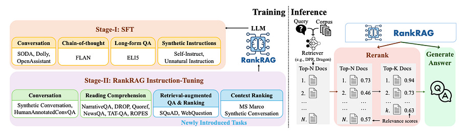

# 65. Finetuning LLMs to make them good at RAG: RankRAG by no other than NVIDIA.

*aka: you can finetune for everything!*

*aka: you can finetune for everything!*

# Introduction

When LLM need context, we default to RAG. From the user query, retrieve the top-k best contexts from your DB and give them in the LLM context.

What I want to discuss today is the following. You could finetune an LLM for the dual purpose of context ranking AND answer generation in RAG. Wouldn’t that be amazing?

That’s what NVIDIA did with RankRAG in [1]. Let’s understand how and the impact.

Let’s be clear here: you still need to use a retriever to actually get some context. But the idea is that you could further finetune the the LLM to make it capture the relevance between query and context and utilize the retrieved context for answer generation

# The technique

As usual, I love papers with easy to follow techniques and this is one of them!

## Stage 1: Supervised Fine-Tuning (SFT)

The first stage is a classic **Supervised Fine-Tuning (SFT)** process, which equips the LLM with fundamental instruction-following capabilities. This stage allows the model to perform basic language understanding and generation tasks effectively. However, while SFT enables models to follow instructions competently, their performance in RAG settings is often suboptimal. This is because SFT alone doesn't optimize the model to extract accurate answers from retrieved contexts, especially when the initial retrieval is less relevant.

## Stage 2: Unified Instruction-Tuning for Ranking and Generation

The second stage in RankRAG—**Unified Instruction-Tuning for Ranking and Generation** —aims to optimize the model for RAG tasks by introducing context ranking into the training process. This stage improves the LLM's capability to discern and prioritize the most relevant pieces of information from the retrieved context, making it robust even when the retriever returns noisy or irrelevant results.

RankRAG's approach involves training the model with a mix of five types of data that simultaneously enhance the model's generation and context-ranking skills.

It’s split into different components:

#### 1\. **Context-Rich QA Data**

This part of the training involves question-answering (QA) tasks where the model must generate answers based on a conversation history and a related document. This type of data encourages the model to handle complex, context-dependent generation.

#### 2\. **Retrieval-Augmented QA Data**

RankRAG introduces retrieval-augmented QA data to build robustness against irrelevant contexts. In this step, for each QA task, the model is provided not only with the gold-standard context but also with additional top-retrieved contexts from a BM25 retriever. These retrieved contexts often include "hard-negative" examples—contexts that do not contain the correct answer but may seem related. Training on this data makes the model better at ignoring irrelevant information during generation.

#### 3\. **Context Ranking Data**

In this part, the model learns to rank the importance and relevance of various pieces of information retrieved for a question. By training the LLM to distinguish between useful and irrelevant contexts, it becomes better at prioritizing the right context for generating accurate answers.

#### 4\. **Retrieval-Augmented Ranking Data**

This final data type involves training the model to determine the relevance of multiple contexts simultaneously. Given a question and several retrieved contexts, the model learns to rank them based on their relevance. This mimics the real-world test-time behavior of RAG, where top-_k_ contexts are chosen to generate answers.

## What about inference?

The core innovation of RankRAG lies in its modified inference pipeline, which incorporates an additional reranking step, turning the typical **retrieve-generate** approach into a more effective **retrieve-rerank-generate** pipeline.

  1. **Retrieve** : A retriever first gathers the top-N contexts from the corpus related to the input question.

  2. **Rerank** : The RankRAG model evaluates the relevance of these retrieved contexts by calculating the probability of generating the correct answer using each context. Based on these scores, the model reranks the contexts and retains only the top-_k_ most relevant ones.

  3. **Generate** : Finally, the model uses these top-_k_ contexts to generate the answer. By ensuring that only the most relevant contexts are used, RankRAG improves both the accuracy and relevance of the generated response.

# Closing thoughts

Incorporating context ranking into the RAG pipeline is quite interesting, particularly in scenarios where the initial retrieval is less reliable.

By training models to rank contexts effectively, RankRAG ensures that even imperfect retrieval results don't compromise the accuracy of the final answer.

If you are a machine learning engineer working with RAG models, RankRAG offers a powerful tool that I think you should try :).

Let me know what you think!  
  
Ludo

# References

  1. [RankRAG: Unifying context ranking with RAG in LLMs](https://arxiv.org/pdf/2407.02485)
