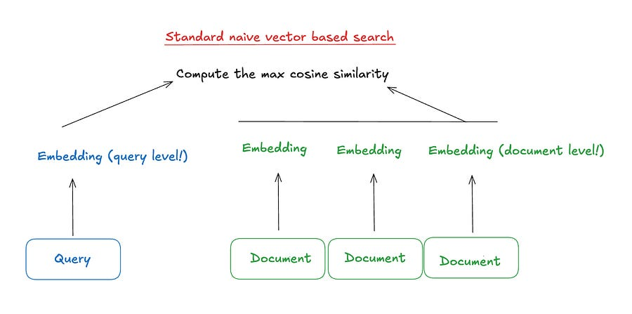
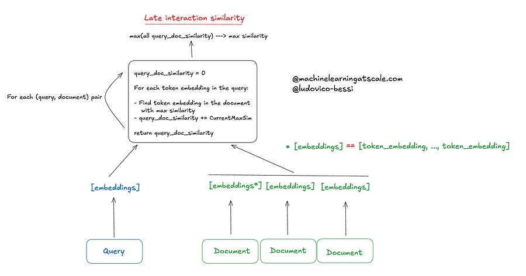

# 68. ColBERT and ColPALI: late interaction retrieval methods

*aka how to increase latency by making your retrieval pipeline work better!*

*aka how to increase latency by making your retrieval pipeline work better!*

# Introduction

Lately I have been going into a RAG-focused content, I hope you are enjoying it as much as I do! :)

Anyway, you can’t say you know RAG-stuff if you don’t know what are late interaction models. So here I am, discussing them for you! :)

This newsletter article will be split into:

  * What is late interaction

  * Colbert model

  * ColPali model

If you manage to read this article all the way, you will know everything there’s to know. 

Spoiler: it’s not so much. The machine learning community is sometimes too focused on jargon ;).

Let’s get started!

# What’s late interaction anyway?

In the context of RAG based systems, you are by this point very familiar with a flow like this:

Zzzz, so boring, right?

Let me hit you with something like this!

What’s happening? Instead of comparing “query/document level embedding”, we are comparing the token embeddings. That is, we are not pooling token embeddings together but using them.

This usually makes your metrics go brrrrrr.

But your infra team will probably scream at you as you are consuming so much GPUs and latency spikes… 

Tradeoffs aside, let’s see in a bit more detail what’s going on!

# ColBERT

  * Preserves token-level embeddings for both queries and documents.

  * The "late interaction" involves a more complex matching between individual token embeddings of the query and document.

  * Point above allows for a more fine-grained comparison, capturing relationships between specific words or subphrases.

  * ColBERT's interaction is more computationally intensive, but can potentially capture more relevant matches.

Not so hard, right?

# ColPALI

So far, we have only discussed text based documents.

But let’s not leave images out of the fun!

ColPALI is a visual retriever model that combines elements of Vision Language Models (VLMs) with the ColBERT retrieval strategy.

The core idea is to adopt ColBERT style late interaction but extend it to image patch embeddings.

  * It extends PaliGemma-3B (that’s where the name comes from) to generate ColBERT-style multi-vector representations for both text and images.

  * It uses patch embeddings from a SigLIP model as input to the PaliGemma-3B language model.

  * ColPALI generates multi-vector representations both textual and visual content.

  * Like ColBERT, ColPALI uses a late interaction strategy. It computes interactions between text tokens and image patches, enabling more nuanced matching.

Let’s discuss some important points:

### We now have both image and text embedding, how to use them together?

That’s a classic problem of aligning embeddings. You just need to learn a linear mapping (i.e. a matrix!) from one space to the other. Easy peasy!

### Context loss: patching vs chunking (and why patches handle context better)

It may seem like dividing image into patches is similar to breaking text into chunks.

Let’s see why that’s not the case!

In traditional text chunking, text is split into smaller chunks based on a certain number of tokens since many models have a limit on the number of tokens they can process at once.

**Problem with Context Loss:**

  * Chunking can split sentences or paragraphs mid-way, losing crucial contex and can result in incomplete information in one chunk and missing context in another.

  * Chunking doesn't preserve visual or structural information, like the relationship between headings and their corresponding content or the placement of text in tables or figures.

**Patches are more effective because:**

**No loss of structure:** The patches retain the visual structure of the document, preserving its spatial layout.

**Multi-modal context:** Patches capture both textual and visual information.

**Positional awareness:** Each patch has a positional embedding that tells the model where it is located on the page, helping the model understand the overall layout. This preserves visual hierarchy as well, as patches maintain this hierarchy because they are inherently aware of their position and size.

### Indexing benefits

You don’t have to do weird things to extract tables, plots and other things from your PDF / images. Just embed the patches (and encode both text and visual context at the same time!)

So, as you see: it does not make much to extend to multi modal for late interactions. (just a few gotchas!)

# Closing thoughts from an architectural POV

You now know what’s all the fuss about late interactions!

Remember that they increase latency and cost more. So don’t throw them in your pipeline without double checking requirements ;).

One way I have seen this used is in a standard two stage pipeline.  
First step, use a cheap method / heuristic to retrieve a lot of candidates (like thousands), 

Then, use a late interaction method to really get your top-K documents.

Let me know how you use them!

Ludo :)

# References

  1. [ColBERT](https://arxiv.org/abs/2004.12832)

  2. [ColPali](https://huggingface.co/blog/manu/colpali)

  3. [ColPali blog](https://antaripasaha.notion.site/ColPali-Vision-Language-Models-10f5314a5639803d94d0d7ac191bb5b1)
