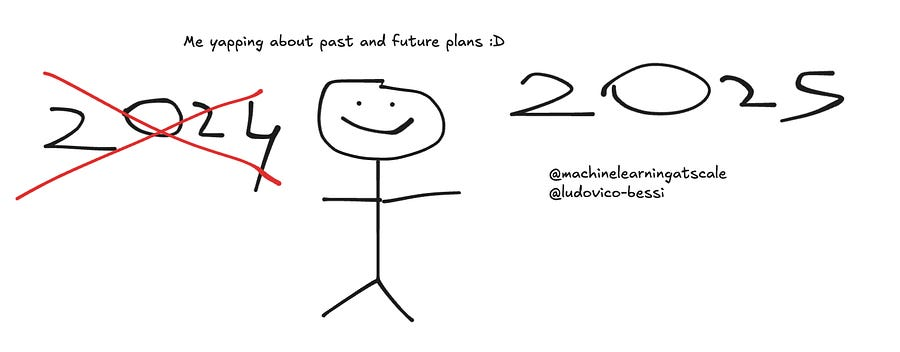

# 69. Closing the year off: stream-of-consciousness, looking back and forward 

*Rambling about 2025*

*Rambling about 2025*

No comment :D

# Introduction

Sooooo I love reflecting back at the end of the year and looking ahead. It’s corny I know, but I just feel warm inside doing it :).

Funny thing: I am writing the initial version of this on the 22th of September (lol), but I will surely edit this as posting time comes. (yeah, edited on the 22th of December!)

This article will be 100% more personal, a bit of a stream-of-consciousness if you will.

If you follow me just for tech things, maybe consider skipping? (But, you also lose on the plans I have for next year… jump to the last section if you are only into that!)

Starting things off, I just want to point out to September of last year. 

[Changes ahead for Machine Learning at scale·September 17, 2023[Read full story](2023-09-17-changes-ahead-for-machine-learning.md)](2023-09-17-changes-ahead-for-machine-learning.md)

One sentence jumps at me reading it back now: “ _Lately, the act of writing posts felt more of a chore rather than a pleasure.”_

Woah, looking back I remember that feeling.

How did I overcome that? After all, I started publishing again from May 2024 again every week. Something must have changed!

I think at the time I felt the obligation to post things that built towards my internet persona of “machine learning systems from companies - explained”. And I felt I had to respect that niche. After all, you are bombarded that you should niche down, otherwise people will not follow you and bla bla bla.

What a dumb mistake!

I snapped out of it and just started yapping about what I liked reading this week.

Who cares if followers count does not go up and to the right (lol it’s not like my life depends on it, just an ego thing)

So that was a first big change. I also got super excited about all the latest developments in the ML space, and felt like I needed to say my take on it! (rich from me, after talking ego a paragraph above)

I find it quite interesting how now I am always ~3 months ahead of “scheduled posts” without having an hard time. I just:

  * Read a lot **for myself** every day and take notes (my notion is exploding, pls notion ppl don’t do usage based pricing ever)

  * When I feel like it, convert the notes to newsletter articles. (does anyone know of a tool that helps streamline this? my newsletter issues are always very much 1:1 my notes, just me talking to you, should not be too hard, brb going to build it :D)

  * … profit?

Anyway, this year I focused on having fun talking to you about what interests me.

I am going to do forever? Am I going to change something going forward? (why not, change is fun right?)

Let’s find out!

# Future plans

## The weekly newsletter

Let me start off by saying that the way we consume machine learning content online is off. There’s sooo much noise! (i hope i am not part of the noise?)

Many subs have told me over and over that they like this newsletter because they are able to get a somewhat high-quality signal about some obscure thing that is interesting but did not discover themself.

So, I’d like to continue doing what I am doing with machine learning at scale.

What I will change here is that I want to also post on Twitter.

## The long content

However, people told me that they like the newsletter also because it’s short and to the point and demystifies a lot of concepts.

So, don’t get me wrong, I like that. But I also feel like I could go MUCH deeper. I feel like while short, there’s a lot golden little nuggets in my articles that “get lost in translation”?

I just condense my understanding and it comes off as short (plus my writing style is just concise), which is a plus, but maybe I am doing a disservice because of that.

I could really explain things from 0 to hero, instead of going off the rails on a particular hyper-niche topic I obsessed about on a random Tuesday morning lol.

I plan on creating a lot more long form content! I want to write more detailed things. I have a somewhat long list of things:

  * **RAG based systems: from 0 to hero (really)**

    * How does vector search work?

    * Naive rag implementation

    * Improving RAG with a tons of different techniques

    * Evaluating a RAG system

    * Cool libraries you can leverage to build a RAG application

    * … and million more things!

  * **LLMSys optimizations: all the tools to make your LLM go brrrrr in prod:**

    * Here I just have a long list of things to cover: from CUDA optimizations to different transformer architectures to quantization, to fast finetuning, and everything in between. Really bullish on this as I don’t see anyone covering it!

  * **LLM training**

    * How to go from random weights to useful models?

    * Everything from data collection to advanced RLHF.

  * **Designing machine learning systems:**

    * This would draw from all the deep dives I have done and condensing them in a really nice content. Many people are doing this but I don’t feel like the space is too crowded. And I feel like I have something to say here!

So many ideas! Just need to find the time to do it! :)

# Talking more about my career!

I think it’d be also super cool to discuss things I am up to at Google (without breaking any rules!). Fuck ups I have made, things I am excited about, my day to day learning.

Many articles about it have been received pretty well, especially:

[![\[Special edition\] Scaling Your Impact: Lessons learned from 1,000 Pull Requests and 100,000 Lines of Code](../assets/a7c1c2f7085e414f.png)[Special edition] Scaling Your Impact: Lessons learned from 1,000 Pull Requests and 100,000 Lines of CodeLudovico Bessi·July 26, 2024[Read full story](2024-07-26-special-edition-scaling-your-impact.md)](2024-07-26-special-edition-scaling-your-impact.md)

[66\. I am no longer postmortem free.Ludovico Bessi·December 8, 2024[Read full story](2024-12-08-66-postmortem-why-are-they-important.md)](2024-12-08-66-postmortem-why-are-they-important.md)

So I’d like to do more of this. Not much more to say about it!

# I do love writing, but I super bullish on video form content actually

I’d like to explore more video form content. That sounds really fun! I will probably start from creating short form content for my articles and attach them to my weekly posts. Those should point to long form videos that basically explain the newsletter content / going into more deep dives / talking about my career learnings.

**But that’s not all…**

I’d like to really help people becoming better machine learning engineers through: talking about MLSys topics, diving deep into some architectural tradeoffs, speaking with cool guests, andtalking about how to progress in your career.

That’s where long form video content comes into play. Stay tuned for that!

(Video content is a whole different beast though, so need to create systems around that to not burn out. Did I tell you I am training for a Olympic triathlon in June as well?)

# Summing it all up

So, in essence, I plan on:

  * Doing what I am doing with Machine learning at scale. Weekly deep dives! (but also post on X, because why not?)

  * More big PDFs going into the nitty gritty details of all-things-ML: from system design to anything really

  * Short form video content from YT channel to describe my newsletter article

  * Long form video content for all things related to my career and explaining stuff in more detail. Good intro to see if I like the idea of creating long form content for things that provide actual value!
