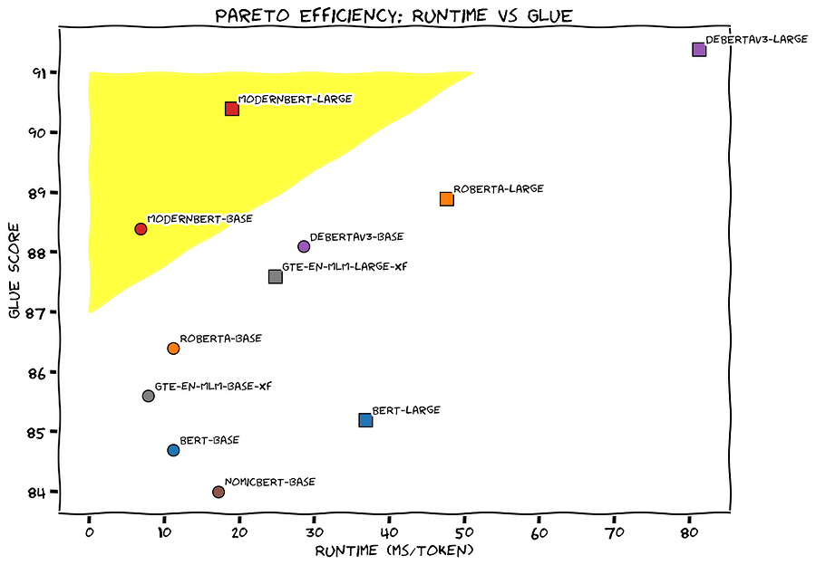

# Modern BERT

*the empire strikes back!*

*the empire strikes back!*

From [1]

## ModernBERT: A Deep Dive into the Encoder-Only Model Revolution

The release of BERT in 2018 marked a pivotal moment in the field of natural language processing (NLP). Despite its age (ancient in AI terms), BERT remains a cornerstone of many NLP applications. Its encoder-only architecture lends itself well to tasks like retrieval (for Retrieval Augmented Generation or RAG), classification, and entity extraction, making it a workhorse for real-world problems.

ModernBERT is poised to become the new standard for applications currently relying on encoder-only models. Its enhanced speed, accuracy, extended context length (8k tokens vs. 512 for most encoders), and code-inclusive training data open doors to new possibilities in large-scale code search, novel IDE features, and advanced retrieval pipelines.

### Encoder-Only Models: The Unsung Heroes

Encoder-only models produce a numerical embedding vector representing the input, effectively encoding the "answer" in a compressed, numerical format.

While decoder-only models can emulate encoder-only models, they are inherently limited by their unidirectional nature. Generative models cannot "peek" at future tokens, whereas encoder-only models are trained to process information bidirectionally, making them highly efficient.

To illustrate the prevalence of encoder-only models:

  * **Supporting Generative Models:** Encoder-only models are often used in conjunction with decoder-only models for efficiency and safety. In RAG systems, an encoder-only model quickly retrieves relevant documents to provide context to the LLM, enhancing its accuracy and reducing reliance on its internal (and potentially outdated) knowledge. Similarly, encoder-based classifiers can be used to ensure the safety of generated content.

  * **Encoder-Based Systems:** Before the rise of generative models, many systems, including content and ad recommendation systems and content classification systems, were built on representational models. These systems are still operational and handle massive volumes of data.

  * **Inference Costs:** The sheer number of inferences performed on encoder-only models dwarfs those on decoder-only models. For example, filtering the FineWeb-Edu dataset (15 trillion tokens) cost $60,000 using a fine-tuned BERT model on H100 GPUs. Using a decoder-only model like Gemini Flash would have cost over a million dollars.

### ModernBERT: Superior Performance and Efficiency

ModernBERT outperforms other models across various tasks, as demonstrated by standard academic benchmarks. It's the only model to consistently achieve top scores, making it a versatile choice for all encoder-based tasks.

ModernBERT surpasses DeBERTaV3, a popular choice in NLP competitions, on the GLUE benchmark while using less than 1/5th of its memory. It's also twice as fast as DeBERTa and up to 4x faster for variable-length inputs. Its long context inference is nearly 3 times faster than other high-quality models like NomicBERT and GTE-en-MLM.

With a context length of 8,192 tokens (16x larger than most encoders), ModernBERT excels in RAG pipelines, enabling the use of larger, semantically richer chunks. It achieves state-of-the-art performance in long-context retrieval with ColBERT and outperforms other long-context models by 9 percentage points. Notably, it scores over 80 on the StackOverflow-QA dataset (SQA), a hybrid natural language and code dataset, a feat unmatched by other models.

#### Efficiency on Consumer-Grade Hardware

ModernBERT's efficiency is evident on affordable consumer GPUs like the NVIDIA RTX 4090. It's designed for practicality, not just benchmarks. It optimizes performance for variable-length inputs, a common scenario in real-world applications, making it significantly faster than other models.

ModernBERT's efficiency allows it to utilize larger batch sizes and run effectively on smaller, cheaper GPUs. This opens the door for applications running directly in browsers, on mobile devices, and other resource-constrained environments.

### The "Modern" in ModernBERT: Architectural and Training Advancements

ModernBERT incorporates several key advancements:

#### A Modernized Transformer Architecture

ModernBERT adopts elements from the Transformer++ architecture, first used in the Llama2 family, including:

  * **Rotary Positional Embeddings (RoPE):** Replacing traditional positional encoding with RoPE enhances the model's understanding of word relationships and enables scaling to longer sequence lengths.

  * **GeGLU Layers:** ModernBERT replaces the GeLU activation function with GeGLU, improving upon the original BERT's performance.

  * **Bias Term Removal:** Streamlining the architecture by removing unnecessary bias terms optimizes parameter allocation.

  * **Post-Embedding Normalization:** Adding a normalization layer after embeddings stabilizes training.

  * **Matryoshka Representation Learning:** ModernBERT was trained to support 2 valid output dimensionalities (768 and 256), providing flexibility to downstream tasks and allowing for more efficient embeddings when full dimensionality is not required.

#### Efficiency-Focused Design

ModernBERT leverages **Flash Attention 2** for speed improvements and incorporates several techniques:

  * **Alternating Attention:** ModernBERT employs alternating attention, where full global attention is used every 3 layers, while other layers use a sliding window (local attention) attending to the nearest 128 tokens. This significantly speeds up processing for long sequences.

  * **Unpadding and Sequence Packing:** Instead of padding sequences to equal length, ModernBERT removes padding tokens and concatenates them into mini-batches. This, combined with a novel implementation of unpadding using Flash Attention's RoPE support, results in a 10-20% speedup over previous methods. Sequence packing further groups sequences to maximize GPU utilization.

  * **Hardware-Aware Model Design:** ModernBERT's architecture is optimized for a basket of common inference GPUs (RTX 3090/4090, A10, T4, L4) by balancing model depth and width to maximize hardware efficiency. This was achieved through a constrained grid search and heuristic-based optimization.

#### Modern Data Scales and Sources

ModernBERT is trained on 2 trillion tokens from diverse English sources, including web documents, code, and scientific articles. This contrasts with older models trained primarily on Wikipedia and Wikibooks. The inclusion of code significantly enhances its performance on programming-related tasks.

#### Training Process

ModernBERT follows a three-phase training process:

  1. **Phase 1:** Training on 1.7 trillion tokens at a sequence length of 1024.

  2. **Phase 2:** Long-context adaptation on 250 billion tokens at a sequence length of 8192.

  3. **Phase 3:** Annealing on 50 billion tokens with a different sampling strategy.  
The model was also trained in 2 stages, first unsupervised contrastive training, followed up by contrastive finetuning with high quality datasets.

This approach ensures strong performance across both short and long contexts. Intermediate checkpoints from the stable phases will be released to facilitate future research and domain-specific fine-tuning.

#### Training Tricks

ModernBERT employs two key tricks for faster training:

  * **Batch-Size Warmup:** Gradually increasing the batch size during the initial training stages accelerates learning.

  * **Weight Initialization via Tiling:** The larger ModernBERT model's weights are initialized by tiling the weights of the smaller ModernBERT model, leading to faster convergence than random initialization.

### Conclusion

ModernBERT represents a significant leap forward for encoder-only models, bringing the advancements of recent LLMs to a proven and practical architecture.

Its superior performance, efficiency, extended context length, and code-inclusive training data make it a powerful tool for a wide range of NLP applications.

# References

  1. [ModernBERT technical report](https://huggingface.co/blog/modernbert)

  2. [Tommarsen tweet](https://x.com/tomaarsen/status/1874118748334178682)

  3. [Doesthatmakesense tweet](https://x.com/doesdatmaksense/status/1873267372116853108)
