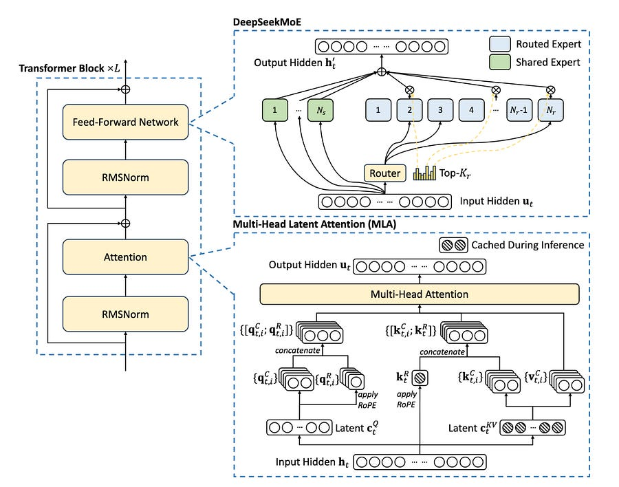

# Deepseek v3 model: feat of engineering above modelling

*aka efficient training and strong performance*

*aka efficient training and strong performance*

# **Introduction**

DeepSeek-V3 builds upon the robust architectural foundation of its predecessor, DeepSeek-V2, retaining key elements like Multi-head Latent Attention (MLA) and the DeepSeekMoE architecture.

Let’s see what they improved upon! :)

## **Multi-Token Prediction (MTP): Unlocking Speculative Decoding**

Traditional language models are trained to predict the next token in a sequence.

MTP, however, extends this horizon, challenging the model to predict multiple future tokens at each step. DeepSeek-V3 adopts a sequential approach. This maintains the causal chain at each prediction depth, ensuring that each token's prediction benefits from the full context of preceding tokens, even at deeper prediction levels.

**The MTP Implementation:**

The MTP mechanism is implemented using a series of sequential MTP modules. Each module comprises:

  * **Shared Embedding Layer:** This layer is shared with the main model, ensuring that the MTP modules benefit from the same rich token representations learned by the primary model.

  * **Shared Output Head:** Similar to the embedding layer, the output head is also shared, allowing the MTP modules to leverage the main model's learned mapping from hidden states to token probabilities.

  * **Transformer Block:** Each MTP module contains its own Transformer block, enabling it to process the combined representation and generate predictions at its specific depth.

  * **Projection Matrix:** This matrix combines the representation from the previous depth (or the main model's output for the first MTP module) with the embedding of the corresponding future token.

**Loss Calculation:**

A cross-entropy loss is computed for each prediction depth. The overall MTP loss is a weighted average of these individual losses across all depths.

**Impact and Implications:**

  * **Training Efficiency:** MTP effectively densifies the training signals. Each token contributes to multiple prediction losses, maximizing the information extracted from each training example. This leads to more efficient use of the training data and potentially faster convergence.

  * **Speculative Decoding:** They can be repurposed for speculative decoding, a technique that can significantly accelerate generation. The model predicts multiple tokens ahead, and if these predictions align with the main model's subsequent predictions, they are accepted, effectively skipping several computation steps. DeepSeek reports an 85-90% acceptance rate for the second predicted token in their evaluations, translating to a substantial **1.8x** improvement in tokens-per-second (TPS).

**2\. Multi-head Latent Attention (MLA): The Cornerstone of Inference Efficiency**

DeepSeek-V3 inherits the highly efficient MLA architecture from its predecessor.

**The Core Idea:**

MLA introduces a low-rank joint compression mechanism for attention keys and values. Instead of caching the full-dimensional keys and values for each attention head at every layer, MLA compresses them into a smaller latent vector.

This latent vector, along with a decoupled key that carries Rotary Positional Embedding (RoPE) is all that needs to be cached during generation.

**The Mechanism:**

  * **Compression:** The input to the attention layer is projected down to create the latent vector using a down-projection matrix.

  * **Key and Value Generation:** Up-projection matrices are used to generate the keys and values from the compressed latent vector. A separate matrix is used to produce the decoupled key which incorporates RoPE.

  * **Query Processing:** Similar to keys and values, queries also undergo a low-rank compression using matrices.

  * **Attention Calculation:** The final attention output is computed using the generated queries, keys, and values, similar to standard MHA.

**Benefits:**

  * **Reduced KV Cache:** MLA drastically reduces the size of the KV cache, leading to significant memory savings during inference.

  * **Faster Inference:** The smaller cache translates to faster memory access and reduced computational overhead, resulting in accelerated inference.

  * **Deployment on Resource-Constrained Hardware:** The reduced memory footprint enables the deployment of larger models on hardware with limited memory capacity.

**3\. Auxiliary-Loss-Free Load Balancing for DeepSeekMoE**

MoE models, while powerful, often have the issue of load imbalance among experts.

If certain experts are consistently favored over others, it can lead to routing collapse, where the model essentially reverts to a dense model, losing the benefits of specialization. It also diminishes computational efficiency, as some experts become overloaded while others remain idle.

Traditional approaches to address load imbalance rely on auxiliary losses. These losses penalize uneven expert utilization, encouraging a more balanced distribution of tokens across experts.

However, a significant drawback of this method is that it can negatively impact model performance. The model is forced to prioritize load balance, potentially at the expense of making optimal routing decisions based on the input. The strength of the auxiliary loss introduces a hyperparameter that needs to be balanced with the model performance.

**DeepSeek-V3's Solution:**

**Key Components:**

  * **Bias Terms:** Instead of directly penalizing imbalance through a loss function, DeepSeek-V3 introduces a bias term for each expert. This bias is added to the expert affinity score before the top-K routing decision is made.

Importantly, the bias term only affects the routing decision. The gating value, which is multiplied with the expert's output, is still derived from the original affinity score, preserving the integrity of the expert's contribution.

  * **Dynamic Adjustment:** The bias terms are dynamically adjusted during training. If an expert is overloaded (i.e., it receives more tokens than average), its bias term is decreased. Conversely, if an expert is underloaded, its bias term is increased. This dynamic adjustment ensures that the load remains balanced throughout training. The adjustment speed is controlled by a hyperparameter.

  * **Sigmoid Gating:** The DeepSeek team also made the decision to utilize a sigmoid activation function for expert routing rather than the traditional softmax.

  * **Complementary Sequence-Wise Auxiliary Loss:** While the primary mechanism is auxiliary-loss-free, DeepSeek-V3 also incorporates a complementary sequence-wise balance loss. This loss, controlled by a very small hyperparameter, encourages balance within each individual sequence, preventing extreme cases where a single sequence might heavily favor a small subset of experts. This acts as a safeguard without significantly impacting the overall training dynamics.

  * **Node-Limited Routing:** To further control communication costs, DeepSeek-V3 employs node-limited routing, similar to the device-limited routing in DeepSeek-V2. Each token is sent to at most M nodes, selected based on the sum of the highest affinity scores of experts on each node. This strategy is crucial for enabling near-full computation-communication overlap during training.

**Advantages:**

  * **Preserves Model Performance:** By decoupling load balancing from the core loss function, the model can focus on making optimal routing decisions based on the input, leading to better overall performance.

  * **Enhanced Expert Specialization:** The auxiliary-loss-free approach allows experts to specialize more effectively. This specialization is crucial for maximizing the benefits of the MoE architecture.

  * **Flexibility:** Batch-wise balancing offers more flexibility than sequence-wise balancing, as it doesn't enforce balance within each individual sequence. This allows experts to develop more distinct specializations.

  * **Efficiency:** The dynamic adjustment of bias terms is computationally inexpensive and doesn't add significant overhead to the training process.

**Addressing Potential Challenges:**

While batch-wise load balancing offers significant advantages, it also presents two potential challenges:

  * **Sequence-Level Imbalance:** There's a risk of imbalance within certain sequences or small batches. However, DeepSeek-V3's training framework, which utilizes large-scale expert parallelism and data parallelism, naturally mitigates this issue by ensuring a large batch size for each micro-batch.

  * **Domain-Shift-Induced Imbalance During Inference:** The expert load distribution might change when the model encounters data that is significantly different from the training data. To address this, DeepSeek-V3 employs a redundant expert deployment strategy during inference, dynamically adjusting the set of redundant experts based on observed load patterns.

**4\. FP8 Mixed Precision Training**

While low-precision training is juicy, it has lots of challenges related to the limited dynamic range of FP8, particularly in the presence of outliers in activations, weights, and gradients.

**Strategic Precision Management:**

The framework employs FP8 for compute-intensive operations, primarily the GEMM (General Matrix Multiply) operations within the Linear layers. However, it retains higher precision (BF16 or FP32) for components that are more sensitive to numerical precision, such as:

  * **Embedding Module:** The embedding layer, responsible for mapping tokens to their initial vector representations, is kept in higher precision to preserve the fidelity of these crucial representations.

  * **Output Head:** The output head, which generates the final probability distribution over the vocabulary, also benefits from higher precision to ensure accurate predictions.

  * **MoE Gating Modules:** The gating modules, which determine the contribution of each expert, are kept in higher precision to maintain the integrity of the routing decisions.

  * **Normalization Operators:** Normalization layers, such as RMSNorm, are crucial for stabilizing training and are therefore kept in higher precision.

  * **Attention Operators:** Attention mechanisms, which are fundamental to the Transformer architecture, are also maintained in higher precision due to their sensitivity to numerical errors.

**Master Weights, Gradients, and Optimizer States:**

To further ensure numerical stability, DeepSeek-V3 stores the master weights, weight gradients, and optimizer states in higher precision (FP32 for master weights and gradients, BF16 for optimizer states). While this introduces some memory overhead, it's effectively minimized through sharding.

**Fine-Grained Quantization:**

To address the challenges posed by FP8's limited dynamic range, particularly in the presence of outliers, DeepSeek-V3 introduces a fine-grained quantization strategy. Instead of applying a single scaling factor to the entire tensor, it groups elements into smaller tiles or blocks and scales them independently:

  * **Activations:** Elements are grouped and scaled on a 1x128 tile basis (i.e., per token per 128 channels).

  * **Weights:** Elements are grouped and scaled on a 128x128 block basis (i.e., per 128 input channels per 128 output channels).

This approach allows the quantization process to adapt to the varying magnitudes of elements within the tensor, effectively mitigating the impact of outliers and maximizing the utilization of the available precision.

**5\. DualPipe and Computation-Communication Overlap:**

Training models like DeepSeek-V3 requires sophisticated distributed training strategies to manage the immense computational workload and communication overhead.

**Key Features of DualPipe:**

  * **Reduced Pipeline Bubbles:** Compared to traditional pipeline parallelism methods like 1F1B and ZeroBubble, DualPipe minimizes the number of pipeline bubbles, which are periods of inactivity where GPUs are waiting for data or computations from other stages. Fewer bubbles translate to higher GPU utilization and faster training.

  * **Computation-Communication Overlap:** It overlaps the computation and communication phases within a pair of individual forward and backward chunks. Each chunk is divided into four components: attention, all-to-all dispatch, MLP, and all-to-all combine. For backward chunks, both attention and MLP are further split into two parts: backward for input and backward for weights.

  * **Bidirectional Pipeline Scheduling:** DualPipe feeds micro-batches from both ends of the pipeline simultaneously. This further reduces pipeline bubbles and allows for more efficient utilization of the available resources.

**Impact:**

  * **Scalability:** DualPipe's design ensures that it can scale effectively as the model size increases. As long as the computation-to-communication ratio remains constant, the communication overhead can be hidden, allowing for efficient training of even larger models.

  * **Memory Efficiency:** While DualPipe requires keeping two copies of the model parameters, the impact on memory consumption is minimized due to the large EP size used during training.

**6\. Optimized Cross-Node All-to-All Communication: Maximizing Bandwidth Utilization**

To further enhance communication efficiency, they developed highly optimized cross-node all-to-all communication kernels. These kernels are co-designed with the MoE gating algorithm and the network topology of their cluster, which utilizes both InfiniBand (IB) for inter-node communication and NVLink for intra-node communication.

**Key Strategies:**

  * **Node-Limited Routing:** As mentioned earlier, each token is sent to at most 4 nodes, reducing IB traffic.

  * **Overlapping IB and NVLink:** When a token reaches its target node via IB, it's immediately forwarded to the specific GPUs hosting its target experts via NVLink, without being blocked by subsequently arriving tokens. This ensures that IB and NVLink communication are fully overlapped.

  * **Warp Specialization:** The team employs warp specialization techniques and dynamically adjusts the number of warps allocated to different communication tasks (IB sending, IB-to-NVLink forwarding, NVLink receiving, etc.) based on the actual workload.

  * **Customized PTX Instructions and Auto-Tuning:** Customized PTX (Parallel Thread Execution) instructions and auto-tuning of communication chunk sizes are used to minimize the use of the L2 cache and reduce interference with other SM computations.

**Impact:**

These optimizations enable the communication kernels to fully utilize the available IB and NVLink bandwidths while minimizing the number of SMs dedicated to communication, thereby maximizing computational throughput.

**7\. Memory Optimization: A suite of techniques to minimize the memory footprint during training:**

  * **Recomputation:** RMSNorm operations and MLA up-projections are recomputed during backpropagation, eliminating the need to store their output activations.

  * **EMA in CPU:** Exponential Moving Average (EMA) parameters are stored in CPU memory and updated asynchronously, avoiding additional GPU memory overhead.

  * **Shared Embedding and Output Head for MTP:** The shared embedding and output head parameters between the MTP module and the main model are physically shared, further reducing memory usage.

**Impact:**

These memory optimization strategies enable the team to train DeepSeek-V3 without using costly Tensor Parallelism (TP), which can introduce significant communication overhead.

**8\. Context Extension and Post-Training: Fine-Tuning**

**Two-Stage YaRN for Long Context:**

DeepSeek-V3 employs a two-stage context length extension approach using YaRN (Yet another RoPE extensioN method) to enable the model to effectively process long input sequences. This is crucial for many real-world applications, such as document summarization, question answering over long documents, and code completion in large codebases.

**The YaRN Method:**

YaRN is a technique for extending the context window of models that use Rotary Positional Embeddings (RoPE). It works by modifying the way RoPE is applied, allowing the model to extrapolate to sequence lengths beyond what it was originally trained on.

**Two-Stage Extension:**

DeepSeek-V3 applies YaRN in two stages:

  * **Stage 1:** The context window is extended from 4K to 32K tokens.

  * **Stage 2:** The context window is further extended from 32K to 128K tokens.

Each stage involves 1000 steps of additional training with specific learning rate and batch size configurations.

**9\. R1 Distillation for Reasoning: Transferring Knowledge from a Specialized Model**

The team leverages an internal DeepSeek-R1 model specialized for reasoning tasks, and the goal is to transfer its expertise to DeepSeek-V3.

**The Process:**

  * **Expert Model Training:** An expert model is trained for a specific domain (e.g., code, math, or general reasoning) using a combined Supervised Fine-Tuning (SFT) and Reinforcement Learning (RL) pipeline. This expert model serves as the data generator for the final model.

  * **Data Generation:** Two types of SFT samples are generated for each instance:

    * <problem, original response>: This format couples the problem with its original response.

    * <system prompt, problem, R1 response>: This format incorporates a system prompt that guides the model towards producing responses enriched with reflection and verification mechanisms, along with the problem and the R1-generated response.

  * **RL Training:** During the RL phase, the expert model uses high-temperature sampling to generate responses that integrate patterns from both the R1-generated and original data. This helps the model learn to incorporate R1-like reasoning even without explicit system prompts.

  * **Rejection Sampling:** After RL training, rejection sampling is used to curate high-quality SFT data for the final model. The expert models serve as data generation sources, ensuring that the final training data retains the strengths of DeepSeek-R1 while producing concise and effective responses.

**10\. A Stable Training Run: Robustness**

The team reports no irrecoverable loss spikes and no rollbacks throughout the entire training on 14.8 trillion tokens.

**Factors Contributing to Stability:**

  * **Robust Training Framework:** The engineered training framework, including the FP8 mixed precision implementation, DualPipe, and optimized communication kernels, plays a crucial role in ensuring stable training.

  * **High-Quality Data:** The carefully curated training data, with its enhanced ratio of math and programming samples and expanded multilingual coverage, contributes to the stability of the training process.

  * **Effective Architectural Choices:** The architectural choices, such as the auxiliary-loss-free load balancing and the multi-token prediction objective, likely contribute to the overall stability of the model.

**Impact:**

It eliminates the need for costly rollbacks and restarts, streamlining the training process and making it more efficient.

# Woah, that was a lot. Congrats for making it all the way.

# References

  1. [Deep seek list of papers](https://huggingface.co/collections/Presidentlin/deepseek-papers-674c536aa6acddd9bc98c2ac)

  2. [DeepSeek-V3 paper](https://github.com/deepseek-ai/DeepSeek-V3/blob/main/DeepSeek_V3.pdf)
