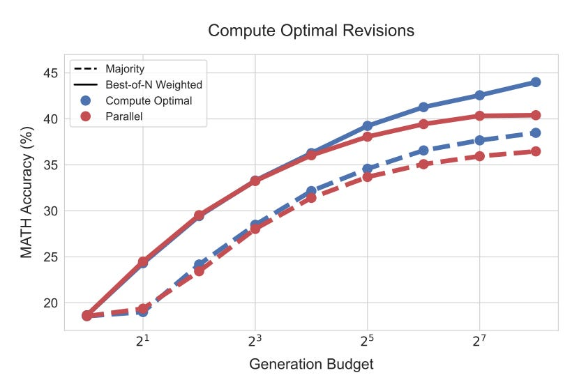

# Deep dive into scaling test time compute. 

# **Beyond Model Scaling: Mastering Test-Time Compute for Large Language Models**

**Why Scale Test-Time Compute?**

Before diving into the technical details, it's important to understand _why_ we should care about scaling test-time compute.

The answer lies in the limitations of LLMs:

  1. **Reasoning Bottlenecks:** While LLMs excel at memorizing vast amounts of information, they often struggle with complex reasoning tasks that require drawing inferences from existing knowledge. Scaling test-time compute provides a mechanism to address this bottleneck by allowing the model to "think longer" and explore different solution paths.

  2. **Efficiency and Deployment:** Training colossal models is computationally expensive. Moreover, deploying them can be impractical in resource-constrained environments, such as on-device applications. Efficiently utilizing test-time compute with smaller models offers a potential path for a solution.

  3. **Inference Cost Dominance:** In many real-world scenarios, especially in large-scale production settings, the cumulative cost of inference can vastly exceed the one-time cost of pretraining. Optimizing test-time compute, therefore, directly translates to significant cost savings. A model used millions of times a day in a product will have its inference cost quickly surpass any pretraining cost increases.

  4. **Specialized Task Performance:** Test-time computation can be particularly beneficial for specialized tasks that were not the primary focus during pretraining. By allowing the model to focus its computational resources on a specific problem at inference, we can improve its performance beyond what its general pretraining might suggest.

**Two Key Mechanisms for Test-Time Computation:**

  1. **Refining the Proposal Distribution: Iterative Revisions**

This approach involves enabling the LLM to iteratively revise its own generated answers. Simply prompting an off-the-shelf LLM to correct its mistakes often proves ineffective, especially for complex reasoning tasks. 

Why, you might ask. Well… if you did not train the model for something the results are usually bad :D.

     * **Training for Revision:** The approach involves constructing training examples consisting of a sequence of incorrect answers followed by a correct answer. The incorrect answers are carefully selected to be correlated with the correct answer (using a character edit distance metric), encouraging the model to learn to identify and correct its mistakes.

     * **Sequential vs. Parallel:** The paper [1] explores the trade-off between generating multiple revised answers independently in parallel (similar to best-of-N sampling) and generating a sequence of revisions, where each revision is conditioned on the previous ones.

     * **Mitigating "Unlearning":** A challenge with iterative revisions is that the model might inadvertently turn a correct answer into an incorrect one in subsequent revision steps. To address this, sequential majority voting or verifier-based selection is employed, choosing the most likely correct answer from the sequence of revisions.

  2. **Optimizing the Verifier: Guided Search**

This approach leverages process-based reward models (PRMs) to guide a search process over the space of possible solutions. PRMs are trained to evaluate the correctness of each intermediate step in a solution, rather than just the final answer. This allows for a more fine-grained search process compared to using an outcome-based reward model (ORM) that only evaluates the final answer.

     * **Training PRMs without Human Labels:** Monte Carlo rollouts are used from each step in a solution to estimate per-step correctness. This makes PRM training more practical and scalable.

     * **Search Algorithms:** The paper explores various search algorithms:

       * **Best-of-N Weighted:** Samples N answers independently and selects the best one according to the PRM, using a weighted aggregation scheme that considers all solutions with the same final answer.

       * **Beam Search:** Maintains a set of candidate solutions (beams) and iteratively expands them step-by-step, pruning the search space based on the PRM's evaluation of each step.

       * **Lookahead Search:** An extension of beam search that performs rollouts several steps ahead to improve the accuracy of the PRM's value estimation at each step. This is similar to a simplified version of Monte Carlo Tree Search (MCTS) adapted for test-time exploitation.

**Compute-Optimal Scaling: The Adaptive Approach**

A key contribution of the paper is the concept of "compute-optimal scaling." This strategy advocates for dynamically selecting the test-time compute allocation based on an estimate of the prompt's difficulty. The core idea is that different strategies work best for different types of problems.

  * **Estimating Prompt Difficulty:** The base LLM is used to compute the pass@1 rate (estimated from multiple samples, typically 2048) to categorize prompts into five difficulty levels.

  * **Difficulty-Based Strategy Selection:** For each difficulty bin, the best-performing test-time compute strategy is determined through experimentation on a validation set. This could involve choosing between sequential revisions and parallel sampling, or between different search algorithms and their hyperparameters.

  * **Practical Considerations:** While estimating difficulty using pass@1 requires additional computation, this cost can be integrated into the overall test-time compute budget (e.g., by using the same samples for both difficulty estimation and search).

**Experimental Results: Key Insights**

  * **Prompt Difficulty is Crucial:** The efficacy of different test-time compute strategies varies significantly depending on the difficulty of the prompt. Easier problems often benefit more from iterative revisions, while harder problems may require more extensive search (e.g., beam search with PRMs). This highlights the importance of an adaptive approach.

  * **Compute-Optimal Outperforms Best-of-N:** By adaptively allocating test-time compute based on the estimated difficulty, performance improvements surpassing a standard best-of-N baseline are achieved while using significantly less compute (up to a 4x reduction in some cases). This demonstrates the potential for substantial efficiency gains.

  * **Sequential vs. Parallel Trade-off:** For revisions, an optimal ratio between sequential and parallel computation exists. Easy questions benefit more from sequential revisions (refining a promising solution), while harder questions require a balance between exploration (parallel) and exploitation (sequential).

  * **Beam Search vs. Best-of-N with PRMs:** Beam search tends to be more effective on harder problems and at lower compute budgets, acting as a more powerful optimizer. However, it can overfit to the PRM on easier problems, leading to worse performance compared to best-of-N at higher budgets. Best-of-N, being less prone to overfitting, excels on easier problems and at higher budgets.

  * **Lookahead Search:** While powerful in principle, lookahead search underperforms other methods at the same generation budget due to the added computational cost of rollouts.

**Training-Time vs. Test-Time Compute: A FLOPs-Matched Comparison**

One of the most interesting aspects is the comparison between the benefits of additional test-time compute and increased pretraining compute. A FLOPs-matched evaluation is conducted in [1], asking:

> If a fixed budget to increase the total FLOPs used (across both pretraining and inference) is available, should it be allocated to pretraining a larger model or to using more test-time compute with a smaller model?

**Defining an Exchange Rate:** Standard approximations are used to estimate pretraining FLOPs (6ND) and inference FLOPs (2ND), where N is the number of model parameters and D is the number of tokens. This allows an exchange rate to be defined between increasing model size and increasing test-time compute.

**The Role of the Inference-to-Pretraining Token Ratio (R):** The amount of test-time compute that can be used to match the FLOPs of a larger model depends on the ratio of inference tokens to pretraining tokens (R).

  * **R << 1 (Self-Improvement):** In scenarios where the model is used to generate data for its own improvement (fewer inference tokens than pretraining tokens), test-time compute can be more effective.

  * **R ~~ 1:** A balanced scenario.

  * **R >> 1 (Large-Scale Production):** In settings with massive inference loads (e.g., a model serving millions of users), pretraining larger models may be preferable.

**Results:**

  * **Easy and Medium Problems:** On easier problems, or in settings with lower inference load (R << 1), test-time compute can often outperform scaling up model parameters during pretraining. This suggests that for problems within a model's basic capabilities, it's more efficient to "teach it to think better" at inference time than to simply make it bigger.

  * **Hard Problems:** On the most challenging problems, or under high inference loads (R >> 1), pretraining larger models remains a more effective way to improve performance. This indicates that for problems truly outside a model's current capabilities, expanding its fundamental knowledge base through pretraining is crucial.

Something I am particularly interested in is “**Distilling Test-Time Improvements”:** Investigating how the outputs generated through enhanced test-time computation can be distilled back into the base LLM is a critical step towards enabling iterative self-improvement. This could involve using the improved outputs as training data for the base model or developing more sophisticated distillation techniques.

Congrats for making it all the way to the end! :)

# References

  1. [Scaling test time compute](https://arxiv.org/abs/2408.03314)
