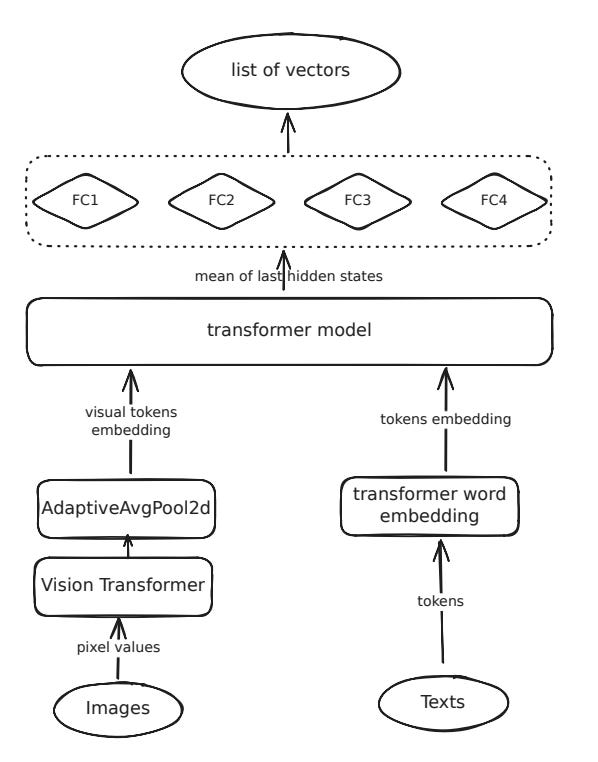

# Distilling SOTA embedding models

# **The Challenge of Efficient Text Embeddings**

Text embeddings have become indispensable in modern NLP, powering applications like semantic search, question answering, and Retrieval-Augmented Generation (RAG).

While benchmarks such as MTEB, BEIR, and AIR-Bench provide a clear picture of state-of-the-art model performance, they often highlight a significant challenge: the most accurate models tend to be large and computationally expensive.

This creates a tension between performance and efficiency, especially when deploying these models in resource-constrained environments.

How to create smaller and faster text embedding models without compromising their accuracy?

**Model Architecture: A Fusion of Text and Vision**

Before diving into the training methodologies, let's examine the model architecture.

The design combines a language model with a vision encoder, creating a multimodal foundation. It consists of four primary components:

  1. **Vision Transformer (ViT) Image Encoder:** This component processes images independently, transforming them into visual token embeddings. It leverages ViTs to capture rich visual information.

  2. **Projection Pool:** This is a crucial bridge between the visual and textual domains. It takes the visual token embeddings, projects them to match the language model's input dimension, and importantly, reduces their count. This step ensures that the visual information is condensed and compatible with the text encoder.

  3. **Transformer Encoder/Decoder:** This is the heart of the text embedding process. It can be any standard transformer model like BERT, GPT-2, or XLMRoberta. Its role is to process text and generate contextualized embeddings.

  4. **Fully Connected (FC) Layers:** These layers are instrumental in both learning from the teacher models and enabling dimension reduction. They project the embeddings to a desired dimension, providing flexibility in controlling the final vector size.

This architecture allows for an integration of visual and textual information, making it possible to train a unified embedding space for both modalities.

**Distillation: Learning from Multiple Teachers**

The core of the proposed approach lies in a new knowledge distillation technique. Unlike traditional distillation, which typically involves a single teacher model, this method leverages _multiple_ high-performing embedding models as teachers. The student model is trained to generate vectors that closely resemble the concatenated vectors of these teachers. Pretty cool!

The training process employs a combination of three loss functions:

  1. **Cosine Loss:** This loss function aims to minimize the angular distance between the student vectors and the teacher vectors.

  2. **Similarity Loss:** This component goes beyond simple vector alignment. It ensures that the _relative similarities_ between text pairs are preserved.   
Iforces the student model to produce similarity scores that are consistent with those generated by the teacher models. This is achieved by calculating the Mean Squared Error (MSE) between the matrix product of the student vectors and their transpose, and the corresponding matrix product of the teacher vectors.

  3. **Triplet Loss:** This loss function further refines the student model's understanding of relative similarities. It leverages the teacher vectors to identify triplets of text: an anchor, a positive example (similar to the anchor), and a negative example (dissimilar to the anchor).

The overall loss is a weighted sum of these three components.

The most significant advantage of this distillation approach is that it **doesn't require any labeled data**. It can effectively learn from vast amounts of unlabeled text, making it highly scalable.

**Dimension Reduction: Shrinking Without Sacrificing Information**

Since the student model learns from multiple teachers, its output vector dimension can become quite large. 

To fix that, g fully connected layers are added to the student model that project the high-dimensional embeddings to a smaller, user-defined dimension.

During this stage, the cosine loss is no longer used, as the dimensions no longer match the teacher vectors. Instead, training focuses on the similarity loss and triplet loss to maintain the integrity of the embedding space.

A fascinating alternative presented is **self-distillation**. In this approach, the student model's own vectors are treated as teacher vectors. This allows for dimension reduction using only unsupervised data and the model itself. While it might lead to a slight decrease in performance, it offers a powerful way to compress any embedding model without external supervision.

**Multimodal Extension: Encoding Images and Text**

The paper briefly explores extending the model's capabilities to handle images.

This is achieved by integrating a pre-trained vision encoder (specifically, SigLIP) into the architecture. The model is then trained on image-caption pairs, aligning the visual embeddings with the text embeddings. The same loss functions (cosine, similarity, and triplet) are employed, but now applied to each student vector-teacher vector pair, where the teacher vector is derived from the caption and the student vector from the image.

**Key Takeaways and Future Directions**

The multi-teacher distillation approach, combined with the dimension reduction technique, allows for the creation of smaller, faster models that retain the performance of their larger counterparts.

The largely unsupervised nature of these methods makes them highly scalable and applicable to a wide range of scenarios.

This work pushes the boundaries of what's possible with text embedding architectures and it’s quite scrappy and fun!

Hope you enjoyed! Are you going to use this method in your pipelines?

# References

  1. **[Distillation of sota embedding models](https://arxiv.org/abs/2412.19048)**
