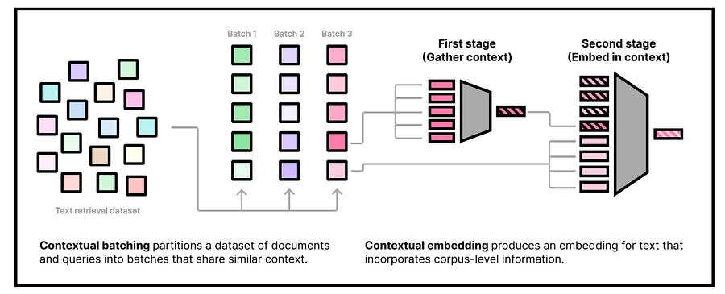

# Dense Retrieval: Contextual Embeddings for Superior Performance

# **Introduction**

Traditional bi-encoder models, which encode documents and queries independently, face challenges in capturing the nuances of context-dependent language understanding.

Today’s article is about the research paper [1], that tackles these limitations through two techniques: _contextual batching_ and a novel _contextual embedding architecture_.

I will examine how these methods enhance retrieval performance, especially in out-of-domain scenarios.

Let’s go!

# **Challenge 1: Contrastive Learning**

Contrastive learning is the workhorse behind training effective bi-encoders.

The core idea is to bring embeddings of relevant document-query pairs closer while pushing apart embeddings of irrelevant pairs. However, achieving optimal results requires a careful orchestration of techniques, including:

  * **Giant Batches:** Large batch sizes are often needed to increase the probability of encountering "hard negatives" – irrelevant documents that are semantically similar to the query.

  * **Distillation:** Employing a more powerful teacher model to guide the training of a smaller, faster student model.

  * **Hard Negative Mining:** Actively searching for those challenging hard negatives, which can be computationally expensive.

These complexities make training bi-encoders a non-trivial task, demanding significant computational resources.

## **Solution: Contextual Batching**

The paper introduces _contextual batching_ as a novel approach to contrastive learning that sidesteps the need for excessively large batches or explicit hard negative mining. The key insight is to construct training batches where all document-query pairs are drawn from a similar context or topic.

**How it Works:**

  1. **Clustering for Context:** Before training, the entire training corpus is clustered into "pseudo-domains" using a fast clustering algorithm like K-Means. These clusters represent groups of topically related documents. For instance, one cluster might contain documents about "machine learning algorithms," while another focuses on "18th-century literature." The clustering itself is performed using a simpler, pre-trained embedding model (like GTR).

  2. **Batch Construction:** During training, each batch is formed by sampling document-query pairs exclusively from within a single cluster. This ensures that all examples in a batch share a common context.

  3. **Maximizing Batch Difficulty:** The authors frame the search for the most difficult configuration of batches as an optimization problem. They show that this can be approximated by minimizing a centroid-based objective using asymmetric K-Means clustering. The goal is to create batches that are as challenging as possible for the model to discriminate between relevant and irrelevant pairs.

  4. **Filtering False Negatives:** The method is particularly sensitive to false negatives, which are more likely to be included in a given batch. To mitigate this, they compute an equivalence class for each query and filter out documents that are not definitively negative.

  5. **Packing:** Clusters of varying sizes are packed into equal-sized batches using either random partitioning or a greedy cluster-level traveling salesman algorithm.

**Theoretical Underpinnings:**

The effectiveness of contextual batching is supported by theoretical arguments.

It has been shown that increasing the difficulty of negative examples within a batch leads to a better approximation of the maximum likelihood objective in contrastive learning. By creating batches where all examples are topically related, contextual batching naturally generates harder negatives, forcing the model to learn more fine-grained distinctions between similar documents.

# **Challenge 2: The Corpus Amnesia of Bi-Encoders**

Traditional bi-encoders suffer from a form of "corpus amnesia."

They encode each document in isolation, without considering the broader context of the corpus they will be used to search. This is a big contrast to statistical retrieval methods like BM25, which incorporate corpus-level statistics (e.g., inverse document frequency or IDF) to weight terms differently based on their prevalence within the specific corpus.

For example, the term "NFL" might be rare in a general-purpose training corpus but very common in a corpus of sports articles. A standard bi-encoder would assign the same embedding to "NFL" regardless of the target corpus, whereas IDF would give it a lower weight in the sports corpus, reflecting its reduced importance.

## **Solution: Contextual Document Embedding (CDE) Architecture**

To address this limitation, the paper proposes a novel _contextual document embedding_ (CDE) architecture. This architecture allows the model to "see" the broader context of the corpus during both training and inference, effectively creating embeddings that are tailored to the specific retrieval task.

**How it Works:**

The CDE architecture operates in two stages:

  1. **Context Encoding:**

     * A set of "context documents" is selected from the target corpus. These could be a random sample or documents deemed relevant to a particular query (in a query-specific scenario).

     * Each context document is embedded using a first-stage encoder (M1).

     * These context embeddings are concatenated to form a "context sequence."

  2. **Document/Query Encoding with Context:**

     * The document (or query) to be embedded is tokenized.

     * The token embeddings are concatenated with the context sequence.

     * This combined sequence is fed into a second-stage encoder (M2).

     * The output of M2, specifically the pooled representation of the document/query tokens (excluding context tokens), is the final contextualized embedding.

**Key Design Choices:**

  * **Parameterization:** Both M1 and M2 are parameterized using standard transformer models (like BERT).

  * **Context Sharing:** During training, context documents are shared within a batch to reduce computational overhead.

  * **Caching:** At inference time, context embeddings can be pre-computed and cached for efficiency.

  * **Position Agnostic:** Positional information is removed from the context embeddings to reflect the unordered nature of the context documents.

# **Conclusion**

By incorporating context into both the training process and the embedding architecture, these methods overcome the limitations of traditional bi-encoders, leading to more accurate and robust retrieval systems.

If you are building information retrieval applications, I believe it could be worth trying out!

# References

  1. [John tweet](https://x.com/jxmnop/status/1842236045074498026)

  2. [Contextual relevance embeddings](https://arxiv.org/abs/2410.02525)
