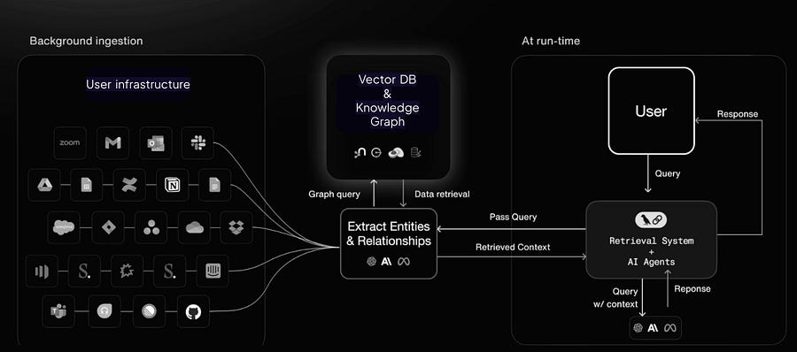

# AI Site reliability engineer?

*aka deep dive on AI startup that wants to automate SREs :)*

*aka deep dive on AI startup that wants to automate SREs :)*

# Introduction

I feel like there’s a lot of cool AI companies that really solve big pain points and I want to share them with my network to let people know how many opportunities you can have outside of the usual FAANG :)

Today, I talk about Calmo, an AI startup that plans on automating away a lot of work from SREs. Plus, the CEO is Italian 🇮🇹 which makes me very proud!

Note: this post is **not** sponsored! I am just playing around. :) If you want to have your startup sponsored by this newsletter, you know where to find me! ;)

Loading...

First, my thoughts on the problem / solution. Companies spend ton of $$ on SREs and the markup due to on call hours. Surely automating away some of those hours make sense.

SREs reading this, don’t worry! I don’t think you can let an AI decide how to fix a big escalation. The majority of escalations I have seen require input from different stakeholders on how they should be fixed.

Instead, having a tool that supports SREs in their job to speed up resolution is a great idea to cut down on time-to-resolve.  
Honestly, I am already seeing tools like being built internally in some form, which makes me think there’s a market for this!

# How Calmo does it!

You get an automatic bug opened: it’s a database connection failing. Oh no!

Example log:

[2024-11-14 14:23:01] ERROR: Database connection failed. Host: db-server-3, Port: 5432. Timeout after 5 seconds.

[2024-11-14 14:23:03] INFO: Retrying connection. Attempt 2 of 3.

[2024-11-14 14:23:06] ERROR: Database connection failed. Host: db-server-3, Port: 5432. Timeout after 5 seconds.

[2024-11-14 14:23:08] ERROR: Service Unavailable. Exceeded max retry attempts.

If you just get an AI agent without context of the overall system around the DB, you might get a generic solution: verify connection setting, ensure no network issue, increase timeout limit, etc.

However, with context (that’s where calmo comes in), you find out immediately that there was an increase on CPU usage and a recent commit changed a certain parameter config.

From there on, you are guided towards the solution!

Essentially, calmo gets access to:

  * Logs

  * Metrics

  * Historical context

Plus, it understands entities in the context of the infra.

It’s based on a combination of Vector DBs and KG, which the user / agent can access:

Reminds you of something…?

YES! I have talked about memory for LLMs a few weeks back:

[Deep dive into "Memory for LLMs" architecturesLudovico Bessi·March 16, 2025[Read full story](2025-03-16-deep-dive-into-memory-for-llms-architectures.md)](2025-03-16-deep-dive-into-memory-for-llms-architectures.md)

Calmo leverages **graph** **structures** alongside **text** **indexing** to improve data retrieval at **two** **levels** : precise information on specific entities (**low** -**level** **knowledge**) and broader themes (**high** -level **knowledge**).

By combining **graph** **structures** with **vector** **representations** , it combines more comprehensive results, optimizing incident management with enhanced, contextually relevant insights.

It’s a pretty interesting space with some challenges:

  * Real time low latency processing

  * Scalability for large data volumes

  * Entity and relationship management

  * Real time adaptability with incremental updates

Every single step along the way takes a lot of recent RAG research into account, which I find pretty cool. In this AI-first systems, the devil is in the detail:

  * What chunking strategy makes the most sense?

  * Which retrieval strategy works in which settings?

  * How does your indexing mechanism takes into account duplicated entities and graph-based data structures?

So it’s not an easy problem at all :).

Interested in more? Check them out [here](https://getcalmo.com/)!

# Final thoughts

I quite enjoyed this different newsletter vibe. What do you think of Calmo?

Let me know if you are interested in knowing more!

Ludo

# References

  1. [Calmo web page](https://getcalmo.com/)
