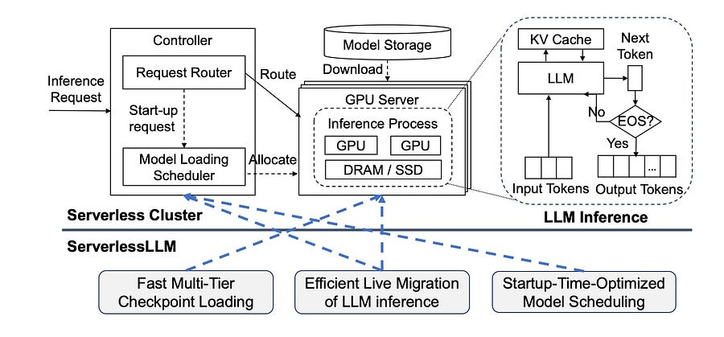

# Tackling the LLM Cold Start Problem with Smarter Storage

*aka a lesson on how to do serverless inference for LLMs*

*aka a lesson on how to do serverless inference for LLMs*

# Introduction

If you've worked on deploying LLMs, you know the trade-off: dedicated GPUs are expensive, but serverless endpoints suffer from brutal cold-start latency. Waiting 30-90 seconds for a model to load from S3 before the first token can be generated is a non-starter for interactive applications.

I just came across a paper titled “**ServerlessLLM: Low-Latency Serverless Inference for Large Language Models” [1]**

where the authors present a clever systems-level approach to this problem. 

Instead of accepting remote download delays as a fact of life, it focuses on intelligently using the hardware already present in our GPU servers.

The core idea is simple but powerful: modern GPU servers have a deep, fast, and often underutilized storage hierarchy (Host DRAM, NVMe SSDs). Why are we slowly pulling massive checkpoints over the network when terabytes of high-bandwidth local storage are sitting right there?

ServerlessLLM builds a system around this insight with three key contributions.

# Serverless LLM

#### **1\. Fast Multi-Tier Checkpoint Loading**

The first bottleneck is getting the model from disk to GPU memory. Standard methods like torch.load are not optimized for read performance. ServerlessLLM redesigns the loading process from the ground up.

  * **A Loading-Optimized Checkpoint Format:** They introduce a new format designed for fast, sequential, chunk-based reading. This avoids the overhead of complex deserialization and allows for efficient memory addressing on the GPU.

  * **A Multi-Tier Loading Pipeline:** The system treats the storage hierarchy (e.g., NVMe SSD -> DRAM -> GPU HBM) as a pipeline. It orchestrates data movement across these tiers in parallel, maximizing the available bandwidth from each link.

**The result:** Micro-benchmarks show this loading method is **3.6x to 8.2x faster** than standard libraries like PyTorch and Safetensors for models like LLaMA-2 and Falcon.

#### **2\. Efficient Live Migration for LLM Inference**

Okay, so you have the model cached locally. What happens if that server is busy running another long inference job? The naive approach is to wait (adding to queue time) or to start a cold load on another free server (defeating the purpose).

ServerlessLLM introduces a more dynamic solution: **live migration**. If a high-priority request comes in for a model cached on a busy server, the system can migrate the _active inference job_ to another server to free up the local resources.

The clever part is _how_ it migrates. Instead of sending the massive, multi-gigabyte KV-cache over the network, it does something much cheaper:

  1. It migrates only the input and generated **tokens** (a few KBs of data).

  2. The destination server receives the tokens and **re-computes** the KV-cache from them.

This is a brilliant compute-vs-network trade-off. For LLMs, a quick re-computation is significantly faster than a massive network transfer, minimizing the migration downtime.

#### **3\. Startup-Time-Optimized Model Scheduling**

The final piece is a scheduler that understands these new capabilities. When a request arrives, the scheduler doesn't just look for a free GPU. It evaluates the cost of all available options:

  * **Option A:** Wait for the server with the local checkpoint to finish its current job.

  * **Option B:** Initiate a cold load from remote storage onto a completely free server.

  * **Option C:** Trigger a live migration of a running job to free up a server with the required checkpoint.

By modeling the latency of checkpoint loading from different storage tiers and the time cost of a live migration, the scheduler can make an informed decision to minimize the _actual time to first token_.

# Conclusions

In end-to-end evaluations simulating real-world serverless workloads, ServerlessLLM demonstrated a **10x to 200x reduction in inference latency** compared to systems like KServe and Ray Serve. The huge performance gain comes from systematically eliminating the single biggest source of latency in serverless ML—the cold start—by fully exploiting local hardware.

This is a great example of MLOps and systems thinking. It's not about a new model architecture, but about building an infrastructure that’s purpose-built for the unique demands of LLM serving.

# References

  1. [Serverless LLM](https://www.usenix.org/system/files/osdi24-fu.pdf)
