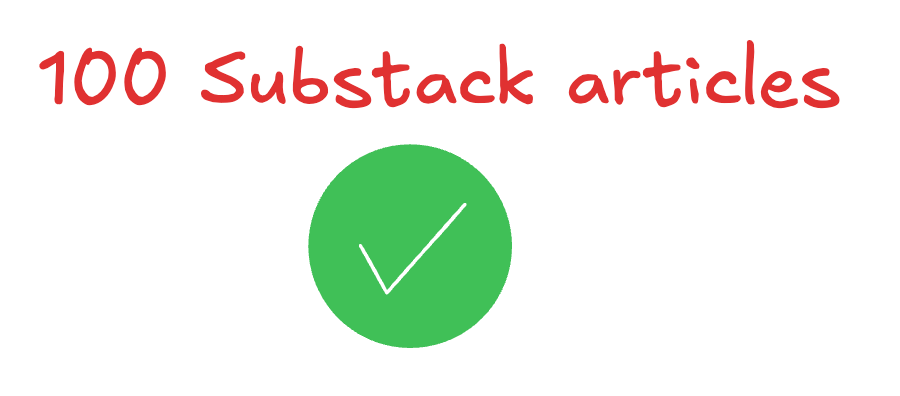
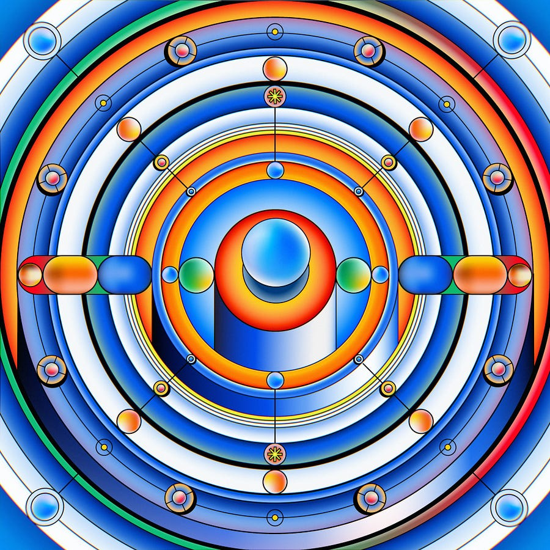

# 100 times Machine learning at scale in your inbox!

*One word: WOW! Thanks for being here.*

*One word: WOW! Thanks for being here.*

# From the beginning all the way to now

What a long way to go since I have started Machine learning at scale.

My first article was in January of 2023:

## [#1 What is my plan with Machine learning at scale?](2023-01-01-hello-world.md)

Ludovico Bessi

·

January 1, 2023

Hey! I am Ludo.

[Read full story](2023-01-01-hello-world.md)

First of all: I used cooler images!

Let’s see what I had to say at the time:

**I have created "Machine learning at scale" to talk about ML systems in the real world.**

**I am personally most interested in is how companies design and build ML systems that scale to billions.**

I believe I mostly stayed true to what I planned to do, even though I have lately focused on LLM things because… well they are interesting to me.

I am very proud of the fact that I have been able to keep up with the process of creating content, with some ups and downs.

For the followers that also create content, you know it’s hard.

Talking about downs September 2023 I stopped writing:

[Changes ahead for Machine Learning at scale·September 17, 2023[Read full story](2023-09-17-changes-ahead-for-machine-learning.md)](2023-09-17-changes-ahead-for-machine-learning.md)

The reason was:

**Lately, the act of writing posts felt more of a chore rather than a pleasure.**

I am so happy that I came back to it. Sharing something with the world that I personally create is really refreshing.

Now writing is again something I appreciate doing and not something “I have to do”.

It also led me to meet / chat with lots of interesting people:

  * I receive tons of messages from people telling me that they love reading my newsletter and they give me tips / share what they like / don’t like. (and not all of them followup with asking a referral for Google, aha)

  * I am invited to some dinners by VCs and operators around Zürich. Yay for meeting new like minded people! (and Yay for free dinners!)

  * One newsletter follower knew I was coming to MTV, I was picked up from the Googleplex and we went for a nice coffe on the beach. What an experience :)

  * I receive tons of messages from people that got into things because they first learnt it from me?! (i.e GSOC) That’s such a nice feeling!

# The plan ahead

First thing that comes to mind is: “Keep having fun with it”.

But let’s be more actionable:

**Content plan**

I want my content to be of the highest quality, while staying accessible. No easy task! 

I want to create better visual content, as I feel I could do a better job there even if it will take more time.

I will be focusing more on things I tackle in my day to day job as that’s where I have the highest leverage.

**Monetization plan**

**TLDR** : I will double down on creating value for you the reader as much as my limited free time permits and **maybe** ask for some $ to validate what I am doing is not entirely useless way down the line. Nothing short term!

Let me preface by saying that I am fortunate to have a job that don’t make me feel like I need to aggressively monetize my content.

Although it’d also feel nice to have some sort of side income?

To validate that people following me are not following me just for the sake of it, but because they think my content provides some sort of value.

But before that, I **want** to make sure that:

  * My content is of the highest possible technical / quality level, given that I want to:

    * Keep performing at my day job 

    * Keep training hard to reach fitness levels I aspire to

    * Keep devoting time to my personal relationships / leisure times

  * I don’t sell low quality slop just because I could. There’s this notion that “when you have distribution, you can sell something to your followers”. But I don’t reason that way and I don’t want to. I just want to give something to people that has high ROI for them and take some profit for my efforts.

I still have so many things I’d like to do that I don’t have time to do. But I want to make that time. So stay tuned for much more free value still!

**Building on the side**

I’d also like to build more ML systems on the side and share my learnings with the world. The idea of having tons of ML-powered SaaS seems cool to me!

**Scale up startup advising**

I have been advising a company for some time now, and I am loving it. I receive a tons of reach out for becoming a founding engineer, but while I am not quite ready to take the leap yet, I’d love to dip my toe by advising startups. If you are a startup in need of some AI related advising, hit me up!

# The end!

Thanks for making all the way to here and for reading my stuff!

If you are not yet subscribed and want to remain in the loop:
