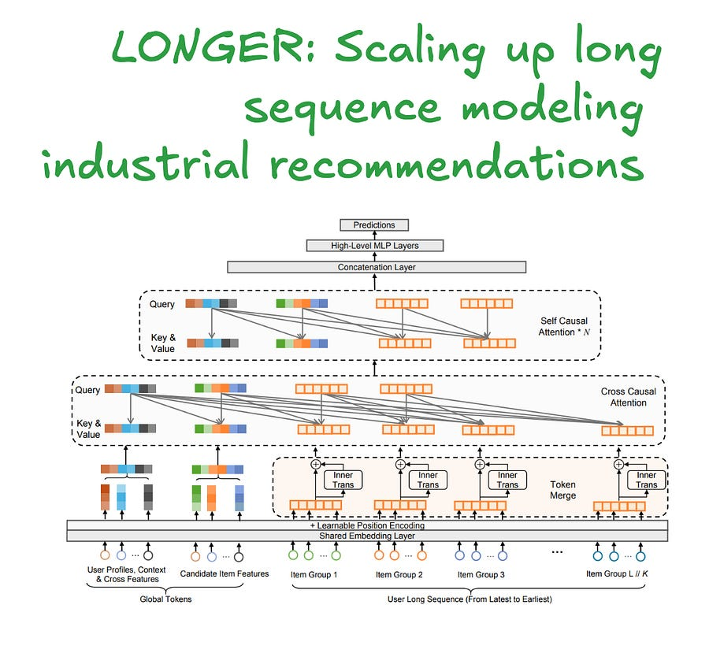

# [RecSys] Part 3: LONGER, scaling up long sequence modelling in industrial recommenders

# Introduction

This week, I am looking at "LONGER: Scaling Up Long Sequence Modeling in Industrial Recommenders" from ByteDance.

While many papers discuss long-sequence modeling, this one stands out for its detailed, systems-aware approach to making ultra-long sequences (up to 10,000 items) a production reality.

For any MLE grappling with the O(L²) complexity of Transformers in recommendation, this is for you!

### **The Core Problem: Beyond Truncation and Two-Stage Models**

Industrial recommenders have long been constrained by the quadratic complexity of attention, limiting sequence lengths to a few hundred items.

Existing workarounds like two-stage retrieval (e.g., [SIM](https://arxiv.org/pdf/2006.05639), [TWIN](https://arxiv.org/pdf/2407.16357)) or pre-trained User Embeddings (UE) introduce upstream-downstream inconsistency and information loss.

LONGER’s goal is to enable true end-to-end modeling on the full sequence, necessitating a fundamental rethinking for both efficiency and expressiveness.

### **Architectural Innovations: Managing Complexity**

LONGER's effectiveness comes from a multi-stage process to compress sequence information without losing critical signals.

#### **Token Merging & InnerTrans: Spatial Compression**

The first bottleneck is the sequence length L. LONGER applies a **Token Merge** strategy, spatially compressing the sequence by a factor of K. Adjacent groups of K item embeddings are merged into a single, wider representation.

  * **Mechanism:** A sequence of length L with dimension d becomes a sequence of length L/K with dimension K*d (via concatenation).

  * **Challenge:** Simple concatenation loses intra-group dynamics. To mitigate this, they introduce **InnerTrans** , a lightweight, single-layer Transformer applied _within_ each group of K items before merging. This preserves local, fine-grained interactions with a negligible compute cost, as it operates on a tiny sequence length (K) and dimension (d).

The computational gain is substantial. The attention complexity ratio is approximately (6dK + L/K) / (6d + L). For L=2048, d=32, and K=4, this results in a **~43% FLOPs reduction** in the attention mechanism.

#### **Hybrid Attention: Query-based Compression**

This is the core efficiency engine. Instead of full self-attention across the L/K merged sequence, LONGER uses a hybrid approach that decouples query generation from the key/value context.

**Input Setup:**

  * **Global Tokens (m):** Non-sequence tokens like the candidate item embedding, a learnable CLS token, or UID embedding. These act as "information anchors" with a full receptive field, stabilizing attention over long contexts and mitigating the "attention sink" phenomenon.

Btw, I talked about attention sinks in a past article already, check it out here:

[StreamingLLM: Unlock Infinite Context for Your LLM ApplicationsLudovico Bessi·March 23, 2025[Read full story](2025-03-23-streamingllm-unlock-infinite-context.md)](2025-03-23-streamingllm-unlock-infinite-context.md)

  * **Merged Sequence Tokens (L/K):** The compressed user history from the Token Merge step.

**The Attention Flow:**

  1. **Layer 1: Cross-Causal Attention:** This is the primary compression layer.

     * **Query (Q):** A _small, sampled subset_ of tokens. Critically, the paper finds that using the k most recent user behaviors (e.g., k=100) plus the m global tokens is the most effective strategy. Q has a length of m+k.

     * **Key (K) & Value (V):** The _full_ set of m global tokens and the L/K merged sequence tokens.

     * **Result:** This layer effectively distills information from the entire long sequence into a short, fixed-size representation of length m+k.

  2. **Subsequent N Layers: Self-Causal Attention:**

     * The subsequent N Transformer layers operate _only_ on the compressed m+k length output from the first layer. This avoids the quadratic cost of the full sequence in deeper layers, where higher-order interactions are modeled.

The ablation study validates this design: using just 100 recent items for the query (from a 2000-item sequence) retains >95% of the performance gains of using the full sequence as a query, while reducing FLOPs by nearly half.

### **Shipping it in production!**

#### **Memory Optimization: Recomputation & Mixed Precision**

To train these large models, they employ two key techniques:

  * **Activation Recomputation:** Instead of caching all intermediate activations for the backward pass (a major memory sink), they discard selected activations and recompute them on-the-fly during gradient calculation. This is implemented in TensorFlow using the custom_gradient mechanism. (they still use tensorflow!!??!??)

  * **Mixed Precision:** Strategic use of BF16/FP16 reduces memory footprint and leverages Tensor Core acceleration. The paper reports an average of **+18% throughput, -16% training time, and -18% memory usage**.

#### **Inference Acceleration: KV Cache Serving**

For online serving, where a single user sequence is scored against multiple candidate items, recomputing the full attention for each candidate is wasteful.

LONGER employs a **KV Cache** :

If you don’t know what KV cache by now, then you need to look at my LLM optimization series:

#### LLM serving (1): Continuous batching[Ludovico Bessi·April 6, 2025[Read full story](2025-04-06-llm-serving-1-continuous-batching.md)](2025-04-06-llm-serving-1-continuous-batching.md)

  1. **Step 1 (User-side):** The Key (K) and Value (V) projections for the user's behavior sequence are computed _once_ and cached. This is possible because the user sequence is independent of the candidate item.

  2. **Step 2 (Candidate-side):** For each candidate item, only its global token's Query (Q) projection is computed. This Q is then used to attend to the pre-computed K and V from the user sequence cache.

Classic!

And…

That’s it! Just classic smart engineering: looking at bottlenecks and tradeoffs and understand what’s important and what’s not.

# What’s next?

In the next week, I will talk about A/B testing, setting up holdbacks and bandits, closing with a deep dive into how YouTube sets up bandits at scale. It will be fun!

# References

  1. [LONGER: Scaling Up Long Sequence Modeling in Industrial Recommenders](https://www.arxiv.org/pdf/2505.04421)
