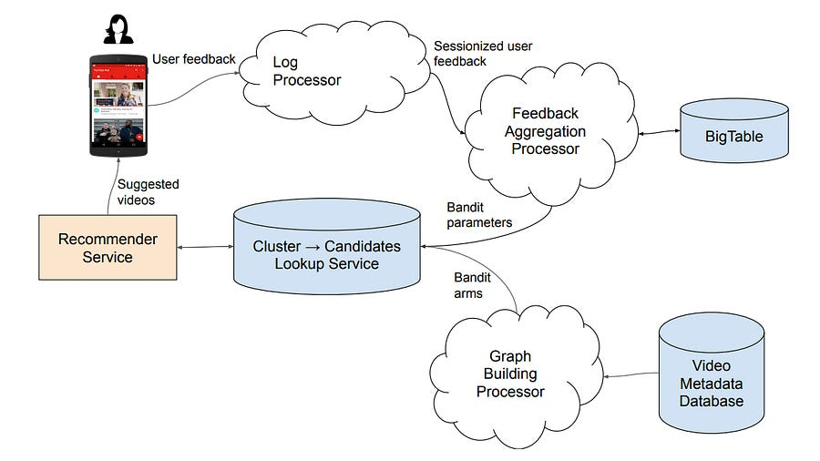

# [RecSys] Part 4: Real time bandits at YouTube

# Introduction

Let’s close the A/B testing and bandits week by taking a look at how YouTube productionizes bandits.

# Real time bandits at YouTube

Batch-trained deep learning models dominate production recommender systems, but they are inherently latent.

The cycle of logging data, training, and deploying introduces significant delays, making them slow to adapt to new items and shifting user interests.

While online learning, particularly contextual bandits, offers a theoretical solution, implementing it at the scale of billions of users and millions of new items per day is a big engineering effort.

#### The Core Challenge: Intractability of Pure Online Learning

A naive application of a contextual bandit algorithm like [LinUCB](https://arxiv.org/pdf/1003.0146) at scale immediately fails due to three critical issues:

  1. **Massive Action Space:** Evaluating a UCB score for every item in a corpus of millions is computationally prohibitive for every user request.

  2. **Expensive Parameter Updates:** LinUCB requires inverting a d x d covariance matrix (A) for each arm (item) to calculate the confidence bound. With streaming updates, this inversion must happen in near real-time, an O(d^3) operation that is just impossible.

  3. **Update Contention:** Popular items receive feedback from many users simultaneously. The standard LinUCB update requires a synchronous, item-level lock, creating a throughput bottleneck.

The Online Matching system solves this by combining offline pre-computation with a novel, scalable bandit algorithm.

#### Step 1: Offline Candidate Space Pruning via a Sparse Bipartite Graph

The first principle is to aggressively prune the exploration space before any online decision is made. Instead of treating the problem as a mapping from millions of users to millions of items, the user space is discretized.

  1. **Co-embedding Users and Items:** An offline two-tower model is trained daily on logged interaction data. This model produces d-dimensional embeddings for users and items, where dot product similarity correlates with engagement.

  2. **User Space Discretization:** A large sample of user embeddings is clustered (e.g., via k-Means) into C centroids (e.g., C = 15k-30k). Each centroid represents a user cohort or micro-interest.

  3. **Graph Construction:** A sparse bipartite graph is constructed between the C user clusters and the N candidate items (e.g., fresh videos). An edge exists between cluster c and item j only if item j is one of the top-W most similar items to the centroid c's embedding, based on Maximum Inner Product Search (MIPS).

This offline process transforms the intractable Users x Items problem into a sparse User Clusters x Items graph. For any given user, we now only need to consider exploring items connected to the clusters they are most similar to.

#### Step 2: Scalable Online Learning with Diag-LinUCB

To operate on this sparse graph, a novel variant of LinUCB, named **Diag-LinUCB** , was developed. Its key innovation is approximating the covariance matrix A_j for each item j with only its diagonal.

A user's context w_u is a sparse C-dimensional vector representing their weighted membership to the top-K nearest clusters. The expected reward for user u on item j is modeled as E[r_uj] = <w_u, θ_j>, where θ_j is the learnable parameter vector for item j.

Under standard LinUCB, updating θ_j requires inverting A_j. Diag-LinUCB bypasses this. The bandit parameters for each edge (c, j) in the graph are reduced to two scalars:

  * b_jc: The sum of rewards, weighted by user context. b_jc ← b_jc + w_uc * r_uj

  * d_jc: The sum of squared context weights (the diagonal term of the covariance matrix). d_jc ← d_jc + w_uc^2

The estimated mean reward for an edge is θ_jc = b_jc / d_jc. The UCB score for a user u and candidate item j is then calculated efficiently as:

UCB_j = Σ_c (w_uc * b_jc / d_jc) + α * sqrt(Σ_c (w_uc^2 / d_jc))

This formulation has system implications:

  * **No Matrix Inversion:** The expensive O(d^3) operation is replaced by a scalar division.

  * **Fully Distributed Updates:** The updates for b_jc and d_jc are atomic and independent for each edge in the graph. This eliminates the item-level lock, allowing for massive parallelization and high throughput. The update system can handle millions of updates per second.

#### End-to-End System Architecture

The Online Matching system is a closed-loop pipeline:

  1. **Offline Pipeline (Hourly/Daily):** The two-tower model trainer, clustering job, and graph builder run in batch, generating the sparse graph that defines the exploration space. New items are added to the graph with low latency.

  2. **Online Agent (Real-time):**

     * A **Recommender Service** receives a user request, generates their embedding, and computes the sparse context vector w_u.

     * It queries a **Lookup Service** to retrieve candidate items and their bandit parameters (b_jc, d_jc) for the user's active clusters.

     * It computes UCB scores, selects an item, and serves the recommendation.

     * User feedback (e.g., clicks, watch time) is processed by a **Log Processor**.

     * A **Feedback Aggregation Processor** performs the Diag-LinUCB updates, writing the new b_jc and d_jc values to **Bigtable**. Bigtable's sparse, wide-column data model is a natural fit, with cluster_id as the row key and item_id as the column qualifier.

     * The updated parameters in Bigtable are pushed to the Lookup Service, closing the loop.

This architecture achieves a median **policy update latency** of ~45 minutes (from user feedback to parameter update) and a **corpus update latency** of ~40 minutes (from new item availability to inclusion in the exploration graph).

#### Deployment and Impact

Online Matching is deployed in two key modes:

  * **Fresh Content Discovery (Explore-Exploit):** A small fraction of traffic (~1-2%) is used for pure UCB exploration to learn item quality. The learned mean rewards (θ_jc) are then used in an "exploitation" mode for the remaining 98-99% of traffic, where Online Matching acts as a high-quality candidate generator for the main ranker. This dual-mode setup resulted in a **+0.15% lift in satisfied user engagement** and a **+8.33% increase in engagement with fresh content**.

  * **Corpus Exploration:** A larger portion of traffic (~6%) is dedicated to UCB exploration on a massive long-tail corpus. A user-corpus co-diverted A/B test setup was used to measure impact accurately. This strategy significantly increased the number of unique videos shown to users (i.e., discoverable corpus size) with a minimal and acceptable short-term engagement cost (-0.05%).

# What’s next?

Next week is final week of the series. Time flies :)

I will be looking at state of the art things: RecSys + LLMs and generative reccomendations.

We will see actual work from companies like Google and TikTok. Should be exciting, see you there!

# References

  1. [YouTube Real Time Bandit Systems](https://arxiv.org/pdf/2307.15893)
