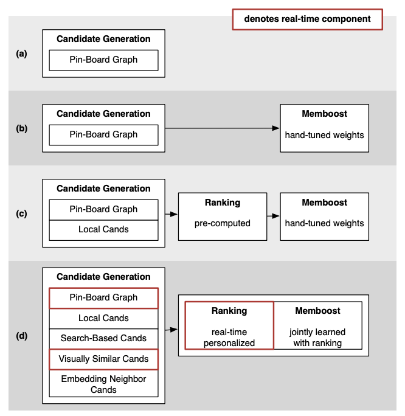

# [Bonus] Pinterest Recommendation Systems evolution through the years: deep dive of 7 architectures

> Paid post — only the publicly visible preview is included.

# Introduction

In today’s article I am going to discuss Pinterest recommendation system evolutions throughout the years.

Pinterest has shared their systems in the open since a long time, so it’s super cool in my opinion to take a look at the evolution through machine learning innovations.

It’s also good way to put together everything we learned in the month of RecSys! :)

# Pinterest RecSys evolution

Lots to cover today, so let’s just get started!

# [1] Related Pins at Pinterest: The Evolution of a Real-World Recommender System

