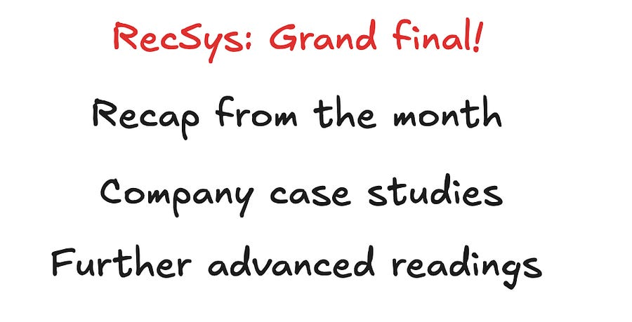
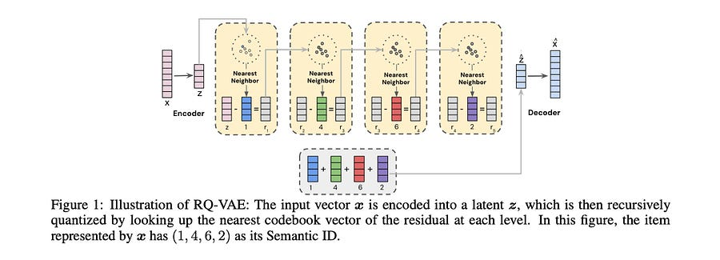

# [RecSys] Grand final!

# What we learned this past month?

Let’s start the grand final by recapping everything we learned this past month:

  * Introduction to RecSys and common blind spots

  * The industry classic: two tower models in production

  * Scaling sequence length for 2B DAUs

  *  Deploying real time bandits at YouTube

I hope you got a lot of values out of all the past newsletter and my LinkedIn posts!

Let’s now close this Generative AI + RecSys week by looking at how you can use generative ranking for better ranking.

# Better Generalization with Semantic IDs: A Case Study in Ranking for Recommendations

The reliance on randomly-hashed item IDs in large-scale recommender systems presents a well-known technical debt: you gain massive memorization capacity at the cost of zero semantic generalization.

This fundamentally limits performance on cold-start and long-tail items.

Let’s see how you can move beyond it by replacing meaningless IDs with structured **Semantic IDs (SIDs)** , achieving superior generalization without compromising the memorization power essential for overall model quality.

#### The Core Problem: The Memorization-Generalization tradeoff

  1. **Randomly-Hashed IDs:** The industry standard. We map billions of item IDs to a multi-million-row embedding table via hashing. This creates a powerful, learnable key-value store where the model memorizes item-specific quality signals (e.g., hash(ID_12345) -> high CTR embedding). The drawback is that the mapping is arbitrary; semantically similar items A and B are mapped to unrelated embedding vectors. A new item C gets a random, uninformative initialization, leading to the classic cold-start problem.

  2. **Direct Content Embedding Replacement:** The intuitive alternative is to replace the ID embedding lookup with a frozen, pre-trained dense content embedding (e.g., from a multimodal encoder). While this provides strong semantic priors for generalization, the paper confirms what many have observed in practice: this often causes a significant drop in overall model quality on large, dynamic corpora. The fixed, non-trainable nature of the input embeddings removes the model's capacity to learn fine-grained, item-level distinctions and popularity signals that are not fully captured by the content representation alone. Increasing model depth (e.g., 1.5x-2x more layers) can partially recover this but comes at a steep serving cost.

#### The Solution: A Two-Stage Framework with Semantic IDs (SIDs)

The paper's core contribution is a two-stage approach that synthesizes the benefits of both worlds.

The goal here is not just to compress, but to create a structured, discrete representation from the dense content embeddings.

  * **Mechanism:** A pre-trained and **frozen** RQ-VAE is used. This model consists of an encoder, a decoder, and a series of L codebooks, each of size K.

  * **Process:**

    1. The encoder maps the input content embedding x to a latent vector z.

    2. The first quantizer finds the nearest codebook vector e_c1 in C1 to z. The first code is c1.

    3. The residual r1 = z - e_c1 is calculated.

    4. The second quantizer finds the nearest vector e_c2 in C2 to the residual r1. The second code is c2.

    5. This process repeats L times, quantizing the residual from the previous stage.

  * **Output:** An L-dimensional integer vector (c1, c2, ..., cL), which is the **Semantic ID**.

  * **Technical Detail:** The RQ-VAE is trained with a joint loss L = L_recon + L_rqvae. The reconstruction loss L_recon = ||x - x_hat||^2 ensures fidelity, while the VQ loss L_rqvae uses stop-gradients (sg) to pull the encoder outputs and codebook vectors towards each other: ||r_l - sg[e_cl]||^2 + ||sg[r_l] - e_cl||^2. This avoids posterior collapse and enables stable training.

  * **Key Property:** This creates a **coarse-to-fine hierarchical representation**. c1 represents a broad semantic category, while subsequent codes c2, ..., cL provide progressively finer details. Items in the same product category might share the same (c1, c2) prefix but differ in later codes. 

This is a HUGE property, you can do a lot of crazy things with it, I speak from experience! ;-)

With a frozen RQ-VAE generating SIDs, the next challenge is to feed them into the ranker.

The SID sequence (c1, ..., cL) is treated as a "sentence" and uses tokenization strategies to create learnable sub-piece embeddings.

  * **Approach A: N-gram Hashing (The Baseline)**

    * **Method:** Group the L codes into fixed-size n-grams. For unigrams, you have L lookups: (c1), (c2), .... For non-overlapping bigrams, you have L/2 lookups: (c1, c2), (c3, c4), ....

    * **Embedding Tables:** This requires separate embedding tables for each n-gram position or a single large table. The vocabulary size grows exponentially with N (e.g., K^N for a single bigram table), hitting the curse of dimensionality and making it impractical for N > 2.

    * **Limitation:** The grouping is static and data-agnostic, leading to suboptimal use of the embedding table budget.

  * **Approach B: SentencePiece Model (SPM) Tokenization**

    * **Method:** Train an SPM model (unigram or BPE) directly on the corpus of item SIDs. The SPM learns a vocabulary of variable-length sub-pieces based on their frequency in the training data.

    * **Data-Driven Vocabulary:** Common, co-occurring SID prefixes (e.g., (c1, c2)) are automatically merged into a single token in the vocabulary. Rare codes or sequences are left as unigrams.

    * **Efficiency & Scalability:** This allows for a **single, fixed-size embedding table** (the SPM vocabulary size). It strikes a balance between memorization and generalization by learning the optimal granularity from the data itself. For a given embedding budget, SPM creates a far more expressive vocabulary than rigid n-grams.

#### Experimental Deep Dive: YouTube Production Results

The experiments were run on a massive production ranking model, replacing the random-hashed video ID features for the user's watch history, current watch, and candidate video.

  * **Superior Cold-Start Performance:** The SID-SPM approach showed significant lifts in CTR AUC on newly uploaded items. This directly validates its improved generalization ability, as the model can infer the quality of a new video from its semantic SID tokenization without prior interaction data.

  * **No Loss in Overall Quality:** Crucially, SID-SPM matched the CTR AUC of the highly optimized random hashing baseline. It solved the generalization problem _without_ creating a memorization deficit.

  * **Serving Efficiency:** SPM is more efficient at inference. The number of embedding lookups per item becomes variable. Popular "head" items, which are mapped to longer, more common SPM tokens, require fewer lookups. This adaptively manages computational cost.

#### Key Technical Takeaways & System Implications

  1. **Frozen Components are Viable:** A key design choice is freezing the RQ-VAE model. The paper's analysis showed that SID representations remained stable and effective over time, even as the item corpus evolved. This is critical for production, as it decouples the expensive content model training (infrequent) from the ranking model training (continuous).

  2. **Treat IDs as a Language:** The paradigm shift is to stop treating item IDs as opaque keys and start treating their semantic representations as a structured language. This unlocks powerful, data-driven tokenization techniques from NLP.

  3. **A Practical Recipe:** This provides a blueprint:

     * **Offline:** Train a powerful content encoder. Train and freeze an RQ-VAE on its embeddings. Train and freeze an SPM model on the resulting SIDs from your item corpus.

     * **Online:** In the ranker's training/serving path, use the frozen RQ-VAE and SPM to convert an item's content embedding into a short list of token IDs. Perform lookups on a single, trainable embedding table.

  4. **Control over the Trade-off:** This framework gives engineers explicit control. The SID length (L), codebook size (K), and SPM vocabulary size are all levers to tune the balance between representation granularity, memorization capacity, and computational budget.

# Want to learn more Machine learning system design?

Actually… 

**You** could tell me what you look for in a machine learning system design course!

I want to do something extremly high touch: live cohorts, low number of attendees, actual designing systems.

[Let me know what you think about that here to get a discount when that’s going to launch! :)](https://app.youform.com/forms/tfc7z4jo)

# References

  1. [Better Generalization with Semantic IDs: A Case Study in Ranking for Recommendations](https://arxiv.org/pdf/2306.08121)
