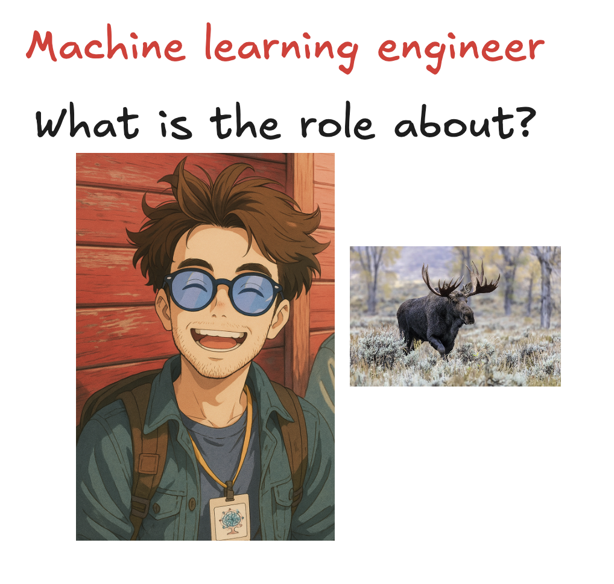

# [Bonus] The most overloaded role: "Machine learning engineer"

*let's demistify what it actually is (spoiler: no single definition)*

<figure><a class="image-link image2 is-viewable-img" target="_blank" href="../assets/1c42d78176ca8488.png" data-component-name="Image2ToDOM">
<picture><source type="image/webp" srcset="../assets/1c42d78176ca8488.png 424w, ../assets/1c42d78176ca8488.png 848w, ../assets/1c42d78176ca8488.png 1272w, ../assets/1c42d78176ca8488.png 1456w" sizes="100vw"></picture>

<button tabindex="0" type="button" class="pencraft pc-reset pencraft icon-container restack-image buttonBase-GK1x3M"><svg aria-hidden="true" width="20" height="20" viewBox="0 0 20 20" fill="none" stroke-width="1.5" stroke="var(--color-fg-primary)" stroke-linecap="round" stroke-linejoin="round" xmlns="http://www.w3.org/2000/svg" class="icon-noB79L"><g><path d="M2.53001 7.81595C3.49179 4.73911 6.43281 2.5 9.91173 2.5C13.1684 2.5 15.9537 4.46214 17.0852 7.23684L17.6179 8.67647M17.6179 8.67647L18.5002 4.26471M17.6179 8.67647L13.6473 6.91176M17.4995 12.1841C16.5378 15.2609 13.5967 17.5 10.1178 17.5C6.86118 17.5 4.07589 15.5379 2.94432 12.7632L2.41165 11.3235M2.41165 11.3235L1.5293 15.7353M2.41165 11.3235L6.38224 13.0882"></path></g></svg></button><button tabindex="0" type="button" class="pencraft pc-reset pencraft icon-container view-image buttonBase-GK1x3M"><svg xmlns="http://www.w3.org/2000/svg" width="20" height="20" viewBox="0 0 24 24" fill="none" stroke="currentColor" stroke-width="2" stroke-linecap="round" stroke-linejoin="round" class="lucide lucide-maximize2 lucide-maximize-2 icon-noB79L"><polyline points="15 3 21 3 21 9"></polyline><polyline points="9 21 3 21 3 15"></polyline><line x1="21" x2="14" y1="3" y2="10"></line><line x1="3" x2="10" y1="21" y2="14"></line></svg></button>

</a></figure>

(The moose picture will be come clear as things go on!)

If there’s one question that I keep getting asked over and over again on my socials is:

“What do you actually do as Machine learning engineer (MLE)?”

Followed closely by:

“What should I learn / focus on to: 1. get a role like that, 2. perform well in that role”

I will draw on my experiences to give an idea of the work and how wildly different it can be depending on the company and on the team within the company.

The most interesting is for sure my two ML heavy roles at Google.

It looks like to me the “MLE” job title is like the “DS” job title a few years ago, so it’s important to clarify expectations.

Let’s go!
<h1>Machine learning engineer intern ClearBox.ai</h1>
Wow, time flies. 6 years ago I did a machine learning internship at a startup in <a href="https://en.wikipedia.org/wiki/Turin">Turin, Italy</a> while studying for my MSc in Applied Maths.

It was truly a different time. There, I focused on a purely research based project where I trained a image recognition to be robust against adversarial attacks.

Adversarial attacks are <strong>techniques used to manipulate machine learning models, causing them to make incorrect predictions or decisions</strong>.

I did something that I now realize is a key experience:
<ol><li>
pick a paper
</li><li>
implement it
</li><li>
validate it works
</li></ol>
There was no major new development, but it’s very important to be able to read papers and really understand what’s going on.
<h1>Machine learning engineer intern VolvoCars</h1>
Here, things took a turn for the more applied side of things: “put an ML model on the car GPU that is useful”

I settled for an object detection model to detect “mooses”.

Yep, those:

<figure><a class="image-link image2 is-viewable-img" target="_blank" href="../assets/94e54b160c03d57c.avif" data-component-name="Image2ToDOM">
<picture><source type="image/webp" srcset="../assets/94e54b160c03d57c.avif 424w, ../assets/94e54b160c03d57c.avif 848w, ../assets/94e54b160c03d57c.avif 1272w, ../assets/94e54b160c03d57c.avif 1456w" sizes="100vw"></picture>

<button tabindex="0" type="button" class="pencraft pc-reset pencraft icon-container restack-image buttonBase-GK1x3M"><svg aria-hidden="true" width="20" height="20" viewBox="0 0 20 20" fill="none" stroke-width="1.5" stroke="var(--color-fg-primary)" stroke-linecap="round" stroke-linejoin="round" xmlns="http://www.w3.org/2000/svg" class="icon-noB79L"><g><path d="M2.53001 7.81595C3.49179 4.73911 6.43281 2.5 9.91173 2.5C13.1684 2.5 15.9537 4.46214 17.0852 7.23684L17.6179 8.67647M17.6179 8.67647L18.5002 4.26471M17.6179 8.67647L13.6473 6.91176M17.4995 12.1841C16.5378 15.2609 13.5967 17.5 10.1178 17.5C6.86118 17.5 4.07589 15.5379 2.94432 12.7632L2.41165 11.3235M2.41165 11.3235L1.5293 15.7353M2.41165 11.3235L6.38224 13.0882"></path></g></svg></button><button tabindex="0" type="button" class="pencraft pc-reset pencraft icon-container view-image buttonBase-GK1x3M"><svg xmlns="http://www.w3.org/2000/svg" width="20" height="20" viewBox="0 0 24 24" fill="none" stroke="currentColor" stroke-width="2" stroke-linecap="round" stroke-linejoin="round" class="lucide lucide-maximize2 lucide-maximize-2 icon-noB79L"><polyline points="15 3 21 3 21 9"></polyline><polyline points="9 21 3 21 3 15"></polyline><line x1="21" x2="14" y1="3" y2="10"></line><line x1="3" x2="10" y1="21" y2="14"></line></svg></button>

</a></figure>

There’s a joke that there are more mooses than swedish people, so that felt an important animal to detect! 

In the ML space, people understood already in 2020 that transformers were quite good, so I focused on adapting <strong><a href="https://arxiv.org/abs/2005.12872">End-to-End Object Detection with Transformers</a> (object detection model by Meta, then Facebook)</strong> for our use cases.

It was quite interesting, even though I worked mostly alone without cloud GPUs (but I did have one “on prem” GPU :D).

It was particularly interesting to play around deploying things on the actual GPU of the car, my memory is not serving me well but I remember I had to quantize the model to make it fit.

What I learned there:
<ul><li>
Hardware knowledge 
</li><li>
I can say i knew about transformers already 5 years ago!
</li><li>
Object detection models
</li></ul>
Pretty fun, but this again was a bit too researchy for my tastes, after all it was an internship for my master thesis.
<h1>Machine learning engineer: first role at Google</h1>
In my first role at Google, I worked in a team that is tasked to find hijackers / abusive accounts.

If you are reading this it means you are a premium sub of the newsletter.

Big thank you as always! :)

A few things:
<ul><li>
At Google scale, this is BIG
</li><li>
Hijackers don’t tell you that they are hijackers… training data is not easy to get
</li><li>
Constant shifts in the space: as you “fix” something, you never know what’s the next easy surface they are going to attack. it feels like an endless mouse and cat game.
</li></ul>
This was the first role where the focus was not particularly on the modeling side of things, but rather on the whole infra.

I’d say in true pareto style, 80% of the role was
<ul><li>
How to deploy models and make they are up to date
</li><li>
How to integrate additional data sources to make models better
</li><li>
How to make sure other teams can operate on the infra
</li></ul>
And only 20% of the time was spent on actual modelling work:
<ul><li>
tensorflow development
</li><li>
feature engineering
</li><li>
model architectures
</li></ul>
Here, I believe I learned what it means to be a “Software engineer” according to Google and the learnings were around making things scalable and reliable while still driving impact.

I also learnt that being a machine learning engineer means being
<h1>1-year stint as a “Full stack SWE with minimal ML work”</h1>
I wanted to really feel how a full stack product engineer works, so I did a brief stint with YouTube Ads on a back-end heavy full stack role.

It was honestly quite fun and it’s super interesting to see immediately the impact of your work through user facing changes.

However, I was really missing ML work, so I went back to a heavy ML focused role.

Still, I learned A LOT, maybe not in terms of hard code technical skills, but these are my learnings:
<ul><li>
How to run a business: we were responsible for the P&amp;L of Home, WatchNext and Search surfaces with finance targets we had to meet. Exciting to move the needle for YouTube as a whole, even though it was a bit stressful at times
</li><li>
Analyzing  experiments and understanding the long term effects on users. Sometimes results are not what you expect!
</li><li>
Quite refreshing where you need to just optimize “revenue”, makes it easy to understand tradeoffs!
</li></ul>
In this year, I think I did what has been my biggest accomplishment at Google: I launched a new feature for &gt;1B DAUs that completly reshapes the way Ads are served and shown on the home page. WOAH! I still play with that feature every now and then, it just is soooo cool and the amount of systems and codebases I touched to make it happen still makes me giggle.
<h1>Machine learning engineer: current role at Google</h1>
In my current role at Google, I work on the YouTube recommendation system, specifically focusing on recommending more shopping videos to users.

Here, the role shifted from massively being infra heavy to being full product:
<ul><li>
Infra is totally handled by other teams, we are just clients of the infra.
</li><li>
We have one north start metric and we do all we can to optimize that. Numbers must go up and to the right and that’s how your team is evaluated
</li><li>
You can try things out if you have a good idea and see the results pretty easily.
</li></ul>
What I find quite refreshing to being back to a ML focused role in a product heavy team, is that launching things is surprisingly easy! At the end of the day, you change some weights of a model in production, and if you can prove that the change is good, you don’t have much to worry about in terms of dependencies.

The only dependencies you can have are:
<ul><li>
Data dependencies, you need to make sure data will keep flowing in!
</li><li>
Costs / latency: your new amazing ML model should still be served in prod with reasonable costs.
</li></ul>
This is a striking difference with the previous product team, where a new feature means A LOT of coding and building on top of the gigantic O(M) LOCs codebases, which makes it hard to launch things fast in my opinion.
<h1>What did we learn from ALL this?</h1>
A few things I hope:
<ul><li>
A machine learning engineer in my opinion is still a software engineer first. Account for that! Especially as modelling is getting more and more abstracted away with tools. Software still eating the world in 2025. (see how the data scientist role is doing currently? Not so good IMHO)
</li><li>
Different teams see the role wildly differently: you could be doing very little modelling or only modelling. Try to understand that to make sure it’s aligned with your career aspirations!
</li><li>
Trying also non-ML things can be a good opportunity to increase your range of skills
</li><li>
Always be learning and be challenged. I realize now that being challenged in your role, while uncomfortable in the moment makes you much stronger later on.
</li><li>
One thing to note is that you should have the psychological safety to take risks and have a leadership team that thinks it’s OK to fail at them, what matters is the failure mode.
</li></ul>
Hope you found value in this premium article. Let me know in the comments what you’d like to see next!

