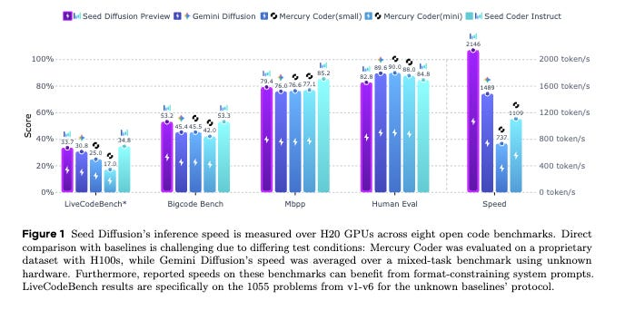

# Seed Diffusion: A Large-Scale Diffusion Language Model with High-Speed Inference

*2,146 tokens/s Code Model with Discrete Diffusion*

*2,146 tokens/s Code Model with Discrete Diffusion*

#### **TLDR:**

  * **What it is:** A large-scale language model for code based on discrete-state diffusion, designed for extremely fast, parallel inference.

  * **Key Result:** It achieves an inference speed of **2,146 tokens/second** on H20 GPUs. This is a substantial leap over other diffusion models like Mercury Coder and Gemini Diffusion, and it achieves this while posting competitive scores on benchmarks like MBXP (72.6 average), BigCodeBench, and HumanEval.

  * **How it Works:** The model's success comes from a series of interconnected innovations that overcome the traditional bottlenecks of diffusion-based approaches:

    1. **Two-Stage Curriculum (TSC) Training:** A new forward process that combines standard mask-based corruption with an **edit-based corruption** process. This forces the model to learn self-correction, a critical capability where previous diffusion models have struggled.

    2. **Constrained-Order Trajectory Distillation:** After initial training, the model is fine-tuned on a distilled dataset of "optimal" generation paths. This mitigates the inefficiency of learning from purely random token orders and closes the quality gap with autoregressive models.

    3. **On-Policy Speed-Up:** A reinforcement learning-style paradigm is used to directly optimize the model to generate code in fewer iterative steps, drastically reducing latency without catastrophic quality degradation.

    4. **Block-Parallel Inference:** At inference, a semi-autoregressive scheme generates blocks of tokens in parallel, leveraging KV-caching and specialized system optimizations to balance parallel throughput with generative quality.

# Deep dive

#### 1\. TSC: A More Robust Training Curriculum

A fundamental flaw in standard mask-based diffusion training is the introduction of a detrimental inductive bias. The model learns that any unmasked token in its input is "correct" and should be preserved. This leads to overconfidence and an inability to perform self-correction on its own generated output during the iterative denoising process.

Seed Diffusion introduces a **Two-Stage Curriculum (TSC)** to build a more robust model:

  * **Stage 1: Mask-Based Corruption (80% of training).** This initial phase uses the standard diffusion process where tokens are progressively replaced with a special [MASK] token. This allows the model to learn a strong foundational understanding of the data distribution, forming a solid basis for density estimation.

  * **Stage 2: Edit-Based Corruption (20% of training).** To counteract the "unmasked tokens are always correct" bias, the final training phase introduces an additional corruption process based on Levenshtein distance. This process applies a controlled number of token-level edits (insertions, deletions, and substitutions) to the input sequence. By doing so, it forces the model to re-evaluate and potentially correct _all_ tokens, including those that were not originally masked. This augmentation is critical for improving model calibration and teaching it the essential skill of self-correction during inference.

#### 2\. Taming the Trajectory Space with Constrained-Order Distillation

Mask-based diffusion models are equivalent to training an autoregressive model over all possible generation orders (permutations) of the sequence. While theoretically powerful, this is practically inefficient. The model wastes significant capacity learning from unnatural or detrimental orders (e.g., generating the middle of a function before its declaration), which contributes to the persistent quality gap between diffusion and standard left-to-right AR models.

Seed Diffusion's solution is to **constrain the vast space of possible generation trajectories** :  
After the initial TSC training, the model is used to generate a large, diverse pool of candidate generation trajectories for samples in the training set. A selection criterion based on maximizing the Evidence Lower Bound (ELBO) is then used to filter this pool, retaining only the most efficient and "high-quality" trajectories. Finally, the model is fine-tuned on this distilled dataset. This procedure implicitly teaches the model to favor more logical and structured generation paths, significantly closing the performance gap with its AR counterparts without sacrificing the flexibility of the diffusion framework.

#### 3\. On-Policy Learning for Drastic Speed-Up

The primary advantage of NAR models is parallel decoding, but this benefit is often nullified by the slow, iterative nature of the denoising process. Each step adds latency, and simply reducing the number of steps typically causes a severe degradation in output quality.

To break this bottleneck, the team implements an **on-policy learning paradigm** to explicitly train for speed. The objective is formulated to directly minimize the length of the generation trajectory (|τ|). To prevent the model from simply outputting nonsense in a single step, this objective is balanced by a model-based verifier that ensures the final generated sample is of high quality.

The paper notes that directly minimizing the trajectory length led to unstable training dynamics. They instead optimized a progressive surrogate loss based on the insight that the number of steps is inversely proportional to the Levenshtein distance between states in the trajectory (dLev(τ[i], τ[j])). This simple method provides a stable training signal and leads to a dramatic acceleration, with the model achieving a **+400% speedup** over its baseline during this phase of training.

#### 4\. Inference: Block-Parallel Decoding & System Co-Design

To translate these training improvements into real-world inference speed, Seed Diffusion employs a **semi-autoregressive block-level parallel diffusion** scheme. A single, fully parallel inference step over a long sequence is computationally expensive. This scheme finds a middle ground:

  * **How it works:** The model generates a block of tokens (e.g., 32 tokens) entirely in parallel. It then uses KV-caching to condition the generation of the next block, which is also generated in parallel. This process repeats, mixing the speed of parallel decoding within blocks with the coherence of a sequential process between blocks.

  * **Key detail:** A significant win is that they avoid training block-specific models or positional embeddings. The model's robustness, gained from the edit-based curriculum and constrained-order distillation, allows it to flexibly handle arbitrary block partitioning at inference time without a noticeable drop in quality.

### Performance Highlights

The results show that Seed Diffusion successfully combines speed and quality, setting a new benchmark for what's possible with non-autoregressive models.

  * **Speed:** The headline figure is **2,146 tokens/s** on H20 GPUs, a speed that dramatically reduces latency for interactive code generation tasks.

  * **Code Generation:** On the multilingual MBXP benchmark, it achieves an average score of **72.6** , which is highly competitive with strong AR models in the ≤15B parameter class, such as Qwen2.5-Coder-7B-Instruct (72.9) and surpasses many others.

  * **Code Editing:** The model truly excels on code editing tasks, a direct payoff from its edit-based training curriculum. On the CanItEdit benchmark, it scores **54.3 pass@1** , outperforming even larger models like Codestral-22B (52.4) and specialized code models like Seed-Coder-8B (50.5).

# References

  1. [Seed diffusion](https://seed.bytedance.com/en/seed_diffusion)
