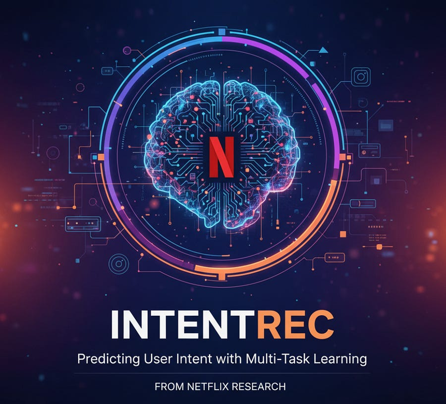
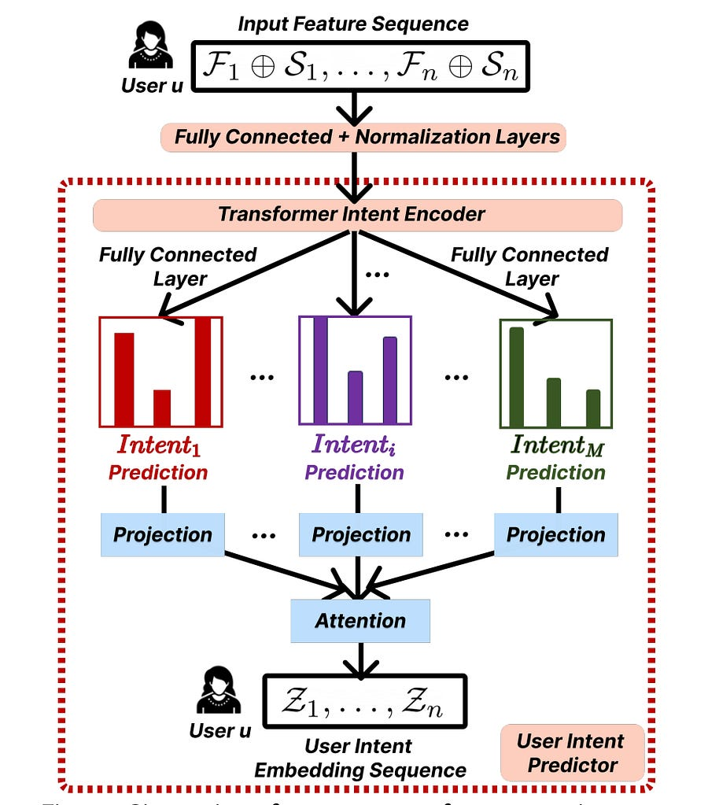

# IntentRec: Predict user intent with multi task learning

*hierarchical models for big business gains!*

*hierarchical models for big business gains!*

For MLEs working in recommender systems, the challenge is always to capture the nuance of user behavior. Are they exploring, binge-watching, or looking for something specific? Most sequential models treat these sessions as a simple stream of item IDs, ignoring the rich metadata that hints at the underlying intent. The IntentRec paper tackles this head-on.

**TL;DR:** A new paper from Netflix, "IntentRec," introduces a hierarchical multi-task learning (H-MTL) framework that significantly improves next-item prediction.

It explicitly models a user's latent intent as an intermediate task, using the output to directly inform the final item recommendation. The architecture effectively separates and models short- and long-term user interests, leading to a 7.4% accuracy uplift over the state-of-the-art TransAct model on their internal dataset.

Pretty cool! Let’s dive into the architecure :)

#### The Core Problem with Existing Approaches

Standard sequential recommenders (even Transformer-based ones) and simple multi-task learning (MTL) models have two key limitations that IntentRec addresses:

  1. **Lack of Hierarchy:** In a typical MTL setup, auxiliary tasks (like predicting genre) and the main task (predicting the next item) are learned in parallel, sharing a common backbone. The auxiliary task informs the main task only implicitly through shared weights. There's no direct pipeline where the _prediction_ of the intent influences the _prediction_ of the item.

  2. **Poor Short/Long-Term Interest Modeling:** A user's immediate interest (e.g., watching horror movies with friends tonight) can diverge significantly from their long-term profile. Naively mixing all historical interactions makes it hard to capture this session-specific context.

#### The IntentRec Architecture: A Three-Stage Breakdown

IntentRec is built on a hierarchical architecture composed of two main Transformer-based predictors.

**Stage 1: Input Feature and Short-Term Interest Construction**

This is a key engineering insight. Instead of using a fixed-size window of recent items, IntentRec defines short-term interest based on a time window (e.g., interactions within the last hour or week, a hyperparameter H).

For each interaction int_k in a user's sequence, a short-term interest feature S_k is computed. This is done by feeding all previous interactions within the time window H through a dedicated **Short-term Transformer Encoder**. This makes the short-term context personalized and dynamic. The final input feature for step k is the concatenation of the raw interaction features F_k and this computed short-term interest S_k.

Input_k = F_k ⊕ S_k

**Stage 2: User Intent Prediction (The First Task)**

The sequence of input features is fed into a **Transformer Intent Encoder**. This encoder's job is to learn a representation that's good for predicting various facets of user intent. At each step, the model outputs predictions for several predefined intent proxies. In the paper, these are:

  * **Action Type:** (e.g., discovery, continue watching)

  * **Genre Preference:** (e.g., horror, thriller)

  * **Show/Movie Preference**

  * **Time-since-release:** (e.g., preference for new vs. old content)

Critically, these individual intent prediction vectors are not just used for calculating a loss. They are projected into a common dimension and then aggregated using a trainable **attention mechanism** to form a single, comprehensive user intent embedding Z_k.

Z_k = Attention(Proj_1(p_intent_1), ..., Proj_M(p_intent_M))

This attention mechanism is powerful, as the learned weights reveal which intent dimension is most important for a specific user at a given time.

**Stage 3: Next-Item Prediction (The Hierarchical Step)**

This is where the hierarchy comes into play. The user intent embedding Z_k from the previous stage is concatenated with the original input feature F_k ⊕ S_k. This creates an "intent-aware" feature sequence.

IntentAwareInput_k = F_k ⊕ S_k ⊕ Z_k

This new sequence is fed into a second, separate **Transformer Item Encoder**. The paper notes that using separate encoders for intent and item prediction empirically outperformed a shared architecture. The output of this encoder is then used to predict the next item ID.

#### Key Results and Ablation Studies

IntentRec outperforms all baselines, including SASRec, BERT4REC, and the previous SOTA, TransAct.

The ablation studies are particularly insightful for engineers:

  * **Simple MTL vs. Hierarchical MTL:** Moving from a simple MTL architecture (V1) to a hierarchical one (V2) where the intent prediction informs the item prediction yielded a **+4.53%** gain in item prediction accuracy. This confirms the value of the hierarchical design.

  * **Adding Short-Term Features:** Incorporating the time-window-based short-term interest features (V3) provided another significant boost, bringing the total improvement to **+8.28%** (over V1).

  * **Which Intent Matters Most?** The ablation in Table 3 shows that predicting the **Action Type** is the single most impactful auxiliary task, contributing a +7.73% lift on its own. This is intuitive, as knowing _why_ a user is interacting (to discover, to continue, etc.) is a powerful signal.

#### Practical Takeaways for MLEs

  1. **Architecture Matters:** The hierarchical flow—predict intent first, then use it as a feature for item prediction—is a powerful pattern that can be applied to other domains.

  2. **Sophisticated Feature Engineering Wins:** The dynamic, timestamp-based short-term interest feature is more robust than a simple fixed-size sliding window.

  3. **Interpretability as a Byproduct:** The attention weights over the intent heads (Fig. 7) are a valuable tool for model diagnostics and user understanding. You can directly inspect whether a recommendation was driven by a user's preference for a genre, new content, or a specific action type.

  4. **Embeddings for Downstream Use:** The learned user intent embeddings Z_k are high-quality representations that can be used for user segmentation, churn prediction, or analytics (as shown in the t-SNE plot in Fig. 6).

In summary, IntentRec presents a well-designed and empirically validated framework that moves beyond simple sequential modeling. By explicitly modeling and leveraging user intent in a hierarchical fashion, it offers a path toward more accurate, personalized, and interpretable recommender systems.

# References

  1. [IntentRec: Predicting User Session Intent with Hierarchical Multi-Task Learning](https://arxiv.org/pdf/2408.05353)
