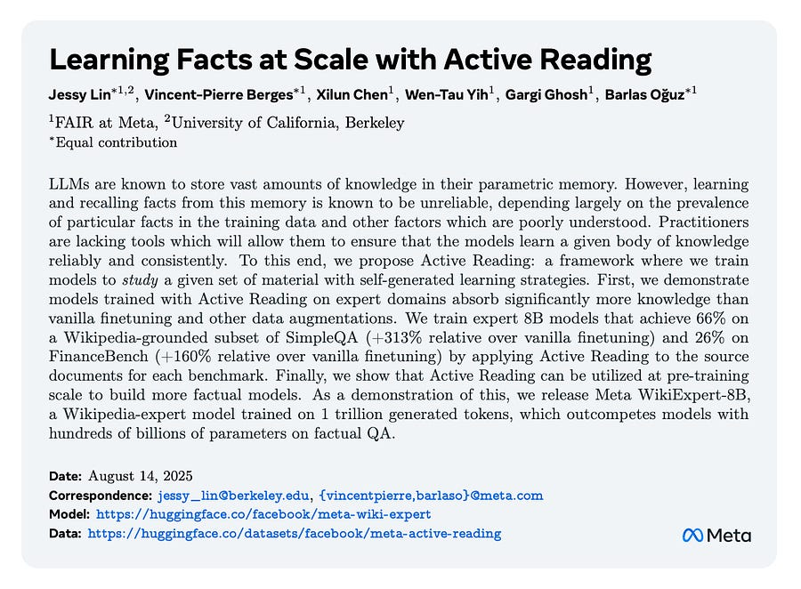

# Learning Facts At Scale With Active Reading

*How to reliably embed knowledge into a model's parameters?*

*How to reliably embed knowledge into a model's parameters?*

**TLDR** Active Reading is a new method from Meta to make LLMs reliably learn facts. Instead of just finetuning on text, the model is prompted to first generate its own diverse "learning strategies" for a document (e.g., create a timeline, use analogies) and then uses those to create a varied synthetic training dataset.

The key is data diversity. This approach avoids the performance plateaus of single-strategy methods like paraphrasing or synthetic QA.

* * *

This week, a paper from Meta FAIR, "Learning Facts at Scale with Active Reading," presents a new methodology for improving the factual reliability of LLMs.

It moves beyond the limitations of passive finetuning to a structured, self-directed learning paradigm that yields significant gains in knowledge internalization.

For engineers working on knowledge-intensive applications, the techniques and scaling insights are highly relevant.

#### **The Core Problem: Brittle Parametric Knowledge**

We know that simply increasing the weight of a knowledge source in finetuning data is inefficient. It often leads to overfitting on surface forms without true generalization. While paraphrasing or synthetic QA generation are improvements, the Meta paper argues they are single, fixed strategies that lack the diversity needed for robust learning and hit performance plateaus quickly.

#### **The Method: Active Reading as a Two-Stage Synthetic Data Pipeline**

Active Reading formalizes a more dynamic approach to knowledge injection. The core idea is to have the model "study" a document by first creating its own learning strategies and then generating training data based on them.

**Stage 1: Self-Generated Learning Strategies**  
Instead of using a fixed template (e.g., "generate a question and answer"), the model is prompted to devise multiple, context-specific strategies for a given source document. The authors experiment with two prompting approaches:

  * **Task-Agnostic:** A general prompt asking the model to generate effective strategies to learn the material (e.g., "Create a timeline," "Use association with other known events," "Create a song or rhyme").

  * **Task-Specific:** A more targeted prompt that first asks the model to imagine downstream questions (e.g., "imagine trivia questions from this text") and then generate learning strategies that would help answer those types of questions. This variant was found to produce more diverse and focused data.

**Stage 2: Synthetic Data Generation**  
Each strategy from Stage 1 is then used as a prompt to transform the source document into a new training instance. This creates a rich, multi-faceted dataset from a single source document, emulating how a human might create flashcards, summaries, and concept maps to master new information.

The key hypothesis, supported by the results, is that this **data diversity** is the primary driver of effective learning. The paper's analysis using self-BLEU (Figure 6) confirms that Active Reading generates text with significantly less n-gram overlap compared to paraphrasing or synthetic QA, especially as the volume of generated data per document increases.

#### **Empirical Validation I: Expert Domain Adaptation**

The first set of experiments tests Active Reading's ability to inject knowledge from a closed corpus for a specific domain. Using a Llama 3.1 8B model, the results are striking:

  * **SimpleWikiQA (tail-fact recall):**

    * Vanilla Finetuning (repetition): 16% accuracy

    * Paraphrasing: 26% accuracy

    * Synthetic QA: 48% accuracy

    * **Active Reading: 66% accuracy**

Notably, the 66% accuracy from the purely parametric model _matches_ the performance of the same model given the ground-truth document in-context (an oracle RAG setup).

  * **FinanceBench (domain-specific QA):**

    * Vanilla Finetuning: 10% accuracy

    * **Active Reading: 26% accuracy**

The scaling curves show that while paraphrasing and synthetic QA plateau after ~1B generated words, Active Reading's performance continues to climb, reinforcing the importance of data diversity.

#### **Empirical Validation II: Scaling to Pre-training with WikiExpert-8B**

The most ambitious part of the work scales Active Reading to the entirety of Wikipedia, generating 1 trillion tokens of synthetic data to train **Meta WikiExpert-8B**. This experiment revealed crucial insights about scaling knowledge injection.

**The Scaling Challenge:** The authors found that naively adding more Wikipedia documents to the training mix (as "distractors") degraded performance on the target SimpleWikiQA task. A standard finetuning setup was insufficient.

**The Solution:** To succeed at scale, they had to shift from a finetuning to a **continued pre-training** paradigm:

  1. **Higher Learning Rate:** The LR was increased from 1e-5 to 3e-4 to provide the model with enough "plasticity" to absorb the vast new information.

  2. **Heavy Pre-training Data Mix:** The final training mix consisted of 50% Active Reading Wikipedia data and 50% general pre-training data. This was critical not only to prevent degradation of general capabilities (guardrail tasks) but, surprisingly, _also to enable the learning of the new facts_. Even with fewer gradient steps on the SimpleWikiQA data itself, its performance recovered and improved when mixed with more pre-training data.

**The Result:** The resulting Meta WikiExpert-8B (trained on a total of 8T tokens) significantly boosts factual recall over its base model. It outperforms much larger models on the adversarial SimpleQA benchmark:

  * Llama 3.1 8B: 7.3

  * **WikiExpert-8B: 23.5**

  * DeepSeekV2 236B: 10.2

  * Llama 3.1 405B: 17.1

  * DeepSeekV3 671B: 24.9 (competitive with SoTA)

#### **Key Engineering Takeaways**

  1. **For Knowledge Injection, Prioritize Diversity:** When generating synthetic data for factual learning, a single strategy is not enough. A multi-strategy approach like Active Reading avoids performance plateaus and leads to more robust knowledge internalization.

  2. **Scaling Knowledge Requires a Pre-training Mindset:** Injecting a large corpus of knowledge is not a standard finetuning task. Expect to use higher learning rates and a significant mix of general pre-training data to maintain model stability and facilitate new learning.

  3. **Self-Generated Data Can Outperform Teacher-Generated Data:** In a surprising finding, the 8B model learned more effectively from its _own_ self-generated Active Reading data than from data generated by a superior 70B model. This suggests a "zone of proximal development" effect, where data that is closer to the model's current representational capacity is more easily assimilated.

# References

  1. [Learning Facts at Scale with Active Reading](https://www.arxiv.org/pdf/2508.09494)
