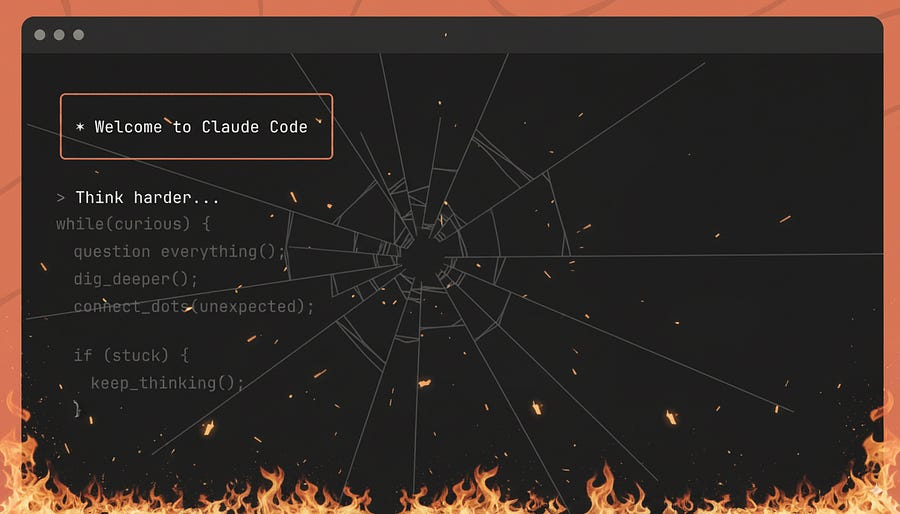
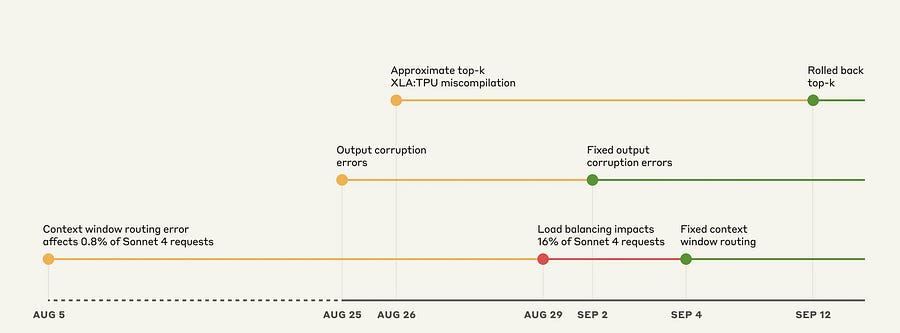

# Deep Dive into Claude Code post mortem

*aka reading post mortem is my guilty pleasure!*

> Paid post — only the publicly visible preview is included.

*aka reading post mortem is my guilty pleasure!*

# Introduction

At work, while waiting for tests to ~~pass~~ fail or queries to run, I lose myself into the internal post mortem page, named OMG (we fun).

It’s always super cool to learn about different failure modes and looking at postmortems makes you realize how edge cases can impact heavily the business in case when you count in billions.

In this special edition article today, I will cover the latest and greatest postmortem from Anthropic themselves!

# The set up

I don’t know about you, but I saw so many twitter posts of people complaining about Claude code dropping in quality, while others were claiming everything is good and there’s a “skill issue”.

Now, that can be! But: if something was working before and now it’s not working anymore and you did not change your prompts / vibe coding style… something’s off right?

That’s also what Anthropic team realized! 

So the investigation begins…

Timeline shared from Claude Code team

Context window routing errors?

Corruption errors?

XLA:TPU miscompilation?

All overlapping!?

Strap in, this is going to be fun…
