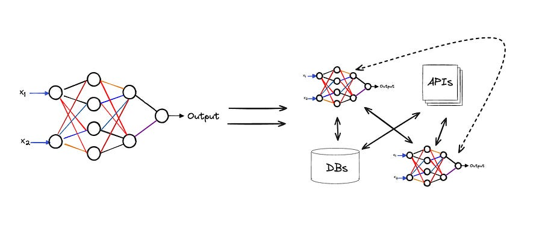

# Agent Learning from Human Feedback (ALHF)

*case study directly from databricks!*

*case study directly from databricks!*

**TLDR** Databricks introduced **Agent Learning from Human Feedback (ALHF)** , a new method where AI agents learn from small amounts of natural language feedback, not just large datasets or simple scores.

In a case study, a Q&A agent's ability to follow specific expert instructions skyrocketed from **~12% to ~80%** with just **32 pieces of feedback** , proving it's highly efficient. The system works by using an "agent memory" to retrieve relevant feedback for new questions and then applies it to the correct part of its reasoning process (e.g., search query vs. final answer).

### A New Paradigm for Agent Adaptation: Agent Learning from Human Feedback (ALHF)

In enterprise AI applications, aligning models with specialized domain knowledge and implicit user expectations is a persistent challenge.

Standard fine-tuning requires large, static datasets of ground-truth examples, which are costly to produce. Reinforcement Learning from Human Feedback (RLHF) has advanced the field, but its reliance on scalar or binary rewards limits the richness of the signal that can be incorporated.

A recent publication from Databricks researchers introduces Agent Learning from Human Feedback (ALHF), a learning paradigm where agents adapt their behavior by incorporating a small volume of natural language feedback from domain experts.

This approach moves beyond simple rewards to leverage the high-bandwidth, nuanced information contained in textual critiques, enabling more sample-efficient and targeted system alignment.

### Case Study: ALHF in the Databricks Knowledge Assistant

The effectiveness of ALHF is demonstrated through a case study on the Databricks Knowledge Assistant (KA), a system designed to create chatbots over proprietary document sets. The evaluation was conducted using the DocsQA dataset, which includes questions on Databricks documentation and a set of defined expert expectations.

**Evaluation Framework**

To measure performance, responses were evaluated against two distinct metrics using LLM judges:

  1. **Answer Completeness:** This metric assesses factual correctness by comparing the agent's response to a reference answer from the dataset. It serves as a baseline for information quality.

  2. **Feedback Adherence:** This measures how well the response incorporates the specific expert expectations articulated in the natural language feedback. This is the primary measure of the agent's ability to adapt.

**Empirical Results**

The results show a clear and significant impact from ALHF, even with minimal feedback. On a held-out test set:

  * **Initial State (0 Feedback):** The KA system starts with a high Answer Completeness score, comparable to other leading systems. However, its Feedback Adherence is low (11.7%), as it is not yet aware of the specialized expert criteria.

  * **With Feedback (32 records):** After incorporating just 32 pieces of natural language feedback, the agent's performance improved substantially.

    * **Answer Completeness** increased by 12 percentage points, outperforming static baselines.

    * **Feedback Adherence** saw the most significant change, increasing from 11.7% to nearly 80%.

This demonstrates ALHF's high sample efficiency and its direct impact on aligning agent behavior with expert requirements, a dimension not captured by traditional factual correctness metrics.

### Core Technical Challenges and Solutions

The implementation of ALHF addresses two fundamental technical challenges: determining when to apply feedback and how to modify the system in response.

**1\. Scoping: Learning When to Apply Feedback**

The first challenge is to determine the scope of applicability for any given piece of feedback. For example, feedback stating "the answer should be compatible with PostgreSQL" should generalize to future SQL-related queries but not to unrelated questions about Python visualization libraries.

The proposed solution is an **agent memory architecture**. This system records all prior feedback and, for each new incoming question, employs an efficient retrieval mechanism to identify relevant feedback. This allows the agent to dynamically scope the application of past guidance, ensuring that it generalizes appropriately without over-generalizing to irrelevant contexts.

**2\. Assignment: Adapting the Right System Components**

The second challenge is assigning the feedback to the correct component within a multi-stage agentic pipeline (e.g., query generation, document retrieval, response synthesis). A single piece of feedback may require modifications to one or more of these stages.

The Knowledge Assistant is designed with a modular architecture where individual components are **LLM-powered and parameterized by feedback**. This design allows for precise routing of feedback. For instance, the PostgreSQL feedback could be routed to:

  * The **retrieval stage** to modify the internal search query to be more PostgreSQL-specific.

  * The **response generation stage** to synthesize an answer that explicitly uses PostgreSQL syntax and functions.

By directly parameterizing system components with relevant retrieved feedback, ALHF can make targeted adjustments to the agent's operational logic, leading to effective and holistic learning.

### Conclusion

Again, it looks like multi agent systems are just a composition of different ML systems. I talked about it in a different article, here:

## [45\. Compound AI systems](2024-07-14-compound-ai-systems.md)

Ludovico Bessi

·

July 14, 2024

Introduction

[Read full story](2024-07-14-compound-ai-systems.md)

# References

  1. [Agent Learning from Human Feedback (ALHF): A Databricks Knowledge Assistant Case Study](https://www.databricks.com/blog/agent-learning-human-feedback-alhf-databricks-knowledge-assistant-case-study)
