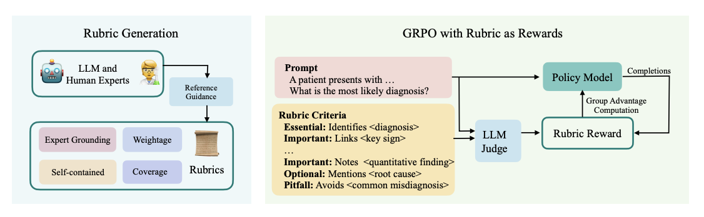

#  Beyond RLHF with Rubrics as Rewards

**TL;DR:** The paper "Rubrics as Rewards (RaR)" introduces a framework for LLM alignment that replaces opaque preference-based reward models with structured, prompt-specific checklists (rubrics).

For on-policy training with GRPO, an LLM judge scores model outputs against these rubrics.

This approach enhances reward signal quality and interpretability and allows smaller, cheaper judge models to align more closely with human preferences.

Defining reliable reward signals for language model alignment is a persistent challenge, particularly in domains lacking unambiguous ground truth. Current paradigms present a trade-off:

  * **Reinforcement Learning with Verifiable Rewards (RLVR):** Highly effective for tasks with deterministic verifiers (e.g., unit tests in code, correct answers in math). However, its applicability is limited in subjective domains like creative writing or medical reasoning.

  * **Preference-Based RL (RLHF/DPO):** Uses human preferences to train a reward model, offering broad applicability. The resulting reward function is often an opaque neural network, prone to overfitting on superficial heuristics (e.g., length, verbosity, formatting) and susceptible to reward hacking.

The paper "Rubrics as Rewards" from Scale AI proposes a framework to bridge this gap, offering a more structured, interpretable, and robust reward mechanism for on-policy optimization.

Love all the research going on in the space!!

Thank you so much for being a paid sub!! <3

Now back to the article!!

The core idea is to decompose the notion of a "high-quality" response into a set of explicit, verifiable criteria tailored to each prompt.

This is formalized as a structured reward function where the final scalar reward r for a prompt x and response ŷ is a normalized, weighted sum of satisfied criteria:

r(x, ŷ) = (Σ wj * cj(x, ŷ)) / (Σ wj)

Here, cj(x, ŷ) is a binary correctness function—evaluated by a judge LLM—that returns 1 if the response ŷ satisfies criterion j, and wj is the criterion's assigned weight.

### **Reward Aggregation Strategies**

The authors investigate two primary methods for aggregating rubric evaluations into a scalar reward:

  1. **Explicit Aggregation:** Each rubric criterion cj is evaluated independently by an LLM judge. The resulting boolean scores are then aggregated externally via a weighted summation using predefined weights (e.g., Essential=1.0, Important=0.7, Pitfall=0.8). This approach offers maximum transparency and control over the reward calculation.

  2. **Implicit Aggregation:** The prompt, model response, and the _entire set of rubric criteria_ are passed as context to a single LLM judge. The judge is then prompted to output a holistic scalar reward (e.g., a 1-10 Likert score), effectively learning to perform the weighting and trade-off analysis internally.

Empirically, **implicit aggregation consistently outperformed the explicit method.** This suggests that allowing a capable judge model to dynamically weigh criteria based on the specific nuances of a response is more effective than relying on a fixed, universal weighting scheme.

### **Implementation Pipeline for On-Policy Optimization**

The RaR framework is integrated into an on-policy RL loop using the GRPO algorithm:

  1. **Rubric Generation (Offline):** For each prompt in the training dataset, a strong LLM (e.g., GPT-4o) synthesizes a detailed, self-contained rubric. This process is grounded by providing an expert-written reference answer as guidance, ensuring the rubric captures key factual and reasoning components.

  2. **On-Policy Loop:**

     * **Generation:** The policy model samples a batch of k responses for a given prompt.

     * **Reward Computation:** A judge LLM evaluates each sampled response against the prompt-specific rubric using the implicit aggregation method, outputting a scalar reward.

     * **Policy Update:** The policy is updated using GRPO with the computed rewards.

### **Empirical Findings and Implications**

  * **Superior Performance on Subjective Benchmarks:** RaR-Implicit achieved a **28% relative improvement** on HealthBench-1k and a 13% improvement on GPQA over a simple Likert-based baseline. It also matched or exceeded the performance of a Reference-Likert baseline, where the judge compares the output to a high-quality reference answer. This indicates that a structured reward signal can be more effective and targeted than an unstructured, dense reference.

  * **Improved Judge Model Efficiency and Alignment:** A key finding is that rubrics act as a cognitive scaffold for the judge LLM. As shown in Figure 2 of the paper, providing a rubric significantly improves the accuracy of judge models in aligning with human preferences across all model scales. This effect is most pronounced for smaller models, narrowing the performance gap with larger, more expensive judges and making the alignment process more cost-effective.

  * **Enhanced Reward Transparency and Debuggability:** Unlike the black-box nature of RLHF reward models, RaR provides clear, interpretable feedback. If a policy is consistently penalized, developers can directly inspect the rubric criteria it fails to meet, enabling targeted debugging and model improvement. This moves alignment from "art" to a more structured engineering discipline.

### **Main take-ways**

Rubrics as Rewards is a robust and practical framework for LLM alignment in complex domains where simple verifiers are insufficient.

By formalizing subjective quality into a machine-readable, multi-dimensional checklist, RaR creates reward signals that are more transparent, less susceptible to hacking (even though they are still there!!), and more efficient to compute than traditional preference-based methods.

Pretty cool work! And IMHO it’s the next step of RL, now it almost looks too easy with verifiable rewards!!

# References

  1. [Rubrics as Rewards: Reinforcement Learning Beyond Verifiable Domains](https://arxiv.org/pdf/2507.17746)
