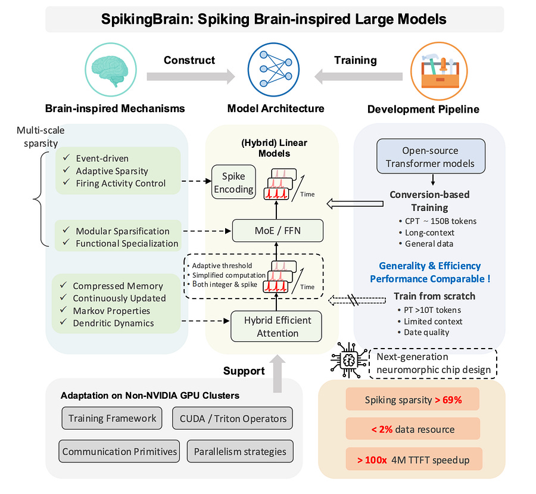

# Spiking Brain-Inspired LMs

*Hybrid linear MoE LLM*

*Hybrid linear MoE LLM*

### **TL;DR**

  * **What:** The report introduces SpikingBrain, a family of brain-inspired LLMs (7B and 76B MoE) designed for extreme long-context efficiency and deployment on non-NVIDIA hardware.

  * **How (Architecture & Training):** They ditch the standard Transformer's quadratic attention for hybrid linear architectures (Sliding Window Attention + Gated Linear Attention). Crucially, they don't train from scratch. Instead, they use a "conversion-based" pipeline, fine-tuning a pre-trained open-source model (Qwen2.5-7B) on just ~150B tokens (<2% of typical pre-training data) to adapt it to the new architecture.

  * **How (Systems):** The entire stack—from distributed training frameworks (DP, PP, EP, SP) to custom CUDA/Triton operators for the new attention types—was engineered and validated on a large-scale MetaX GPU cluster, proving viability beyond the NVIDIA ecosystem.

  * **Results:** The models achieve competitive performance with standard Transformers while offering massive efficiency gains. SpikingBrain-7B shows a >100x speedup in Time-to-First-Token (TTFT) for 4M-token sequences with near-constant memory usage. A novel adaptive spiking mechanism achieves 69% activation sparsity, paving the way for ultra-low-power inference on future neuromorphic hardware.

* * *

#### **1\. Model Architecture: Moving Beyond Quadratic Attention**

The core architectural innovation is the replacement of the Transformer's O(n²) softmax attention with more efficient, linear-time alternatives. This is achieved through a hybrid approach.

**Key Components:**

  * **Sliding Window Attention (SWA):** Standard local attention that restricts the context window to a fixed size w. This captures fine-grained local patterns with O(n) compute and O(1) inference memory for the KV cache.

  * **Linear Attention (LA):** This variant removes the softmax non-linearity, allowing the attention computation to be expressed as a linear recurrence. The paper uses Gated Linear Attention (GLA).  
This state-space representation allows for O(1) memory during auto-regressive decoding and enables chunk-wise parallelism during training, resulting in O(n) complexity.

**Two Models, Two Strategies:**

  1. **SpikingBrain-7B (Max Efficiency):** This model uses an **inter-layer** hybrid design, alternating between SWA and LA layers. This architecture is purely linear in complexity, making it exceptionally efficient for ultra-long sequences. SWA handles local context, while LA compresses and propagates global information.

  2. **SpikingBrain-76B (Balanced Performance):** This is a hybrid-linear MoE model that uses an **intra-layer** parallel design.

     * **Attention:** Most layers compute SWA and LA in parallel and merge their outputs. A few layers (1 in every 7) also include a full softmax attention head to retain global retrieval capabilities where needed. 128 learnable "sink tokens" are prepended to the input to anchor attention, a known technique to improve stability in non-causal attention contexts.

     * **FFN:** Feed-forward layers are replaced with sparse Mixture-of-Experts (MoE) layers (16 routed experts, 1 shared expert, top-1 gating). This scales the parameter count to 76B while keeping the activated parameters per token low (~12B).

#### **2\. The Training Paradigm: Efficient Conversion, Not Training from Scratch**

Instead of incurring the massive cost of pre-training a new architecture on trillions of tokens, the authors developed a conversion-based pipeline.

**Core Idea:** The attention maps of SWA (sparse) and LA (low-rank) can be seen as approximations of the standard softmax attention map. This allows for effective weight transfer from a pre-trained Transformer.

**The Pipeline:**

  1. **Initialization:** Start with weights from a pre-trained checkpoint (Qwen2.5-7B). The QKV projection weights are directly reused for the new SWA and LA modules. For the 76B model, dense FFN weights are replicated across all experts in the MoE layers (**upcycling**).

  2. **Stability during Upcycling:** A key detail for MoE conversion is maintaining output scale. Since multiple experts are initialized with the same weights, the output magnitude would otherwise explode. They apply a scaling factor to the initial expert weights: scaling_factor = 1 / (S + k/N), where S is the number of shared experts, k is top-k, and N is the number of routed experts.

  3. **Continual Pre-training (CPT):** The model is trained on a relatively small dataset (~150B tokens) in stages, progressively increasing the context length from 8k to 32k, and finally to 128k. This stage adapts the pre-trained weights to the new attention mechanisms and teaches the model to handle long dependencies.

  4. **Supervised Fine-Tuning (SFT):** Standard SFT follows to align the model for instruction-following and dialogue.

This methodology reduces the data and compute required for developing a long-context model by over 98% compared to training from scratch.

#### **4\. System Engineering: Making it Run on MetaX GPUs**

Training a 76B MoE model with long sequences is a major systems challenge, especially on a non-NVIDIA platform. The report details extensive adaptations.

  * **Distributed Training Topology:**

    * **SpikingBrain-7B (128k context):** 32-way Data Parallelism (DP) + 8-way Sequence Parallelism (SP). ZeRO-2 was used for memory optimization.

    * **SpikingBrain-76B (128k context):** A complex 4D parallelism: 128-way DP + 8-way Expert Parallelism (EP) + 4-way Pipeline Parallelism (PP) + 8-way SP.

  * **Custom Communication for SP:** Standard SP uses all-to-all communication, which is a bottleneck. For the linear attention modules, they implemented more efficient primitives: **AllGather** for small SP sizes and **All-Scan** for larger, multi-node SP, effectively reducing communication overhead.

  * **Operator Adaptation:** They ported the necessary operators (like GLA) to the MetaX stack via two routes:

    1. **Triton Adapter:** Leveraging Triton's compilation pipeline to optimize kernels for MetaX hardware (e.g., matching grid configurations, specifying cache usage).

    2. **CUDA-to-MACA Migration:** A direct porting framework to MetaX's native MACA API, replacing performance-critical operators with hand-optimized versions from MetaX libraries (e.g., mcFlashInfer2).

  * **MoE Optimizations:** Deployed practical techniques like replicating frequently used "hot" experts locally to reduce communication and using adaptive activation recomputation to manage memory spikes.

The result was stable training for over two weeks on hundreds of MetaX GPUs, achieving a respectable **23.4% MFU** for the 7B model.

### **Key Results & Implications**

  * **Long-Context Dominance:** SpikingBrain-7B's TTFT for a 4M token prompt is estimated to be **over 100x faster** than a standard Transformer. The inference latency remains almost constant as sequence length and GPU count scale together, a direct benefit of the linear architecture and efficient SP communication.

  * **Viable Performance with Less Data:** Despite using <2% of the data, the converted models perform comparably to established open-source baselines like Llama 3 and Mistral, demonstrating the efficacy of the conversion-based training strategy.

  * **High Sparsity:** The adaptive spiking scheme yields **69.15% sparsity** in activations when using a bitwise representation. This is a significant figure that directly translates to potential power savings on event-driven hardware.

  * **Platform Independence:** This work serves as a strong proof-of-concept for developing and deploying large-scale AI models outside the NVIDIA ecosystem, detailing the full-stack engineering effort required.

# References

  1. [Spiking Brain-inspired Large Models](https://arxiv.org/pdf/2509.05276)
