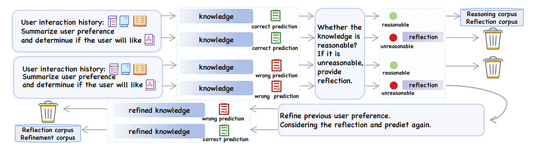

# R4ec: Teaching Your Recommender LLMs to Think Twice

### TLDR;

**The Problem:** Using Large Language Models (LLMs) for recommendations with simple, one-shot prompts is like using System-1 thinking—fast but error-prone. A single hallucination or reasoning flaw can tank the quality of the generated user/item knowledge.

**The Solution:** The R4ec framework introduces a System-2 thinking loop with two smaller, fine-tuned LLMs: an **Actor Model** that generates user preferences or item facts, and a **Reflection Model** that acts as a critic, providing feedback on the Actor’s output.

**The Result:** The Actor refines its knowledge based on the feedback, producing more accurate and reliable features for the downstream recommender model. This approach outperformed existing methods in offline tests and, more importantly, delivered a **2.2% revenue increase** and a **1.6% CVR lift** in a large-scale online A/B test.

### Moving Beyond “Prompt and Pray”

If you are an MLE working on RecSys, you are surely increasingly tasked with integrating LLMs into our recommender systems.

The typical approach involves crafting a clever prompt to make an LLM (often a large, expensive API) generate enriched user profiles or item descriptions.

While this can work, it’s a brittle process. The model’s reasoning is a black box, and a small error in its internal “chain of thought” can lead to nonsensical or factually incorrect output, poisoning the feature set.

The paper “R4ec: A Reasoning, Reflection, and Refinement Framework for Recommendation Systems” argues this is a failure of “System-1” thinking.

It proposes a more robust, deliberate process that mimics human “System-2” thinking—the ability to pause, reflect on an initial answer, and correct it. The result is a practical framework that not only improves accuracy but does so using smaller, more manageable open-source models.

### The Actor-Reflector Loop for Self-Correction

The core innovation of R4ec isn’t a new model architecture, but a new process. Instead of a single LLM call, it orchestrates an interaction between two specialized models.

Think of it like a junior developer and a senior developer working together:

  1. **The Actor Model (The Junior Dev):** This model is fine-tuned to perform the primary task: reasoning. Given a user’s interaction history, it generates a summary of their preferences (e.g., “This user enjoys sci-fi novels with strong female protagonists”). This is the initial, System-1 answer.

  2. **The Reflection Model (The Senior Dev / Code Reviewer):** This model’s only job is to be a critic. It receives the user’s history and the Actor’s generated preference summary and judges its quality. It answers the question: “Is this summary reasonable and complete?”

  3. **The Feedback & Refinement Loop:**

     * If the Reflection model thinks the summary “reasonable,” the process ends.

     * If it finds flaws, it generates specific, constructive feedback (e.g., “The summary is not reasonable. You overlooked that the user consistently dislikes books with dystopian themes, which contradicts your conclusion.”).

     * The Actor model then receives the original input _plus_ the Reflector’s feedback and is prompted to generate a _refined_ user preference summary.

This iterative process ensures the final knowledge output has been “vetted” for quality and consistency, making it a much more reliable feature to feed into a traditional recommendation backbone like DeepFM or DIEN.

### The Payoff: Real-World Wins with Smaller Models

This is where the framework proves its value for production systems.

**1\. Smarter, Not Just Bigger:** A key finding is that this framework, using a fine-tuned 7B parameter model (Qwen-2.5 7B), outperformed KAR, a previous state-of-the-art method that relied on direct calls to the much larger GPT-3.5. This shows that a well-designed reasoning process with smaller, specialized models can be more effective (and cheaper) than brute-forcing the problem with a giant, general-purpose one.

**2\. Production-Ready Performance:** The online A/B test results are compelling. Deployed on a large-scale advertising platform, R4ec achieved:

  * **+2.2% increase in overall revenue.**

  * **+1.6% increase in conversion rate (CVR).**

  * **+4.1% revenue lift on long-tail data,** showing its effectiveness in solving the cold-start problem.

These are significant business metrics that justify the added complexity of the framework. The paper also explores scaling laws, showing that using a more powerful Reflection model consistently yields better results, giving teams a clear path for future investment and improvement.

### Main Takeaways for MLEs

  1. **Embrace Multi-Agent Systems, Not Monolithic Prompts:** The future of reliable AI systems isn’t just about finding the “perfect prompt.” It’s about building systems where specialized models check and balance each other.

  2. **Distill Knowledge from SoTA Models to Train Your Own:** The authors created their training data for the Actor and Reflector models by prompting a powerful model (GPT-4o). This is a highly effective strategy: use a large, expensive model once to generate a high-quality dataset, then use that dataset to fine-tune smaller, cheaper, and faster open-source models for production inference.

  3. **Your “Reflector” Can Be a Powerful Asset:** The idea of a model dedicated to quality control is a game-changer. You can apply this pattern to other domains: validating generated marketing copy, checking code snippets for bugs, or ensuring chatbot responses are factually grounded. The Reflection model itself becomes a valuable asset.

  4. **Process Over Parameters:** R4ec’s success demonstrates that the _process_ by which a result is generated can be more important than the raw size of the model. By introducing reflection and refinement, the system becomes more robust to the inherent stochasticity and error-proneness of LLMs, making them safer and more effective for production use cases.

### References

  1. [𝑅 4ec: A Reasoning, Reflection, and Refinement Framework for Recommendation Systems](https://dl.acm.org/doi/pdf/10.1145/3705328.3748068)
