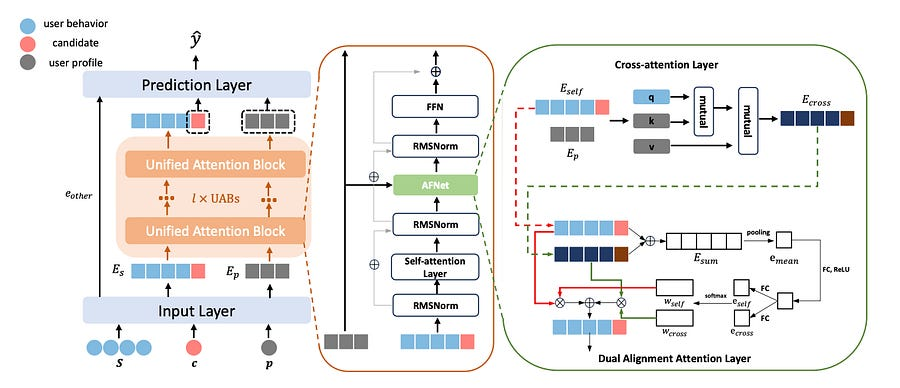

# Exploring Scaling Laws of CTR Model for Online Performance Improvement

### TLDR:

The paper proposes a powerful two-stage ML system design to break through CTR performance plateaus.

First, they build a massive, non-deployable “teacher” model (SUAN) architected specifically to exhibit LLM-like scaling law: its performance predictably improves with more data and parameters.

Second, they distill this intelligence into a highly optimized, production-ready “student” model (LightSUAN) using online distillation.

The result: a 2.81% online CTR lift and a 1.69% CPM uplift with acceptable inference latency increase.

# Hitting the Ceiling with Traditional CTR Models

For years, improving CTR models has been a game of inches, where a 0.001 AUC gain is considered a major victory. This suggests the field is hitting a performance bottleneck with existing architectures.

Inspired by the success of Large Language Models (LLMs), which demonstrate predictable performance improvements with scale, a different approach is tried.

Instead of incrementally improving a single, deployable model, they propose a system that decouples the task of achieving maximum predictive power from the constraints of online inference. The core idea is to first build an unconstrained, high-grade model that benefits from scale, and then transfer its knowledge to an efficient model that can serve users in real-time.

# Architecting the “Teacher” for Scalability (SUAN)

The foundation of this system is a model designed explicitly to scale: the **Stacked Unified Attention Network (SUAN)**.

The key component is the **Unified Attention Block (UAB)** , which acts as a powerful encoder for user behavior sequences. A single UAB integrates three distinct attention mechanisms to create a comprehensive feature representation:

  1. **Self-Attention:** Models the temporal and sequential relationships within a user’s behavior history, much like a Transformer. Attention biases for relative position and time, which they found crucial for performance.

  2. **Cross-Attention:** Injects non-sequential user profile information (e.g., age, gender) into the sequence modeling. It uses the user’s behavior sequence as the query and the user profile features as the key and value, allowing the model to re-weigh behaviors from the perspective of the user’s static attributes.

  3. **Dual Alignment Attention:** An adaptive gating mechanism that dynamically weighs the outputs of the self-attention and cross-attention layers. This allows the model to decide, on a per-behavior basis, whether to prioritize information from the sequence itself or from the user’s profile.

To ensure training stability, a prerequisite for scaling, the authors borrow two critical components from LLMs: **RMSNorm** (used in a pre-norm configuration) and a **SwiGLU-based Feedforward Network**. The ablation study confirmed that these regularizers were essential for preventing performance degradation at larger model sizes and maintaining the scaling law.

The result is a model whose AUC scales predictably with both model grade (a combination of parameter count and sequence length) and data size, spanning three orders of magnitude in their experiments. However, this high-performance model is too computationally expensive for online deployment.

# Deploying the “Student” via Online Distillation (LightSUAN)

To bridge the gap between SUAN’s performance and the strict latency requirements of online services, the authors create **LightSUAN** , an optimized version, and employ an **online distillation** strategy.

**LightSUAN’s Optimizations:**

  * **Sparse Self-Attention:** The quadratic complexity of self-attention is the primary bottleneck. LightSUAN replaces it with a combination of local (attending to nearby elements) and dilated (attending to elements at a fixed stride) attention, reducing complexity while capturing both recent and long-range dependencies.

  * **Parallel Inference:** To accelerate ranking for a single user with multiple candidate items, they batch the candidates. This allows the expensive encoding of the user’s behavior sequence to be computed once and reused for all candidates in the batch, significantly reducing the total inference time per user.

**Online Knowledge Distillation:**  
Instead of a simple pre-train/fine-tune approach, the high-grade SUAN (teacher) and the low-grade LightSUAN (student) are trained simultaneously. The total loss function is a weighted sum of three components:

  1. The student’s standard cross-entropy loss against the ground truth labels.

  2. The teacher’s standard cross-entropy loss against the ground truth labels.

  3. A distillation loss where the student learns to mimic the teacher’s “soft” probability distribution (logits scaled by a temperature t).

This simultaneous training allows the student to learn from a continuously improving teacher. The resulting distilled LightSUAN not only meets the latency budget but outperforms a non-distilled SUAN model of a higher grade, proving the effectiveness of the knowledge transfer.

# Main Takeaways for Machine Learning Engineers

  1. **Adopt a Two-Model System Design:** Decouple the goals of achieving state-of-the-art accuracy from meeting production constraints. Build a “cost-is-no-object” research model to push performance boundaries, and use knowledge distillation as the bridge to a separate, highly optimized inference model.

  2. **Stability is the Foundation of Scaling:** Achieving scaling laws isn’t just about adding more layers. Architectures must be inherently stable. The use of RMSNorm and pre-norm strategies was critical. When your models become unstable during large-scale training, consider adopting modern normalization and activation techniques from the LLM world.

  3. **Online Distillation is a Potent Technique:** Training the teacher and student models concurrently can be more effective than distilling from a static, pre-trained teacher. The student benefits from learning a moving target that is constantly improving its own understanding of the data.

  4. **Combine Architectural and Inference Optimizations:** LightSUAN’s effectiveness comes from both architectural changes (sparse attention) and system-level optimizations (parallel inference). A production-ready model requires a holistic approach that considers how the model will be served from day one.

# References

  1. [Exploring Scaling Laws of CTR Model for Online Performance Improvement](https://arxiv.org/pdf/2508.15326)
