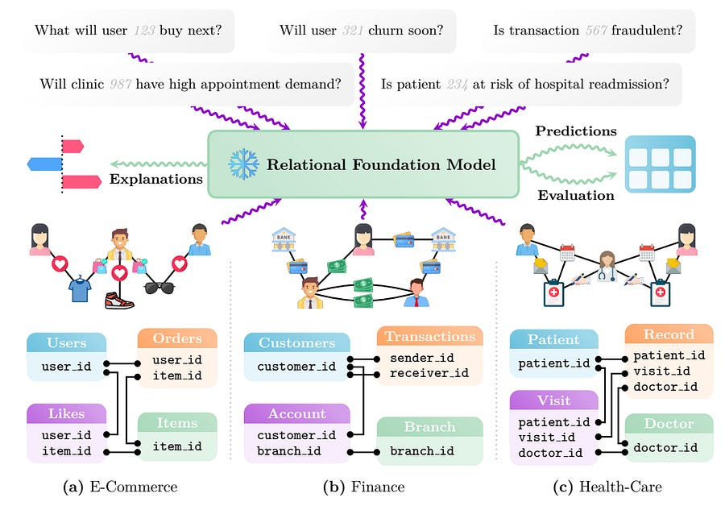

# Foundation Model for In-Context Learning on Relational Data

*relational data is kinda important :D*

> Paid post — only the publicly visible preview is included.

*relational data is kinda important :D*

**TLDR:** The KumoRFM paper introduces a pre-trained foundation model for zero-shot predictions on any relational database. From a system design perspective, it pairs a declarative Predictive Query Language (PQL) with a real-time data sampling engine, abstracting away the entire feature and label engineering pipeline.

The core architecture represents the database as a temporal graph and uses a Relational Graph Transformer to perform in-context learning on historical examples generated on-the-fly. For MLEs, this presents a paradigm shift from building bespoke models to querying a single, general-purpose system, offering both rapid prototyping via in-context learning and production scalability via an optional fine-tuning path.

# KumoRFM: A Deep Dive into the First Foundation Model for Relational Data

Machine learning on relational databases has traditionally been a bespoke, labor-intensive process of per-task feature engineering and model building. The KumoRFM paper introduces a compelling new architecture: a pre-trained Relational Foundation Model (RFM) designed for zero-shot, in-context learning on any relational database. This is a significant system-level undertaking that merits a closer look from a machine learning engineering perspective.

# The Declarative Front-End: PQL and Online Context Generation
