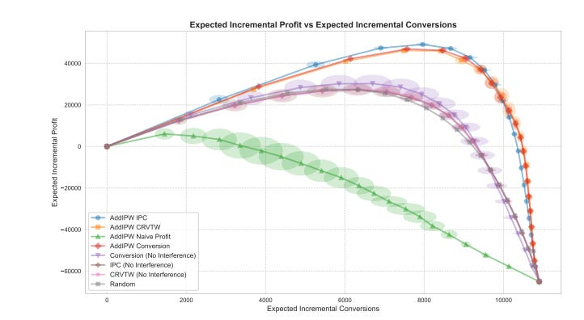

# Direct Profit Estimation Using Uplift Modeling under Clustered Network Interference

### TLDR;

Standard uplift models for promotions fail in recommender systems because they ignore interference (e.g., cannibalization). This paper presents a practical ML system design for building interference-aware models by turning a causal policy evaluator, AddIPW, into a differentiable learning objective. This allows for direct, gradient-based optimization of economic outcomes like incremental profit, significantly outperforming naive approaches in environments with item-to-item influence.

# The System Design Flaw in Standard Uplift Modeling

As Machine Learning Engineers, we’re often tasked with personalizing promotions to maximize business KPIs like profit or ROI. The go-to tool for this is uplift modeling, which estimates the _causal effect_ of an intervention. However, the standard implementation of these models rests on a critical, often violated assumption: the Stable Unit Treatment Value Assumption (SUTVA).

SUTVA implies that treating one unit (e.g., promoting an item) has no effect on the outcomes of other units. In any real-world marketplace or recommender system, this is fundamentally untrue. Promoting one hotel in a list directly impacts the probability of a user booking another hotel in that same list. This _clustered network interference_ leads to suboptimal policies, as models that ignore it cannot correctly account for effects like sales cannibalization. While causal inference literature has produced robust estimators for _evaluating_ policies under interference, like Additive Inverse Propensity Weighting (AddIPW), these tools have not been systematically integrated into the _learning_ process. This paper bridges that critical gap.

# From Causal Evaluator to Differentiable Learning Objective

The core innovation is a systems-level shift: transforming a policy _evaluator_ into a model _objective_. The authors leverage the AddIPW estimator, which is designed to efficiently evaluate a policy’s value under clustered interference.

The key steps in this design are:

  1. **Isolate the Policy-Dependent Term:** The AddIPW estimator formula (Eq. 1 in the paper) is decomposed. The parts of the formula that do not depend on the policy π being learned are dropped, leaving a core expression (Eq. 5) that isolates the relationship between the policy, the observed outcome, and the treatment assignment.

  2. **Define the Loss Function:** This policy-dependent term becomes the learning objective to be maximized. For a binary treatment, it simplifies to maximizing the weighted sum: Σ [ Yi * ( Aij/e1 - (1-Aij)/e0 ) * fθ(Xij) ] where fθ(Xij) is the model’s continuous output (the probability of treatment).

  3. **Embrace the Cluster-Level Outcome:** The most critical design choice is the use of the **cluster-level outcome Yi** (e.g., the average conversion rate across _all_ items shown to a user) instead of the individual item outcome Yij. By weighting each item’s contribution by the outcome of the entire cluster, the model is forced to learn the total impact of its decision, implicitly accounting for cannibalization or spillover effects within that cluster.

  4. **Enable Gradient-Based Optimization:** By replacing the discrete policy decision with a continuous, differentiable function fθ(Xij), the entire objective becomes differentiable. This allows the use of standard, powerful optimization tools like gradient boosting or deep learning frameworks to train the uplift model.

This transforms the problem from a simple supervised classification task into a properly specified causal optimization problem that respects the underlying structure of the data-generating process.

# Integrating Economic Objectives: Direct Profit Optimization

The ultimate goal isn’t just to increase conversions; it’s to maximize profit. A naive attempt to do this—by simply replacing the conversion outcome Yi with the observed profit Yp,i—is flawed. The model would incorrectly learn to penalize all treated items because they have an associated cost, failing to isolate the _incremental_ gain from the treatment.

The paper demonstrates how to adapt proven profit-uplift techniques into this interference-aware framework using a response transformation. The key is to modify the cluster-level outcome variable that is plugged into the AddIPW learning objective. Two successful adaptations are highlighted:

  * **AddIPW-CRVTW (Continuous Response Variable Transformation with Weightings):** The cluster-level outcome is set to the average cluster _revenue_ Yr,i. The cost of the treatment is handled implicitly by the uplift formulation, allowing the model to learn a policy that maximizes incremental revenue.

  * **AddIPW-IPC (Incremental Profit per Conversion):** The model is trained only on clusters with at least one conversion. The outcome is the average cluster-level profit, but calculated as if the treatment cost was applied to all converted items. This focuses the model on learning the profit dynamics for the most relevant user segments.

Experiments show the AddIPW-IPC adaptation is particularly effective, especially for prioritizing the highest-impact interventions when budgets are limited. This demonstrates that by carefully designing the target variable within the AddIPW objective, we can directly train for complex economic goals under interference.

# Main Takeaways for MLEs

  1. **Acknowledge SUTVA Violation as a System Bug:** If your treatments are delivered in a context where they can influence each other (e.g., ranked lists, carousels), your standard uplift models are built on a flawed assumption. The resulting policies are likely suboptimal.

  2. **Shift Your Unit of Analysis from Item to Cluster:** For training and evaluation, the “unit” is the cluster (e.g., user session, search result page). Your outcomes (Yi) and propensity scores (e(a|Xi)) must be defined at this level to capture interference effects.

  3. **Repurpose Causal Estimators as Loss Functions:** The pattern of taking a robust statistical estimator (like AddIPW) and converting it into a differentiable learning objective is a powerful technique. This is a generalizable approach for building models that directly optimize for the metric you use for evaluation.

  4. **Adapt, Don’t Just Substitute, for Economic Goals:** When optimizing for profit, don’t just swap “conversion” for “profit” as your target variable. Use established causal methods like response transformations (CRVTW, IPC) and adapt them to your interference-aware framework by using cluster-level economic outcomes. This correctly frames the problem for the optimizer.

# References

  1. [Direct Profit Estimation Using Uplift Modeling under Clustered Network Interference](https://arxiv.org/pdf/2509.01558)
