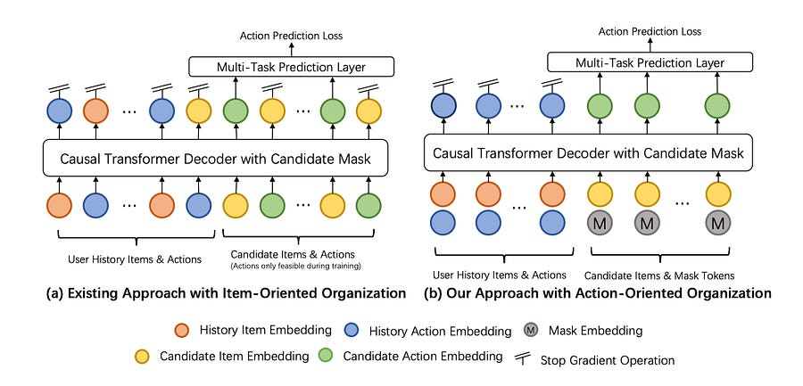
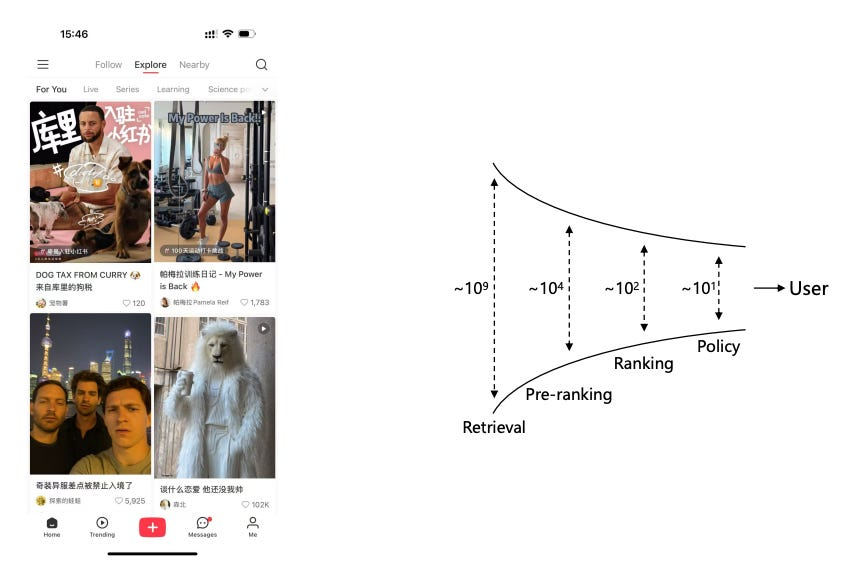

# Towards Large-scale Generative Ranking

> Paid post — only the publicly visible preview is included.

**TL;DR:**  
Why generative ranking works? How to make it production ready?

The auto-regressive **architecture** , not the training paradigm, is the primary source of effectiveness.

To overcome efficiency bottlenecks, engineers at Xiaohongshu introduce **GenRank** , an architecture that halves the effective sequence length by treating items as context and generating actions. Combined with efficient, parameter-free position biases (ALiBi), GenRank achieves a **94.8% training speed-up** over the baseline with better offline AUC. In online A/B tests on tens of millions of users, it delivered significant engagement lifts with comparable resource costs and a **> 25% improvement in P99 response time**.

# **The Generative Paradigm**

Industrial recommender systems are typically multi-stage cascades, with the ranking stage acting as the final, fine-grained arbiter of what a user sees. While generative models have shown promise, their application in large-scale ranking has been under-explored. The team at Xiaohongshu (creators of RedNote) moved beyond simply proposing a new model to ask two fundamental system design questions:

  1. What are the core mechanisms that make the generative paradigm effective for ranking?

  2. How can we design a generative architecture that meets the stringent efficiency demands of a system serving hundreds of millions of users?
