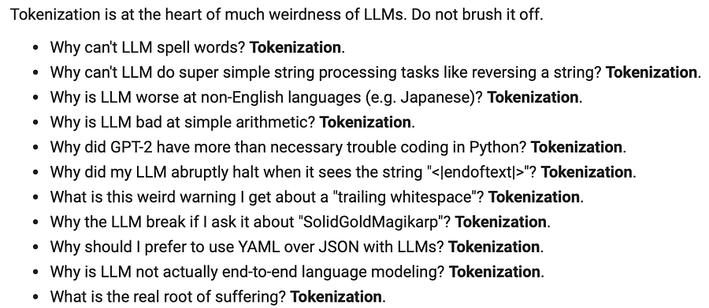

# Don't Abolish Tokenizers—Understand Them

**TLDR:** Hating on tokenizers is the cool thing to do right now, but the “tokenizer-free” alternatives being pushed (byte-level, dynamic patching) are just tokenization by another name—and they usually come with massive performance penalties.

Instead of trying to abolish tokenizers, we should stop being lazy about how we use them.

* * *

# Introduction

If you’ve been following the discourse (or watching Karpathy’s lectures), you know that tokenizers are currently public enemy number one.

They get blamed for everything from weird arithmetic failures to “glitch tokens” like SolidGoldMagikarp. The proposed solution? Go “tokenizer-free.”

But I came across this piece [1] from Catherine Arnett, “There is no such thing as a tokenizer-free lunch,” and it lays out the reality check we probably need.

As long as we are discretizing text into _something_ a model can embed, we are tokenizing. The debate isn’t about elimination; it’s about which trade-offs we’re willing to accept in production.

This almost feels like a tradeoff of MLSys, so that’s right on point of what I like!

# **The “Tokenizer-Free” Hype vs. Production Reality**

The main alternatives being pitched right now are byte/character-level models (like ByT5) or dynamic tokenization (like the new Byte Latent Transformer). They sound elegant because they solve the Out-Of-Vocabulary problem and feel more “pure.”

But let’s look at the engineering cost.

If you go byte-level, your vocabulary is just the 256 UTF-8 bytes. Great, no UNKs.

But you’ve just forfeited the text compression that subwords give you.

For languages using non-Latin scripts, the sequence length explodes. Encoding Burmese, for example, takes 4x more bytes than the English equivalent.

When you’re dealing with quadratic attention, a 4x increase in sequence length is a disaster for both training cost and inference latency.

You’re burning compute just to represent the input, eating up your context window with raw bytes instead of semantic units.

# **Dynamic Tokenization Isn’t Magic Either**

The other flavor is “dynamic tokenization,” where the model takes bytes and uses a small neural net (like a CNN or local transformer) to create embeddings for “patches” on the fly.

Again, this is still tokenization; you’re just moving the complexity from a pre-processing step into the model forward pass.

You’re adding compute _before_ you even hit the main transformer layers. And as the article [1] notes, there’s currently zero empirical evidence that these dynamically generated patches are qualitatively better than a well-trained static BPE vocabulary. We’re adding complexity and opacity for theoretical purity.

# **Stop Recycling Your Tokenizers**

The most practical takeaway from the article—and the one we’re probably all guilty of ignoring—is **tokenizer recycling**.

We spend months curating datasets and millions on compute, but then we’ll just pull the Llama 2 or GPT-2 tokenizer off the shelf and use it on completely different data (code, biomedical text, etc.). This is just lazy engineering.

If your tokenizer wasn’t trained on a representative sample of your actual pre-training data, you’re introducing inefficiency and subtle performance degradation from day one. Training a bespoke BPE/Unigram tokenizer is cheap and fast. There’s no excuse for skipping it.

# **The Main Takeaway for MLEs?**

Static subword tokenizers (BPE, WordPiece) aren’t perfect, but they are efficient, deterministic, and debuggable. If a specific token ID is causing issues, you can find it.

Before we jump on the “tokenizer-free” bandwagon, we need to be honest about the trade-offs. For most production use cases, the compression and efficiency we get from boring old subwords are still unmatched. We shouldn’t be trying to kill tokenizers; we should just stop implementing them poorly.

# References

  1. [There is no such thing as a tokenizer-free lunch](https://huggingface.co/blog/catherinearnett/in-defense-of-tokenizers)
