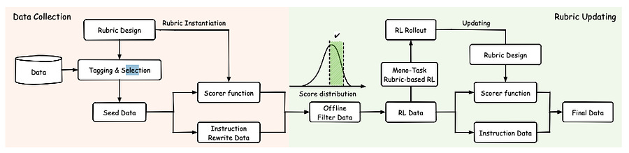

# Reinforcement Learning with Rubric Anchors: A Technical Deep Dive

> Paid post — only the publicly visible preview is included.

**TLDR:** A new study introduces “Reinforcement Learning with Rubric Anchors” (Rubicon), a framework extending Reinforcement Learning from Verifiable Rewards (RLVR) to open-ended, subjective tasks. By employing a vast system of over 10,000 rubrics for reward signaling, the Rubicon-preview model, a fine-tuned Qwen-30B-A3B, demonstrates a 5.2% absolute improvement on humanities-focused benchmarks with only 5,000 training samples. This approach not only surpasses a much larger 671B DeepSeek-V3 model by 2.4 percentage points on these tasks but also offers granular stylistic control, producing more human-like and less “AI-sounding” responses without degrading general reasoning abilities.

# Beyond Verifiable Rewards: The Rubicon Framework

Reinforcement Learning from Verifiable Rewards (RLVR) has proven to be a powerful technique for enhancing the capabilities of Large Language Models (LLMs), especially in domains where a definitive, checkable answer exists.

This is particularly effective for tasks like code generation, where unit tests can verify correctness, and mathematical reasoning, where the final answer can be programmatically checked.

However, this reliance on unambiguous, verifiable signals has largely confined RLVR to a narrow set of problems, leaving a vast landscape of open-ended and subjective tasks—such as creative writing, nuanced conversation, and complex humanities analysis—unaddressed.
