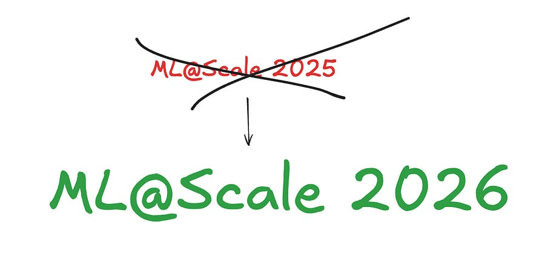
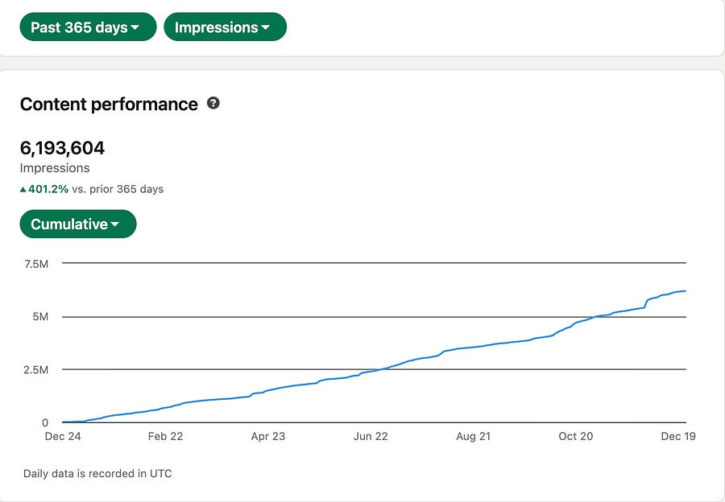
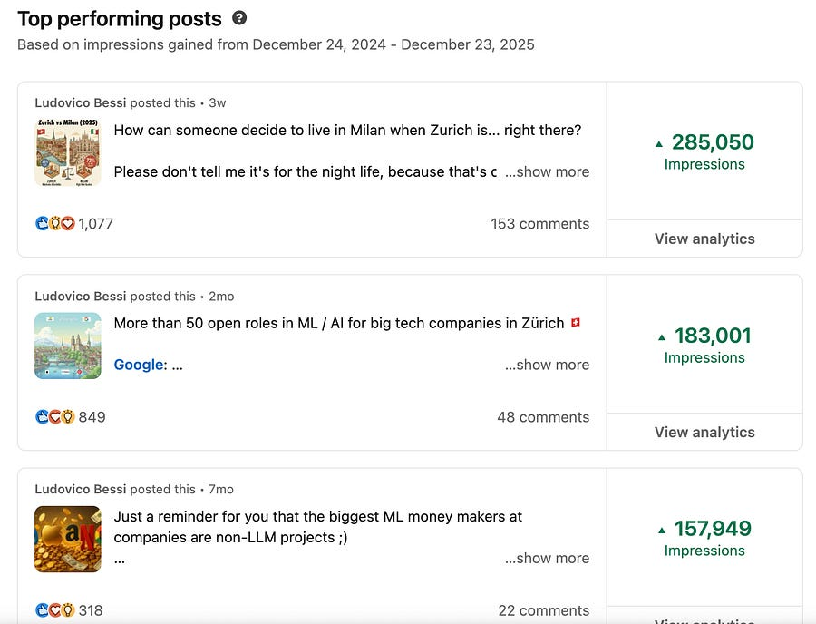
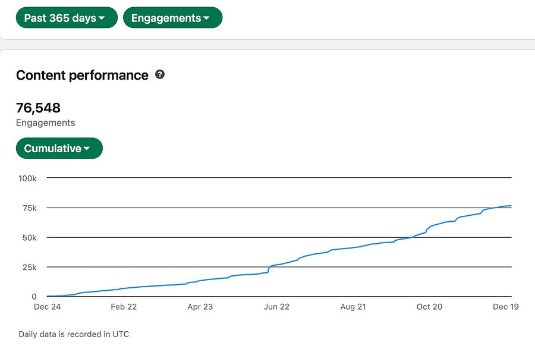
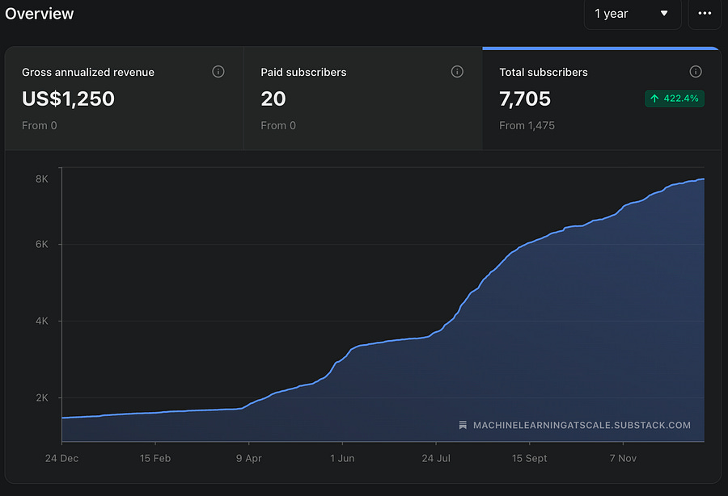
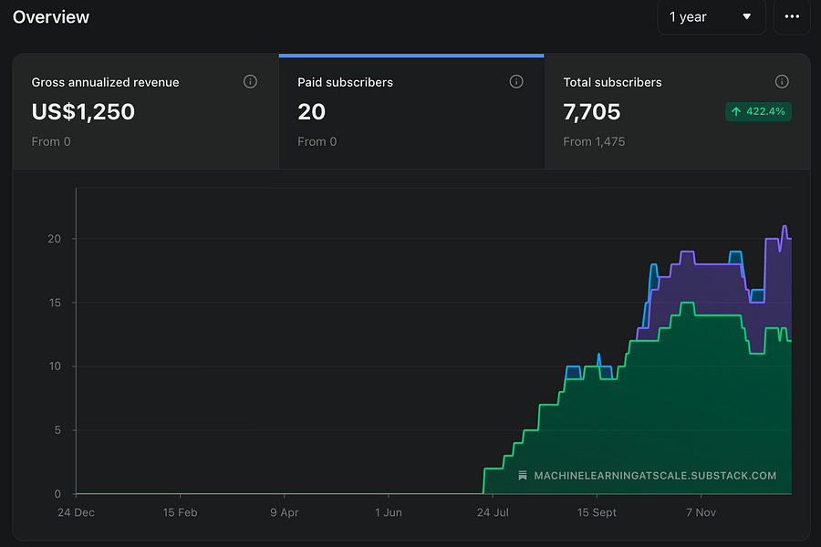
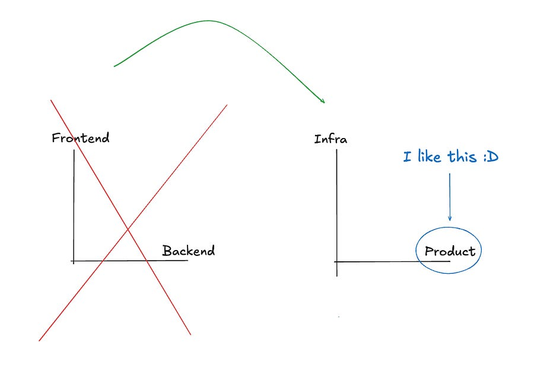
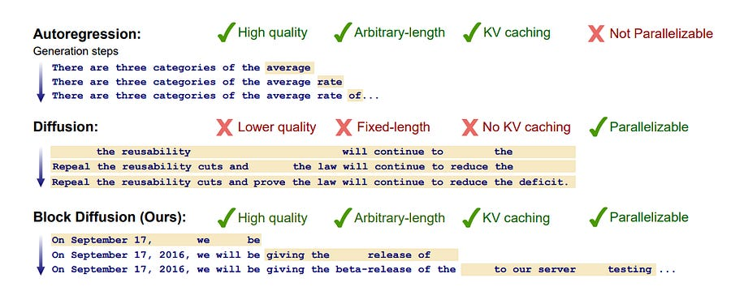

# ML@Scale 2025 was the biggest year (yet)

*Let's do a recap!*

*Let's do a recap!*

# 2025 - what a year!

Let’s look at:

  * LinkedIn performance (impressions, engagement, top performing posts)

  * Newsletter performance (subs, paid subs)

  * Plans for 2026

  * A bit of a personal note!

#### LinkeIn Stats

6 MILLION IMPRESSIONS?!

With a CPM of 8$ (super low), that’s equivalent to the reach of 48k USD spend on ads on LinkedIn. that’s just CRAZY to me!

Looking at top performing posts:

I guess insulting Milan is top tier rage bait? Learnt something!

People also engage with posts quite a lot? :)

I have met lots of amazing people throughout the platform, I am very blessed!

#### Newsletter stats

I am honestly super proud of what we accomplished with the newsletter in 2025.

Let’s take a look at some stats together:

On 01/01/2025 ML@Scale had 1494 subs.

At the time of this writing (23/12/2025) we are at 7705 subs.

WOAH! 

On top of that, I turned on monetization in early July, and the response has been great!

I personally don’t care too much about the money itself (I live in Switzerland, I can a pay a pizza a month with that, for real!), but it’s comforting to see that people find the content i put out valuable enough to pay for it.

In a sense, I turned on the monetization as a “proxy for value”: if no-one finds the content good enough to support, maybe I should ask myself if I am really providing value for people.  
  
On the topic of value: I also know that I am providing “not incredible value” for paying users, so there’s still lots of room to grow here, need to come up with additional add-ons!

**The one thing I am most proud of is the consistency I have had in 2025 and the difference it made in outcomes.**

I’d say content creation is essentially grinding > > > everything else, and one thing I think I am good at is that: grinding. So that’s good to have! :) 

Closing the 2025 section with my personal favourite articles:

**My RecSys series:**

## [[RecSys] Part 1: Intro and common blind spots](2025-08-03-recsys-part-1-intro-and-common-blind.md)

Ludovico Bessi

·

August 3, 2025

[![\[RecSys\] Part 1: Intro and common blind spots](../assets/cb0f2573fa6905bc.png)](2025-08-03-recsys-part-1-intro-and-common-blind.md)

Introduction

[Read full story](2025-08-03-recsys-part-1-intro-and-common-blind.md)

**Some thoughts on Product vs Infra teams:**

## [MLE/Backend/Frontend vs Product/Infra ](2025-01-05-mlebackendfrontend-vs-productinfra.md)

Ludovico Bessi

·

January 5, 2025

The change

[Read full story](2025-01-05-mlebackendfrontend-vs-productinfra.md)

**My LLM serving series:**

## [LLM serving (1): Continuous batching](2025-04-06-llm-serving-1-continuous-batching.md)

Ludovico Bessi

·

April 6, 2025

Introduction

[Read full story](2025-04-06-llm-serving-1-continuous-batching.md)

**Block diffusion article:**

## [How Block Diffusion Bridges AR and Diffusion Models](2025-06-22-how-block-diffusion-bridges-ar-and.md)

Ludovico Bessi

·

June 22, 2025

Introduction

[Read full story](2025-06-22-how-block-diffusion-bridges-ar-and.md)

Ok, enough of 2025! Let’s go to 2026 big bets!

# 2026 - plans

I want to double down on what worked in 2025:

  1. Consistency with quality

  2. Month of X series

  3. Large scale system designs

**Consistency with quality**

Consistency was absolutely the key for 2025 for me. Not only because the platforms incentivise you to be consistent, but also for myself to know that “I gotta write today”.

I learnt so much in 2025 thanks to this, and I will never stop hopefully!

**Month of X series**

People love the idea that for the next month and I am going to be focusing on one topic and one topic only.

It’s easier to follow along because I introduce the basic idea and build up on it.

So, more of those for sure!

**Large scale system designs**

I believe people are craving more content on how to design systems “like big tech”. And that checks out with engagement on those topics in my newsletter. I could be doing a much better job there, but it’s also much more work.

Still, there’s a big gap there and I want to be the one filling it!!

**Video experiments**

You will see my voice / face on LinkedIn a bit more, as I start experimenting with video content. looks fun, but takes soooo much time and that’s the thing I lack the most of!

# Closing thoughts

I am loving this side projects of mine: I feel creativity and the idea of having my own “real side business” (can we call it that?) feels me with joy!

Can’t wait to bring this to the next level. But bear in mind I still have a quite demanding FTE job as a MLE@Google that I want to keep excelling at: I am not a full time content creator and I do think the value I am able to provide comes from the fact that I am in the industry and I can offer a “in the trenches” perspective.

Let’s make 2026 another record breaking year! 

Ludo
